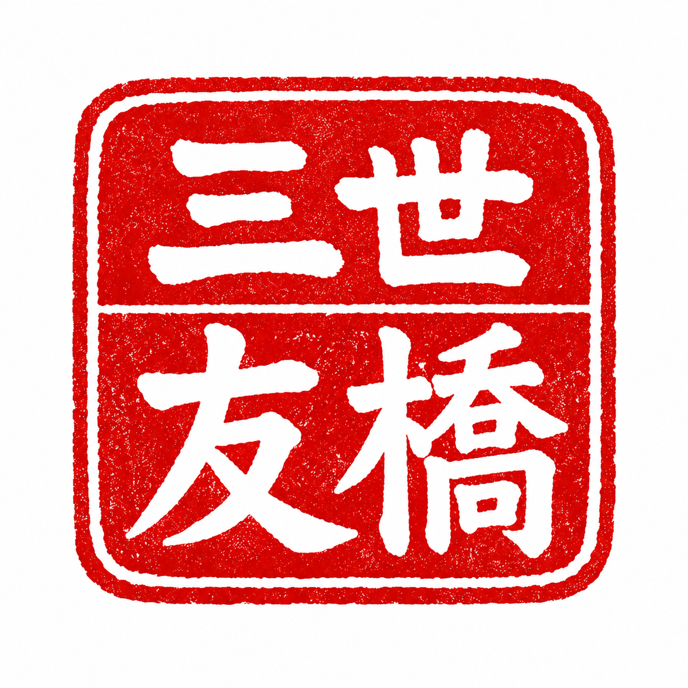
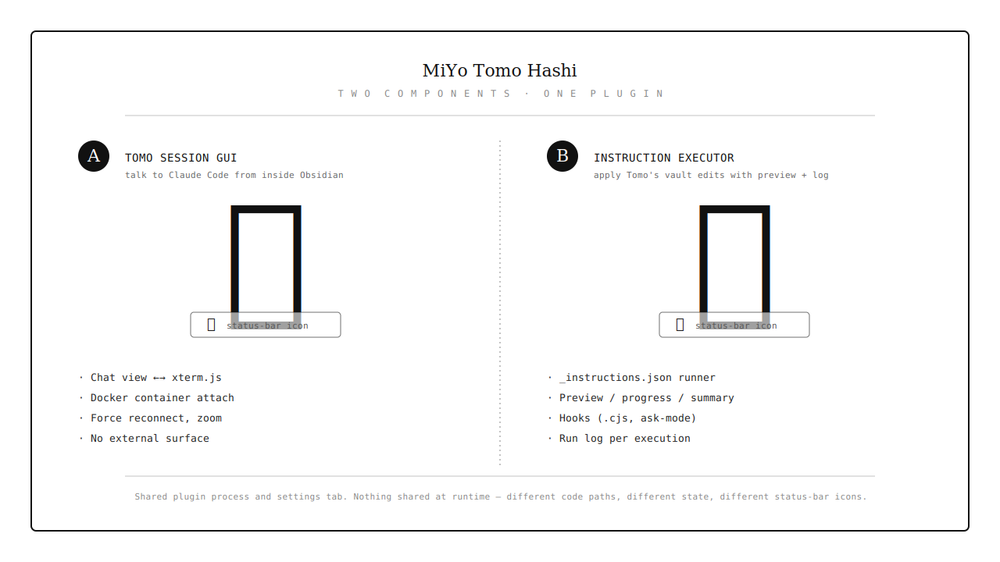
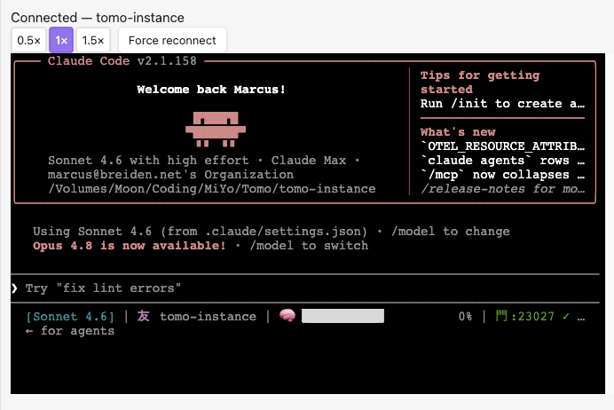
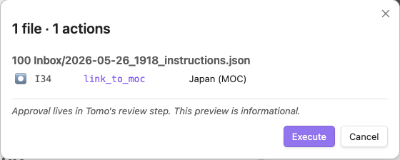

  

# MiYo Tomo Hashi — Obsidian ↔ Tomo Bridge

Three things in one Obsidian plugin:

- **A** — A live chat tab that attaches to a running [Tomo](https://github.com/MMoMM-org/miyo-tomo) Docker container. Talk to Claude Code from inside Obsidian.
- **B** — An instruction executor that runs `_instructions.json` files Tomo emits, applying batch vault edits with full preview, run logs, and idempotent re-runs.
- **C** — An IDE Bridge that gives Claude Code (running in your Tomo container) live editor context — active file, cursor position, and current selection — over a localhost WebSocket. Disabled by default; opt-in.

> Part of the **MiYo** family. The plugin is referred to as **MiYo Tomo Hashi** in the Obsidian community-plugin index and in the settings UI; "Hashi" alone is used as a short form throughout this README and the source. 橋 means *bridge*.

  

## Why MiYo Tomo Hashi?

Tomo (Claude Code) generates a lot of vault-shaped output — MOCs to create, notes to move, daily logs to update — and Tomo's review step is where you decide *what* to apply. Hashi is what runs the apply step, with two opinions baked in:

- **Apply happens locally, with a preview.** Nothing in your vault changes until you've seen the action list. Even auto-run mode shows the preview *first*, just without blocking. And if you have the peace of mind.. Tomo Hashi even does everything in the background.. your choice.
- **Re-running is safe.** Every action has an idempotency probe. Hashi writes `applied: true` next to each action it commits, so a re-trigger picks up where it stopped — after a crash, after manual cleanup, after a partial cancellation.

If you're already using Tomo for inbox processing or daily-note summaries, Hashi turns its review-output into one click.

## Three components, one plugin

  

All three components share the plugin process and the settings tab, but **nothing else**. You can use Hashi for instruction sets without ever connecting to a Tomo container, enable the IDE Bridge without using the chat view, or use any combination independently. See [How It Works](docs/how-it-works.md) for the architectural boundary.

## Features

### A — Tomo session GUI

- **Unified chat tab** rendering the Tomo container's TUI via xterm.js
- **Bidirectional input** — type directly into the terminal; `@file` references are injected into the session via the file-menu action
- **Connection state** in the status bar (友) and chat-view header
- **Force reconnect** with fixed-schedule backoff (5 attempts, 15.5 s budget)
- **Auto-reconnect on plugin load** — by container label, with a Notice telling you which one
- **Zoom controls** (0.5× / 1× / 1.5×), persisted across reloads
- **Sync-aware** — the persisted instance name handles Obsidian Sync correctly (with a visible warning)
- **No external surface** — Docker socket is *outbound only*, no ports opened

### C — IDE Bridge (ambient editor context for Tomo)

- **Localhost WebSocket server** bound to `127.0.0.1` (default port `23027`, configurable). Loopback-only — not reachable from any other host.
- **Claude Code IDE protocol** — gives Claude Code in your Tomo container live ambient context: the active file path (vault-relative), cursor position, and currently selected text.
- **Disabled by default** (`ideBridgeEnabled: false`). Enable it in **Settings → MiYo Tomo Hashi → IDE Bridge** and copy the generated token + port into your Tomo settings.
- **Auth-gated** — the `x-claude-code-ide-authorization` bearer token is checked before the WebSocket handshake completes; wrong or missing token gets HTTP 401.
- **Tomo handles its side** — after you copy the token and port into Tomo, Tomo writes the container-side discovery lock file. Hashi doesn't touch that side.
- **Ephemeral only** — the bridge streams editor state live; nothing it sends is logged or persisted.

### B — Instruction executor

- **Three execution modes**: Confirm before run / Auto-run with preview / Silent
- **Preview → progress → summary** modal, all stages in one Modal instance (no flicker)
- **Idempotent re-runs** with a partial-resume banner ("N of M remaining (X already applied)")
- **Per-run log** as a markdown file in your inbox folder, with retention policy
- **Status bar 橋** indicator (idle / running / error)
- **Path safety** — `.obsidian/`, `.git/`, `.trash/`, hooks dir, and traversal-escape paths are denied
- **Optional hooks** — `.cjs` files in your vault, full plugin privilege, with an ask-mode disclosure modal
- **Schema validation** — vendored Tomo schema, ajv-compiled at module load
- **9 action kinds** — create_moc, move_note, link_to_moc, add_relationship, update_tracker, update_log_entry, update_log_link, delete_source, skip

## Documentation

| Document | Audience | Content |
|---|---|---|
| [Installation](docs/installation.md) | Everyone | Community Plugins, BRAT, manual install |
| [Configuration](docs/configuration.md) | Vault owners | Settings reference, both components |
| [How It Works](docs/how-it-works.md) | Vault owners | Two-component architecture, layer boundaries |
| [Session View](docs/session-view.md) | Tomo users | Chat tab, terminal, zoom, file-prefill — branch A |
| [Connection](docs/connection.md) | Tomo users | Picker, reconnect schedule, status bar 友 — branch A |
| [Instruction Executor](docs/instruction-executor.md) | Tomo users | Modal stages, modes, partial-resume, status bar 橋 — branch B |
| [Action Reference](docs/action-reference.md) | Tomo users | All 9 action kinds with idempotency rules — branch B |
| [Hooks](docs/hooks.md) | Power users | `.cjs` hook authoring, policy, disclosure modal — branch B |
| [Run Log](docs/run-log.md) | Vault owners | Log format, retention, hook output — branch B |
| [Development](docs/development.md) | Contributors | Build, test, lint, architecture, test vault |

## Quick start — A — Tomo session GUI

1. [Install the plugin](docs/installation.md)
2. Start a Tomo container with the right label (`docker run --label miyo.tomo.role=session …`)
3. **Settings → MiYo Tomo Hashi → Connect** → pick the container in the picker
4. The chat view opens automatically; type to interact, watch Claude Code's TUI render inline

> Screenshot — chat view connected, Claude Code's TUI visible in the terminal area.

  

## Quick start — B — Instruction executor

1. [Install the plugin](docs/installation.md)
2. **Settings → MiYo Tomo Hashi → Tomo inbox folder** → set your inbox path (e.g., `100 Inbox`)
3. Drop an `_instructions.json` from Tomo into that folder
4. **Command palette → "Execute instructions document"** → review the action list → **Execute**
5. Watch progress; check the run log file (`tomo-hashi-run-log_…md`) afterwards

> Screenshot — execution modal at the preview stage, actions grouped by source file, **Execute** button.

  

## Screenshots

### Settings

> Screenshot — full settings tab with both sections expanded.

  

### Execution flow

> Screenshot — progress view with rows partway through, glyphs animating, sticky error banner.

  

> Screenshot — summary view with stats line and View errors button.

  

### Hook disclosure

> Screenshot — hook disclosure modal asking the user whether to enable a hook (Disable focused as safe default).

  

## Roadmap

- **Granular hook policy** — per-hook enable/disable persistence (currently session-scoped after the disclosure-modal decision).
- **Action: copy_note** — explicit copy variant of `move_note`.
- **Rollback hint** — when a run halts mid-way, surface a `git restore`-style suggestion in the summary.
- **Mobile compatibility** — currently `isDesktopOnly: true` because of Docker socket and Node `fs` use. Mobile would need a non-Docker transport or drop the Tomo Chat interface. Let me know.

## Known edge cases

- **Auto-reconnect across Obsidian Sync devices.** The persisted `chosenInstanceName` is replicated by Sync. On a second device, the auto-attach may land on a same-labelled but unrelated container. Hashi shows a Notice naming the instance it just attached to so a wrong-container connect is detectable.

## Part of MiYo

Hashi is part of **MiYo**, a small family of Obsidian-adjacent tools focused on giving you control over what your assistants can see and do.

- [**MiYo Kado**](https://github.com/MMoMM-org/miyo-kado) — security-first MCP gateway. The *external-inbound* surface for AI assistants. Default-deny, per-key scopes, audit log.
- [**MiYo Tomo**](https://github.com/MMoMM-org/miyo-tomo) — Claude Code AI workflows. The session you talk to from Hashi's chat view, and the source of the `_instructions.json` Hashi runs.
- **MiYo Tomo Hashi** — *this plugin*. Paired with Tomo. Outbound Docker socket + optional loopback IDE Bridge; no external surface off-host.

Scope boundary: Kado is the only external-inbound vault surface in the MiYo family. Hashi's IDE Bridge is an **opt-in loopback-only** inbound surface (`127.0.0.1`, disabled by default) for its single consumer — Claude Code in your local Tomo container. It is not reachable from any other host and exposes no vault read/write capability (that's Kado's domain).

## Privacy

See [PRIVACY.md](PRIVACY.md) for the full statement. Short version: nothing leaves your machine. No telemetry, no crash reports, no third-party services.

## Support

If MiYo Tomo Hashi is useful and you want to help me keep building, you can support development via:

- [Buy Me a Coffee](https://ko-fi.com/mmomm)
- [GitHub Sponsors](https://github.com/sponsors/MMoMM-org)

Issues and pull requests are also very welcome.

## Contributing

See the [Development Guide](docs/development.md) for build, test, and lint commands. Short version:

1. **Open an issue first** for non-trivial work so we can align on scope.
2. **Fork & branch** from `main` with a descriptive name (`fix/<thing>`, `feat/<thing>`).
3. **Keep changes focused** — one feature or one fix per PR.
4. **Tests & lint must pass** — `npm run build`, `npm test`, `npm run lint`.
5. **Conventional commits** — release notes are generated from commit history.
6. **Open a PR** against `main` and reference the issue.

For security issues, please **do not** open a public issue — email marcus@mmomm.org instead.

## License

[MIT](LICENSE)
