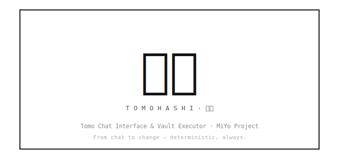

<p align="center">
  
</p>

# MiYo Tomo Hashi

Direct integration with Tomo (Claude Code) sessions for session interaction and automated vault updates

<p align="center">
  
</p>

## Installation

### Community Plugins (after listing)
1. Open Obsidian Settings → Community Plugins
2. Search for "MiYo Tomo Hashi"
3. Install and enable

### Manual
1. Download `main.js`, `manifest.json`, and `styles.css` from the [latest release](https://github.com/MMoMM-org/miyo-tomo-hashi/releases/latest)
2. Create folder `<vault>/.obsidian/plugins/miyo-tomo-hashi/`
3. Copy the downloaded files into that folder
4. Restart Obsidian and enable the plugin

### BRAT (Beta)
1. Install [BRAT](https://github.com/TfTHacker/obsidian42-brat)
2. Add beta plugin: `MMoMM-org/miyo-tomo-hashi`

## What it does

MiYo Tomo Hashi is the **executor** half of a Tomo→Obsidian workflow.
After a Tomo session emits an `_instructions.json` (e.g., from inbox-processing review),
this plugin runs those instructions against your vault: creates MOCs,
moves notes, updates daily logs, links new notes into existing MOCs,
deletes processed sources. You always get a preview before anything is
written, watch progress in real time, and get a per-run log file for
inspection.

The plugin **never runs automatically** — only on explicit user action.
Approval lives upstream in Tomo's review step; Hashi's preview is
informational, not an approval gate.

## Quick start

1. Settings → Community plugins → MiYo Tomo Hashi → enable
2. Settings → MiYo Tomo Hashi → set **Tomo inbox folder** (e.g., `100 Inbox`)
3. Open command palette → **Execute instructions document**
4. Review the action list in the modal → click **Execute**
5. Check the run log file (`tomo-hashi-run-log_YYYY-MM-DDTHHMM.md`)
   that appears alongside your `_instructions.json`

## How to run

| Trigger | Behavior |
| --- | --- |
| Command palette **Execute instructions document** with an `_instructions.json` or its `.md` peer active | Runs against that single set |
| Command palette with no relevant file active | Batch — runs every `*_instructions.json` in your configured inbox folder |
| Right-click on a `.md` peer in the file explorer → **Execute instructions…** | Same as palette + active peer |

## Execution modes

Settings → MiYo Tomo Hashi → **Execution mode**:

| Mode | Behavior |
| --- | --- |
| **Confirm before run** *(default)* | Modal opens with action preview. Click **Execute** to proceed; **Cancel** anytime. |
| **Auto-run with preview** | Modal opens AND execution starts immediately. You can watch progress and **Cancel** mid-run. |
| **Silent** | No modal. A Notice summarizes the result on completion. The run log file records everything. |

## Symbol legend during a run

Five glyphs appear across the preview, progress, and summary views:

| Symbol | Meaning | Where it appears |
| :---: | --- | --- |
| **✓** | **Applied** — action succeeded; vault was modified | Per-row glyph (progress + summary); summary stats |
| **✗** | **Failed** — action returned an error; nothing committed for that action | Per-row glyph; summary stats |
| **⊘** | **Skipped** — action did not need to run, or was preempted | Per-row glyph; summary stats |
| **⏺** | **Pending** — action queued, not yet executed | Per-row glyph (preview + progress) |
| **⟳** | **Running** — action currently executing | Per-row glyph for the current action |

The summary stats line at the end of a run reads:

> ✓ *applied* · ⊘ *skipped* · ✗ *failed* (*duration* s)

### What "Skipped" (⊘) means in detail

Three sub-categories all roll up into the ⊘ count:

- **`skipped-already`** — the action's target state is already in place
  (the bullet is already in the MOC, the tracker field is already set
  to the target value, the source file is already trashed, …).
  Re-running an instruction set is therefore safe — this is idempotency
  working correctly.
- **`skipped-dependency`** — a `link_to_moc` references a MOC whose
  earlier `create_moc` failed; the dependent link is not attempted
  (halt-on-dependency).
- **`skipped-cancelled`** — you clicked Cancel during a run; the
  in-flight action commits, all remaining actions are recorded as
  cancelled.

The run log records the specific sub-category per action.

## Reading the modal

**Preview** (before the run starts):
- Every action grouped by source file
- Banner "*N* of *M* remaining (*X* already applied — re-run safe)" for
  partial-resume runs
- **Execute** + **Cancel** buttons; footer:
  *"Approval lives in Tomo's review step. This preview is informational."*

**Progress** (during the run):
- Each row's glyph updates ⏺ → ⟳ → (✓ / ✗ / ⊘) as actions complete
- A sticky error banner accumulates if anything fails
- **Cancel** halts the run after the current action commits

**Summary** (after the run):
- Stats line `✓ A · ⊘ S · ✗ F (T s)`
- *"Run log: \<filename\>"* reference
- **View errors** button (only when failures > 0) opens the run log
- **Close** dismisses the modal

## Status bar — 橋 indicator

The 橋 (bridge) glyph in your status bar reflects executor state:

| State | Meaning |
| --- | --- |
| **Idle** | No active run, no recent failures |
| **Green** | Run in progress |
| **Red** | Last run had failures (auto-clears after ~10 s, or on next run) |

Hover for tooltip details (action counts during a run, log filename
after a failure). Click during an active run to focus the modal.

## Run log

Every run produces `tomo-hashi-run-log_YYYY-MM-DDTHHMM.md` in your
configured inbox folder, alongside the source `_instructions.json`.

The log contains:
- Header: start/end times, mode, source file(s), per-bucket totals
- Per-action table: `I##` · kind · payload summary · outcome · error
  (when failed)

**Retention** (Settings → Run log retention):
- **Always keep** *(default)* — every run leaves a log file
- **Only after failed runs** — zero-failure runs delete their log at
  the end (cuts down on inbox noise)

## Partial-resume

If a run was interrupted or you re-trigger after some actions already
ran, the modal banner shows *"N of M remaining (X already applied —
re-run safe)"*. Already-applied rows render at reduced opacity with
the ✓ glyph; only the unapplied actions execute. The `_instructions.json`
file is the source of truth — its per-action `applied: true` flag
controls what gets re-tried.

## Hooks (optional, power-user)

Drop Node `.cjs` files in your hooks directory (default
`.tomo-hashi/hooks/`) to extend each action with custom pre/post
logic — e.g., `before-create_moc.cjs`, `after-move_note.cjs`. Hooks
run with full plugin privilege (same trust model as Templater).

**Hook policy** (Settings → Hooks):
- **Disabled** *(safe default — kill switch)* — hooks never run
- **Ask on first use** — disclosure modal lists the hook's path + size
  before first run; you choose Enable / Enable once / Disable
- **Enabled** — hooks run without per-invocation prompts

Hook return shape: `{ info?: string[], warnings?: string[], errors?: string[] }`.
A non-empty `errors` array fails the action.

## Path safety

Actions targeting `.obsidian/`, `.git/`, `.trash/`, the configured
hooks directory, or paths that escape the vault root are rejected
before any write — the deny-list cannot be disabled.

## Troubleshooting

| Symptom | Likely cause / fix |
| --- | --- |
| Notice "Tomo inbox folder not found" | Set the path in Settings → MiYo Tomo Hashi |
| Notice "Tomo inbox is empty" | Your inbox folder has no `*_instructions.json` files; generate a new set in Tomo |
| Modal opens but is empty after a run | Build is older than `f59a89a` (2026-04-30) — update the plugin |
| Links land in `[!connect] Your way around` instead of `[!blocks] Key Concepts` | Build is older than `e227691` (2026-04-30) — update the plugin |
| **View errors** button does nothing | Build is older than `66e068d` (2026-04-30) — update the plugin |
| Action failed *"MOC target missing"* | The MOC referenced by `link_to_moc` is neither in your vault nor created earlier in the same run by `create_moc` — check Tomo's instruction set |
| Action failed *"Inconsistent state — both source and destination present"* | Both the source file in inbox AND the destination already exist; resolve manually before re-running |
| `delete_source` on a file with `:` in its name returns `skipped-already` on platforms other than macOS | Obsidian's `vault.trash()` may not see the file; use a post-hook or trash manually |

## Development

```bash
git clone https://github.com/MMoMM-org/miyo-tomo-hashi.git
cd miyo-tomo-hashi
git config core.hooksPath .githooks
npm install
npm run dev       # Watch mode
npm run build     # Production build
npm test          # Run tests
npm run lint      # Lint
```

## License

MIT - see [LICENSE](LICENSE)
