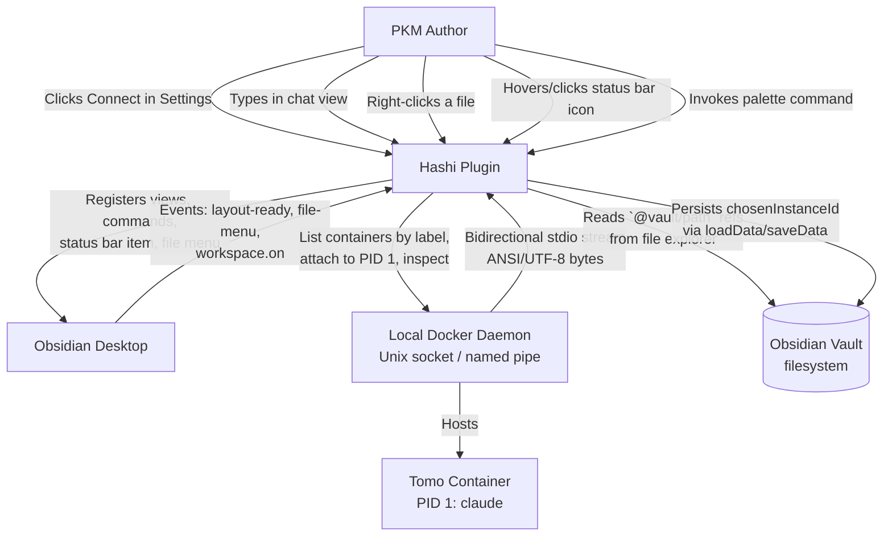
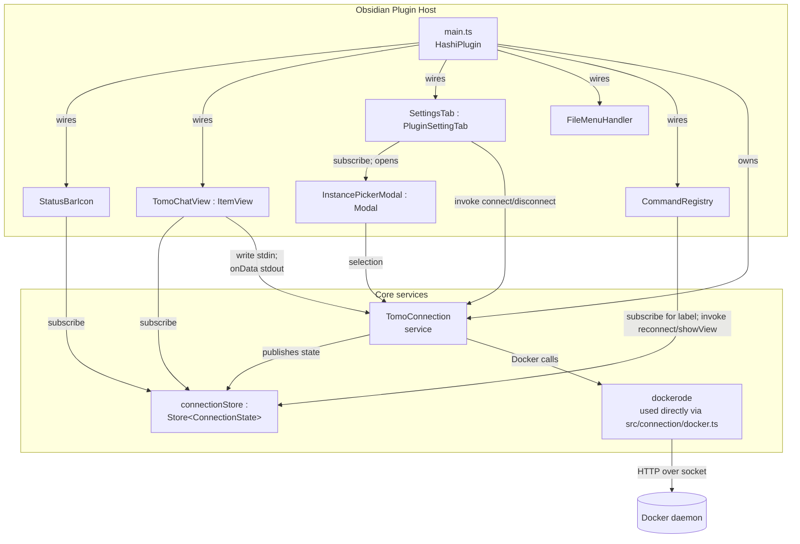
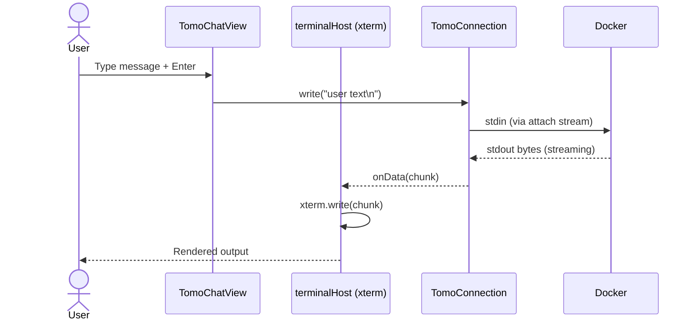
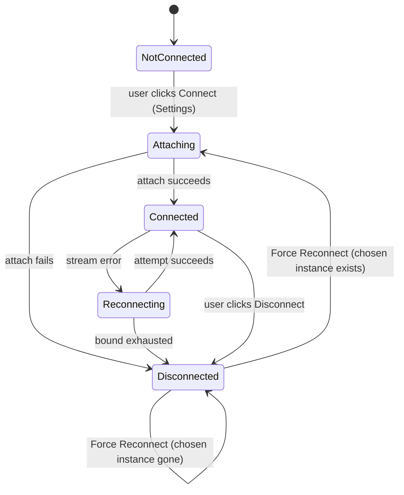

# Solution Design Document

> **Architecture pattern**: Layered plugin with singleton connection service + event-subscribed UI. Key components: TomoConnection (uses dockerode directly), TomoChatView (ItemView), StatusBarIcon, SettingsTab, InstancePickerModal, FileMenuHandler, CommandRegistry, Store helper. External integrations: Docker Engine API (local socket), Obsidian Plugin API. 10 ADRs (5 revised in 2026-04-25 simplification — see §Architecture Decisions).

## Constraints

CON-1 **Platform**: Obsidian Desktop (Electron). TypeScript `strict: true`, `noUncheckedIndexedAccess: true`. Target ES6 (per `tsconfig.json`); `lib: ["DOM", "ES5", "ES6", "ES7"]`. esbuild emits CommonJS to `main.js`. Runtime has full Node.js built-ins plus DOM — we can use `net`, `http`, `stream`, and `process`.
CON-2 **Build**: esbuild with CommonJS output bundled to `main.js`. Externals list excludes `obsidian` and node builtins. xterm.js requires a CSS loader (for `@xterm/xterm/css/xterm.css`). No template/component preprocessor needed — plain TS compiles directly.
CON-3 **Desktop-only enforcement**: `manifest.json` must flip `isDesktopOnly: false → true`. Currently drift (PRD constraint); SDD allocates it to the plan's initial phase.
CON-4 **Testing**: vitest with two configs — unit (`vitest.config.ts`, jsdom, obsidian mock) and live (`vitest.live.config.ts`, node, real Docker). Team feedback memory: **no mocks for the Docker boundary in integration tests** — live tests must hit a real daemon.
CON-5 **No external inbound surface**: no ports, no webhooks, no MCP server. All code runs in-process with the Obsidian plugin.
CON-6 **One connection, one chat view**: enforced at the service layer (connection) and workspace layer (singleton Leaf lookup).
CON-7 **Bundle budget**: informal target ≤ 500 KB minified for `main.js`. xterm.js (~150 KB) + dockerode (~80 KB) + app code fits comfortably (no UI framework runtime per ADR-3 plain TS).
CON-8 **Trust boundary**: all bytes from the container are untrusted text. xterm.js handles them as terminal text — no HTML rendering, no URI handling from stream output.
CON-9 **Tomo handoff dependency**: picker labels and reconnect-command label benefit from Tomo exposing an instance-name Docker label (`miyo.tomo.instance-name=<name>`). PRD mandates graceful fallback if missing; SDD must implement fallback as first-class behavior, not an error path.

## Implementation Context

**IMPORTANT**: The following context sources MUST be read and understood before implementing any component.

### Required Context Sources

#### Documentation Context
```yaml
- doc: docs/XDD/specs/001-session-view/requirements.md
  relevance: CRITICAL
  why: "PRD — every requirement must map to an SDD component or ADR"

- doc: docs/XDD/specs/001-session-view/README.md
  relevance: HIGH
  why: "Scope boundaries and Decisions Log — captures every product decision the SDD must honor"

- doc: docs/XDD/specs/002-instruction-executor/README.md
  relevance: MEDIUM
  why: "Sister spec; confirms 002 is decoupled from 001 — the SDD must not expose shared state to 002"

- doc: src/CLAUDE.md
  relevance: HIGH
  why: "TDD rules — RED/GREEN/REFACTOR; no impl before a failing test"

- doc: test/CLAUDE.md
  relevance: HIGH
  why: "Test naming conventions, coverage expectations, fixture isolation"

- url: https://github.com/apocas/dockerode
  relevance: CRITICAL
  why: "Docker client library — attach API semantics, stream hijack protocol, demuxing stdout/stderr"

- url: https://xtermjs.org/docs/
  relevance: HIGH
  why: "Terminal rendering — lifecycle, addons (fit), DOM binding"

- url: https://docs.obsidian.md/Plugins/
  relevance: HIGH
  why: "Plugin API — ItemView, WorkspaceLeaf singleton patterns, addStatusBarItem, addCommand, Menu, PluginSettingTab"

```

#### Code Context
```yaml
- file: src/main.ts
  relevance: CRITICAL
  why: "Plugin entry point — lifecycle hooks (onload/onunload) where the connection service, chat view, status bar, commands, and file menu handler are wired"

- file: src/settings/SettingsTab.ts
  relevance: HIGH
  why: "Will be rewritten to build Connect/Disconnect UI directly in `display()` using Obsidian's native `Setting` API"

- file: src/types/index.ts
  relevance: HIGH
  why: "Will be expanded — PluginSettings gets chosenInstanceId; domain types (ConnectionState, TomoInstance) added or moved to dedicated modules"

- file: esbuild.config.mjs
  relevance: HIGH
  why: "Build config — must add a loader for xterm.css; no preprocessor plugin needed for plain TS"

- file: tsconfig.json
  relevance: HIGH
  why: "Strict mode constraints; baseUrl='src' allows bare imports like `connection/TomoConnection`"

- file: manifest.json
  relevance: CRITICAL
  why: "`isDesktopOnly: false` MUST flip to `true` per PRD constraint"

- file: package.json
  relevance: HIGH
  why: "Runtime deps to add: dockerode, @xterm/xterm, @xterm/addon-fit. DevDeps to add: @types/dockerode"

- file: test/__mocks__/obsidian.ts
  relevance: HIGH
  why: "Mock must be extended — ItemView, WorkspaceLeaf, Menu, Events/EventRef; add as needed during implementation"

- file: vitest.config.ts + vitest.live.config.ts
  relevance: HIGH
  why: "Two test surfaces — unit (mocked obsidian) and live (real Docker). Connection service unit-tested; docker attach live-tested."
```

#### External APIs
```yaml
- service: Docker Engine API
  doc: https://docs.docker.com/engine/api/v1.45/
  relevance: HIGH
  why: "Endpoints used: GET /containers/json?filters={label: miyo.component=tomo}, POST /containers/{id}/attach?stream=1&stdout=1&stderr=1&stdin=1&logs=0, GET /containers/{id}/json (inspect for labels/started-at). Accessed via dockerode, not raw HTTP."

- service: Obsidian Plugin API
  doc: https://docs.obsidian.md/Reference/TypeScript+API/
  relevance: HIGH
  why: "WorkspaceLeaf, ItemView, PluginSettingTab, addStatusBarItem, addCommand (incl. removeCommand for dynamic relabeling), Menu, Notice, registerEvent('file-menu')"
```

### External Interfaces

#### System Context Diagram



#### Interface Specifications

```yaml
inbound:
  - name: "User → Settings Tab"
    type: Obsidian PluginSettingTab
    format: DOM events (click, focus)
    authentication: Trusted (plugin owner)
    data_flow: "Connect/Disconnect clicks; picker selection"

  - name: "User → Command Palette"
    type: Obsidian Command (via addCommand)
    format: Command invocation callback
    authentication: Trusted
    data_flow: "Reconnect, Show chat window"

  - name: "User → Status Bar Icon"
    type: HTMLElement click/hover on addStatusBarItem
    format: DOM events
    authentication: Trusted
    data_flow: "Hover → tooltip render; click → Menu popover"

  - name: "User → File Explorer Context Menu"
    type: Obsidian 'file-menu' workspace event
    format: Menu item callback with TFile argument
    authentication: Trusted
    data_flow: "Right-click on any file → insert/open chat with @file"

  - name: "User → Chat View"
    type: Obsidian ItemView
    format: DOM events in chat input; terminal keyboard events routed to xterm
    authentication: Trusted
    data_flow: "Chat input keystrokes → Docker stdin"

outbound:
  - name: "Docker Engine API"
    type: Unix domain socket / Windows named pipe (macOS: Docker Desktop socket; Linux: /var/run/docker.sock; Windows: \\.\pipe\docker_engine)
    format: HTTP over socket (dockerode handles protocol + stream hijack)
    authentication: OS file permissions (user must have socket access)
    criticality: HIGH
    data_flow: "List containers with label filter; attach to container stdio; inspect for metadata"
    transport_pinning: "TomoConnection MUST construct dockerode with an explicit `socketPath` and SHALL NOT honor `DOCKER_HOST`, `DOCKER_CONTEXT`, or `~/.docker/config.json` context files. Rationale: a stale `DOCKER_HOST=tcp://…` in the user's shell profile would otherwise silently route Hashi to a remote daemon, contradicting the PRD constraint 'local Docker daemon socket only in v0.1'. If the platform-default socket is unreachable, the named error is `daemon-unreachable` — there is no fallback to TCP."

  - name: "Obsidian Persistence"
    type: Plugin loadData/saveData
    format: JSON blob (PluginSettings)
    authentication: Sandboxed to plugin
    criticality: LOW
    data_flow: "Persist chosenInstanceId (FS2) across Obsidian launches"

data:
  - name: "Obsidian Vault (filesystem)"
    type: Not directly accessed by 001 beyond reading file paths (read-only; spec 002 does the vault writes)
    connection: Obsidian Plugin API (app.vault)
    data_flow: "File-menu handler receives TFile; we only read its path (`file.path`) to build the `@`-mention. No content is read."
```

### Cross-Component Boundaries

- **API Contract (internal, 001 ↔ 002)**: **None.** Per PRD brainstorm pivot, spec 002 runs standalone. The only shared artifact is the Tomo Docker label contract (`miyo.component=tomo`, `miyo.tomo.instance-name=...`), and even that is consumed only by 001.
- **Shared Resources**: `src/types/index.ts` may hold plugin-wide settings types; 002 will add its own types in a sibling module. No shared state.
- **Breaking Change Policy**: 001's internal modules are not public — no external consumer. Breaking changes within 001 are free until release.

### Project Commands

```bash
# Discovered from package.json
Install: npm install
Dev:     npm run dev          # esbuild watch mode (unbundled, inline sourcemap)
Build:   npm run build        # tsc --noEmit + esbuild production
Test:    npm test             # vitest unit (jsdom, obsidian mock)
Test-watch: npm run test:watch
Coverage: npm run test:coverage
Test-live: npm run test:live  # vitest live (node env, REAL Docker, 90s timeout)
Lint:    npm run lint         # ESLint with obsidianmd rules
```

## Solution Strategy

- **Architecture Pattern**: **Layered plugin with singleton connection service and event-subscribed UI**. One `TomoConnection` singleton owns all Docker I/O and state; every UI surface (Settings, status bar, chat view, commands) subscribes to a typed `Store<ConnectionState>` helper that mirrors the service state; the file menu handler and command registry are thin shims over the service.
- **Integration Approach**: All Docker work happens in the connection service. UI layers are pure state consumers — they do not call dockerode directly and do not hold connection state themselves. This keeps reconnect logic, backoff, and state transitions in one place.
- **Justification**: One connection → one source of truth. Multi-surface UI (Settings + status bar + chat view + palette command label) demands a shared reactive state. A small typed `Store<T>` helper (~30 LOC) is sufficient for the few reactive surfaces involved — no framework runtime needed. Keeping Docker I/O confined to `src/connection/docker.ts` makes the unit-test surface small (`vi.mock('dockerode')` at the test boundary); real Docker is reached only in `test:live`.
- **Key Decisions** (full rationale in Architecture Decisions section):
  - ADR-1 Docker client = **dockerode** (confirmed)
  - ADR-2 Attach mechanism = **`docker attach` to PID 1 + xterm.js** (confirmed)
  - ADR-3 UI approach = **Plain TypeScript + DOM via Obsidian primitives** (confirmed)
  - ADR-4 State store = **Custom typed `Store<T>` helper** (confirmed)
  - ADR-5 Layer boundary = **Ports & adapters at the Docker edge** (confirmed)
  - ADR-6 Singleton view management = **Obsidian `getLeavesOfType` + `setViewState`** (confirmed)
  - ADR-7 Reconnect backoff = **Cancellable promise-chain with explicit delays** (confirmed)
  - ADR-8 Dynamic command label = **`removeCommand` + `addCommand` on state change** (confirmed)
  - ADR-9 Status bar popover = **Obsidian `Menu` API** (confirmed)
  - ADR-10 Test split = **vitest unit for state/logic; vitest live for Docker** (confirmed)

## Building Block View

### Components



### Directory Map

```
.
├── src/
│   ├── main.ts                              # MODIFY: plugin entry; wire everything on onload
│   ├── types/
│   │   └── index.ts                         # MODIFY: PluginSettings (chosenInstanceId)
│   ├── connection/                          # NEW: core service + types
│   │   ├── TomoConnection.ts                # NEW: the service (state machine, reconnect orchestration, stream plumbing)
│   │   ├── connectionStore.ts               # NEW: `Store<ConnectionState>` instance + derived slices (displayInstanceName, kind)
│   │   ├── state.ts                         # NEW: ConnectionState discriminated union + transition helpers
│   │   ├── reconnectLoop.ts                 # NEW: cancellable backoff loop (extracted from service for testability)
│   │   └── types.ts                         # NEW: TomoInstance, ConnectionError
│   ├── docker/                              # NEW: Docker boundary (port + adapter)
│   │   └── docker.ts                        # NEW: thin dockerode wrapper used by TomoConnection (no port); exports listTomoInstances, attach, inspect helpers and the AttachSession type. Unit tests use vi.mock('dockerode').
│   ├── ui/
│   │   ├── chat-view/
│   │   │   ├── TomoChatView.ts              # NEW: Obsidian ItemView subclass; builds DOM in onOpen; owns xterm.js instance; subscribes to connectionStore
│   │   │   ├── terminalHost.ts              # NEW: xterm.js lifecycle helper (init, write, resize, dispose)
│   │   │   └── index.ts                     # NEW: VIEW_TYPE_TOMO_CHAT constant + export of TomoChatView
│   │   ├── status-bar/
│   │   │   ├── StatusBarIcon.ts             # NEW: registers status bar item; renders Tomo-kanji icon + hover tooltip; opens popover on click; subscribes to connectionStore
│   │   │   └── openPopover.ts               # NEW: builds Obsidian `Menu` with 3 actions
│   ├── settings/                              # NOTE: outside src/ui/ — matches the existing repo path src/settings/ used by spec 002
│   │   ├── SettingsTab.ts                   # MODIFY: Connect/Disconnect UI built directly in display() with Obsidian `Setting` API; subscribes to connectionStore for live state
│   │   └── InstancePickerModal.ts           # NEW: Obsidian `Modal` subclass listing candidates (name + uptime rows); resolves on selection
│   ├── commands/
│   │   ├── registerCommands.ts              # NEW: addCommand() for 3 Hashi commands + dynamic relabel of Reconnect (removeCommand/addCommand on state change)
│   │   └── fileMenu.ts                      # NEW: registerEvent('file-menu') → inject @file action
│   └── util/
│       ├── store.ts                         # NEW: `Store<T>` — ~20 LOC typed observable helper (no `derived` — dropped from v0.1)
│       ├── time.ts                          # NEW: formatUptime(startedAt) → "3 min ago"
│       └── logger.ts                        # NEW: thin console.debug wrapper tagged with [miyo-tomo-hashi]
├── test/
│   ├── unit/
│   │   ├── connection/
│   │   │   ├── TomoConnection.test.ts       # NEW
│   │   │   ├── state.test.ts                # NEW (transition table)
│   │   │   └── reconnectLoop.test.ts        # NEW (incl. cancel-during-wait case traced in this SDD)
│   │   ├── commands/
│   │   │   └── registerCommands.test.ts     # NEW (dynamic label re-register)
│   │   ├── util/
│   │   │   ├── store.test.ts                # NEW (subscribe/unsubscribe; identity equality; derived)
│   │   │   └── time.test.ts                 # NEW
│   │   └── ui/
│   │       └── status-bar/
│   │           └── openPopover.test.ts      # NEW (popover action routing; disabled tooltip)
│   ├── live/                                # Run via `npm run test:live`; hits real Docker
│   │   ├── attach.live.test.ts              # NEW: attach to a disposable `alpine:latest` running `cat` to echo stdio
│   │   └── discovery.live.test.ts           # NEW: list containers by label; multi-candidate case
│   └── __mocks__/
│       └── obsidian.ts                      # MODIFY: extend with ItemView, WorkspaceLeaf, Menu, Modal, EventRef stubs
├── esbuild.config.mjs                       # MODIFY: add CSS loader for @xterm/xterm/css/xterm.css
├── manifest.json                            # MODIFY: isDesktopOnly: true
├── package.json                             # MODIFY: add runtime deps (dockerode, @xterm/xterm, @xterm/addon-fit) + devDeps (@types/dockerode)
└── styles.css                               # MODIFY: add minimal rules for chat view, status bar indicator, banner
```

### Interface Specifications

#### Application Data Models

```typescript
// src/connection/state.ts
export type ConnectionState =
  | { kind: "disconnected"; reason?: ConnectionError }
  | { kind: "attaching"; target: TomoInstance }
  | { kind: "connected"; instance: TomoInstance }
  | { kind: "reconnecting"; target: TomoInstance; attempt: number; nextDelayMs: number }
  | { kind: "error"; error: ConnectionError; lastKnown?: TomoInstance };

// src/connection/types.ts
export interface TomoInstance {
  readonly containerId: string;       // full Docker container ID
  readonly shortId: string;           // first 12 chars (display)
  readonly name: string | null;       // from label miyo.tomo.instance-name; null if absent
  readonly startedAt: Date;           // from container inspect State.StartedAt
  readonly image: string;             // image reference (for diagnostic tooltip only)
}

export type ConnectionError =
  | { code: "daemon-unreachable"; detail: string }
  | { code: "socket-permission-denied"; detail: string }
  | { code: "no-instances"; detail: "No Tomo instance seems to be running — start one and try again." }
  | { code: "attach-failed"; detail: string };  // covers chosen-instance-gone, stream-error, reconnect-exhausted

// Note: picker cancel is NOT an error — `openPicker()` resolves to `null` instead.

// src/types/index.ts (extended)
export interface PluginSettings {
  chosenInstanceId: string | null;    // full container ID; null if never connected
}
export const DEFAULT_SETTINGS: PluginSettings = { chosenInstanceId: null };
```

#### Docker Helpers (no port — use dockerode directly)

```typescript
// src/connection/docker.ts
// Thin wrapper around dockerode used directly by TomoConnection.
// No interface, no adapter, no fake — unit tests use vi.mock('dockerode')
// to script the small handful of methods we touch (listContainers, getContainer,
// container.inspect, container.attach). Live tests exercise the real daemon
// (team standard: no Docker mocks in integration tests; the small mocked surface
// for unit tests is acceptable per ADR-5 v2 trade-off).
export interface AttachSession {
  readonly stdout: NodeJS.ReadableStream;
  readonly stdin: NodeJS.WritableStream;
  close(): Promise<void>;
  onClose(cb: (reason: "user" | "remote" | "error") => void): void;
}
```

#### TomoConnection Service Surface

```typescript
// src/connection/TomoConnection.ts
export class TomoConnection {
  constructor(private settings: PluginSettings);  // imports dockerode helpers directly from "./docker"

  // State access
  get state(): ConnectionState;                // current snapshot

  // User-driven actions
  async openPicker(): Promise<TomoInstance[]>;    // lists candidates (Settings calls this)
  async connect(target: TomoInstance): Promise<void>;  // after picker selection
  async disconnect(): Promise<void>;              // Settings Disconnect
  async forceReconnect(): Promise<void>;          // chat view / palette / status bar popover;
                                                  // NEVER opens picker; stays disconnected on instance-gone

  // Lifecycle
  async autoReconnectIfRemembered(): Promise<void>;  // called once on plugin load
  dispose(): Promise<void>;                          // called from plugin onunload

  // Stream plumbing (chat view uses)
  write(data: string): void;                      // to stdin; throws if not connected
  onData(cb: (chunk: Uint8Array) => void): Disposable;  // from container stdout

  // Dynamic label helper (command registry subscribes)
  get instanceName(): string | null;              // from state; for command palette label
}
```

#### State Store (typed Store<T> helper)

```typescript
// src/util/store.ts  — ~25 LOC, zero deps
// No `Readable<T>` interface, no `derived<T,U>` — both dropped per ADR-4 v3
// (2026-04-25 simplification). Subscribers compute derived values inline.
export class Store<T> {
  private listeners = new Set<(value: T) => void>();
  constructor(private value: T) {}

  get(): T { return this.value; }

  set(next: T): void {
    if (Object.is(this.value, next)) return;               // identity-based dedup
    this.value = next;
    for (const listener of this.listeners) listener(next);
  }

  subscribe(listener: (value: T) => void): () => void {
    listener(this.value);                                  // fire immediately, matches Svelte/Obsidian conventions
    this.listeners.add(listener);
    return () => { this.listeners.delete(listener); };
  }
}
```

```typescript
// src/connection/connectionStore.ts
import { Store } from "util/store";
import type { ConnectionState } from "./state";

// Singleton store. TomoConnection (the only writer) imports this directly and
// calls .set(); UI surfaces import it and call .subscribe(). No read/write split,
// no derived helper — derived values are computed inline by subscribers when needed.
export const connectionStore = new Store<ConnectionState>({ kind: "disconnected" });

// Inline helpers (plain functions, no store wrapping):
export function displayInstanceName(state: ConnectionState): string | null {
  if (state.kind === "connected") return state.instance.name ?? state.instance.shortId;
  if (state.kind === "reconnecting" || state.kind === "attaching") return state.target.name ?? state.target.shortId;
  return null;
}
```

**Write discipline**: `connectionStore` exposes `set` directly. The "only `TomoConnection` writes" rule is enforced by code review, not type-level ceremony — the project is small enough that a `Store<T>` + naming convention beats a sealed-writer abstraction. `derived<T,U>` was considered and dropped: the two derived slices (`kind`, `displayInstanceName`) are plain functions called inside subscribers, no need for a second-order observable.

**Subscribe-fires-immediately** matches how Obsidian consumers expect state: a subscriber that registers mid-session should render the current state instantly, not wait for the next change. It also aligns with `plugin.register(unsubscribe)` — the unsubscribe is returned directly and teardown is automatic on plugin unload.

#### Data Storage Changes

```yaml
# Plugin data (Obsidian loadData/saveData)
PluginSettings:
  + chosenInstanceId: string | null    # full container ID; persisted on successful connect; persisted across sessions; not cleared on Disconnect (FS2 semantics)
```

No vault file writes. No new Obsidian settings beyond `chosenInstanceId`.

#### Internal API Changes

Not applicable — no HTTP/RPC endpoints; all integration is in-process function calls through `TomoConnection` and the typed `Store<T>` helper (per ADR-3 plain TS + ADR-4 custom store).

#### Integration Points

```yaml
# Docker Engine API (via dockerode)
Docker_Engine:
  - doc: https://docs.docker.com/engine/api/v1.45/
  - ops_used:
      list_containers: GET /containers/json?filters={"label":["miyo.component=tomo"]}
      inspect: GET /containers/{id}/json
      attach: POST /containers/{id}/attach?stream=1&stdout=1&stderr=1&stdin=1&logs=0&tty=1
  - integration: "dockerode wraps each op; attach returns a node Duplex on which reads are TTY-framed (when tty=true in run-time config) or multiplexed frames (when tty=false). Tomo containers are expected to run with tty=true (claude is a TUI); dockerode demuxes accordingly. If the container was started without tty, we receive multiplexed frames and dockerode exposes `modem.demuxStream()` — the adapter handles both cases."
  - critical_data: container labels, container id, started_at timestamp

# Obsidian Plugin API (in-process)
Obsidian:
  - doc: https://docs.obsidian.md/Reference/TypeScript+API/
  - ops_used:
      Plugin.onload / onunload / loadData / saveData
      Plugin.addStatusBarItem()
      Plugin.addCommand() / removeCommand()       # removeCommand supports dynamic relabel
      Plugin.addSettingTab()
      Plugin.registerView(VIEW_TYPE_TOMO_CHAT, leaf => new TomoChatView(leaf, plugin))
      Plugin.registerEvent(app.workspace.on('file-menu', handler))
      app.workspace.getLeavesOfType(VIEW_TYPE_TOMO_CHAT)   # singleton lookup
      app.workspace.getRightLeaf(false) / getLeaf('tab')   # placement
      app.workspace.setActiveLeaf()
      Menu (for status bar popover)
      Notice (for pre-view errors when chat view is closed)
      PluginSettingTab
```

### Implementation Examples

#### Example: Reconnect Backoff

**Why this example**: PRD Feature F8 mandates 5 attempts with exponential backoff (500 ms, 1 s, 2 s, 4 s, 8 s). The non-obvious part is cancellation — the user can trigger Disconnect or Force Reconnect mid-backoff, and the pending delay must cancel cleanly without firing a late retry.

```typescript
// src/connection/reconnectBackoff.ts (conceptual — actual code may refactor further)
const DELAYS_MS = [500, 1000, 2000, 4000, 8000] as const;

export class ReconnectLoop {
  private cancelled = false;
  private currentTimer: NodeJS.Timeout | null = null;

  async run(
    attempt: (attemptNumber: number) => Promise<boolean>,   // returns true on success
    onAttempt: (attemptNumber: number, nextDelayMs: number) => void,
  ): Promise<"success" | "exhausted" | "cancelled"> {
    for (let i = 0; i < DELAYS_MS.length; i++) {
      if (this.cancelled) return "cancelled";
      const delay = DELAYS_MS[i]!;                            // non-null per noUncheckedIndexedAccess; bounded loop
      onAttempt(i + 1, delay);
      await this.wait(delay);
      if (this.cancelled) return "cancelled";
      const ok = await attempt(i + 1);
      if (ok) return "success";
    }
    return "exhausted";
  }

  cancel(): void {
    this.cancelled = true;
    if (this.currentTimer) { clearTimeout(this.currentTimer); this.currentTimer = null; }
  }

  private wait(ms: number): Promise<void> {
    return new Promise(resolve => {
      this.currentTimer = setTimeout(() => { this.currentTimer = null; resolve(); }, ms);
    });
  }
}
```

**Implementation gotcha**: `cancel()` must also resolve the pending `wait()` so the loop head's cancellation check runs immediately — store the `resolve` function and call it from `cancel()`. Without this, a Disconnect during backoff leaves the wait promise unresolved (resource leak). Tests must cover the cancel-during-wait case explicitly.

**Edge cases**:
- Cancel fires after `attempt()` resolves but before the loop iterates — the `cancelled` check at loop head covers this.
- Multiple concurrent `run()` calls — `ReconnectLoop` is per-reconnect-session; `TomoConnection` creates a fresh instance each time it enters Reconnecting state, and cancels the prior one.
- Network-gone and recovered mid-backoff — attempt returns `false`, loop continues normally; no special handling needed.

#### Example: Dynamic Command Label

**Why this example**: Obsidian's command registry does not natively support renaming a registered command. PRD F6 requires the palette to show "Tomo Hashi: Reconnect to `<instance-name>`" with the name pulled from state. We implement this with `removeCommand` + `addCommand` on every state change where the display name would differ.

```typescript
// src/commands/registerCommands.ts
import type { Plugin } from "obsidian";
import { displayInstanceName } from "connection/connectionStore";

export function registerReconnectCommand(plugin: Plugin, onInvoke: () => Promise<void>): void {
  const RECONNECT_ID = "reconnect-to-tomo";
  let currentLabel = "";

  const install = (name: string | null): void => {
    const label = name ? `Reconnect to ${name}` : "Reconnect to Tomo";
    if (label === currentLabel) return;
    if (currentLabel) plugin.removeCommand(RECONNECT_ID);
    plugin.addCommand({ id: RECONNECT_ID, name: label, callback: onInvoke });
    currentLabel = label;
  };

  // subscribe() fires immediately with the current value AND on every change.
  // It returns the unsubscribe; plugin.register() calls it on plugin unload.
  plugin.register(displayInstanceName.subscribe((name) => install(name)));
}
```

**Note**: Obsidian prefixes commands with the plugin's `name` from `manifest.json` automatically, so the user sees "MiYo Tomo Hashi: Reconnect to `<name>`". The `name:` in `addCommand` is the suffix only.

`plugin.register(cleanupFn)` is Obsidian's teardown registration — the subscribe's unsubscribe function runs on plugin unload.

## Runtime View

### Primary Flow — Connect (from Settings)

```mermaid
sequenceDiagram
    actor User
    participant S as SettingsTab
    participant C as TomoConnection
    participant D as dockerode
    participant Docker

    User->>S: Click Connect
    S->>C: openPicker()
    C->>D: listTomoInstances()
    D->>Docker: GET /containers/json?filters
    Docker-->>D: [ {id, labels, StartedAt, Image}, ... ]
    D-->>C: TomoInstance[]
    C-->>S: TomoInstance[]
    S->>User: Render picker (name + uptime)
    User->>S: Select instance
    S->>C: connect(instance)
    Note over C: state → attaching
    C->>D: attach(containerId)
    D->>Docker: POST /containers/{id}/attach?tty=1
    Docker-->>D: Duplex stream (stdio)
    D-->>C: AttachSession
    Note over C: state → connected; persist chosenInstanceId
    C->>S: state change (via store)
```

### Primary Flow — Chat Message Send



### Failure Flow — Transient Disconnect → Auto Reconnect → Success

```mermaid
sequenceDiagram
    participant C as TomoConnection
    participant R as ReconnectLoop
    participant D as dockerode
    participant Store as connectionStore

    Note over C: state=connected; stream error event
    C->>Store: state = reconnecting(attempt=1, nextDelayMs=500)
    C->>R: run(attemptFn, onAttempt)
    R->>R: wait(500ms)
    R->>D: attach(containerId)
    D-->>R: throws (daemon not ready)
    R->>R: wait(1000ms)
    R->>D: attach(containerId)
    D-->>R: AttachSession (success)
    R-->>C: "success"
    C->>Store: state = connected
```

### Failure Flow — Chosen Instance Gone on Force Reconnect

```mermaid
sequenceDiagram
    actor User
    participant V as TomoChatView
    participant C as TomoConnection
    participant D as dockerode

    Note over C: state=disconnected (after exhausted reconnect)
    User->>V: Click Force Reconnect
    V->>C: forceReconnect()
    C->>D: inspect(containerId)
    D-->>C: null (container gone)
    C->>C: state = disconnected{reason: chosen-instance-gone}
    Note right of C: Picker NOT opened; user must go to Settings → Connect
    C-->>V: state change → show error in banner
```

### Error Handling

| Error source | Detection | Surface | Recovery |
|---|---|---|---|
| Docker daemon not running | dockerode rejects with ECONNREFUSED / ENOENT on socket | Settings inline (if user-initiated) OR chat-view banner (if passive) OR Notice (if palette) | User starts Docker; clicks Retry/Reconnect |
| Docker socket permission denied | dockerode rejects with EACCES | Settings inline with Linux-specific help text mentioning `docker` group | User adjusts group membership and retries |
| No Tomo instances found | listTomoInstances returns [] | Picker modal shows empty state with plain-English message | User starts a Tomo container and retries |
| Chosen instance gone (on reconnect) | inspect returns null | Chat view banner + status bar icon reflects disconnected; error code distinct | User opens Settings → Connect to pick another |
| Attach stream error mid-session | Node stream 'error' event or 'close' with non-clean reason | Auto-reconnect triggers; if exhausted → Disconnected with `reconnect-exhausted` | User clicks Force Reconnect, or Settings → Connect |
| Picker cancelled by user | User closes modal without selecting | Silent — stays Disconnected | None; next Connect restarts the flow |

### Complex Logic — Discovery result mapping

```
ALGORITHM: listTomoInstances
INPUT: Docker list response (containers with label miyo.component=tomo)
OUTPUT: TomoInstance[]

1. For each container in response:
   a. Extract container.Id (full ID) → containerId
   b. Slice containerId[0..12] → shortId
   c. Look up container.Labels["miyo.tomo.instance-name"]:
      - present and non-empty → name
      - absent or empty → null (picker and command label will fall back to shortId / static "Tomo")
   d. Parse container.State.StartedAt (ISO 8601) → Date startedAt
   e. Use container.Image (string, may be digest or tag) → image
2. Return sorted by startedAt DESC (newest first) so the most recently started instance is first in the picker
```

## Deployment View

### Single Application Deployment

- **Environment**: Obsidian Desktop plugin, loaded from the vault's `.obsidian/plugins/miyo-tomo-hashi/` directory.
- **Configuration**: No environment variables. Plugin data stored via `saveData()` (JSON blob in the vault-local plugin data file).
- **Dependencies**: Local Docker daemon reachable via socket. No network dependencies. No outbound HTTP other than Docker socket.
- **Performance**: Idle CPU near-zero (one attached TCP-over-socket stream, Node event loop). Memory proportional to xterm scrollback buffer (default ~1000 lines; ~100 KB for typical sessions). Plugin bundle ≤ 500 KB minified.
- **Distribution**: Community plugin listing (post-v0.1 release) + manual + BRAT (beta), per `README.md`.

### Rollback Strategy
Plugin disable via Obsidian Settings → Community Plugins is sufficient. No migrations, no external state to unwind.

## Cross-Cutting Concepts

### Pattern Documentation

```yaml
- pattern: "Ports & Adapters (Hexagonal)"
  relevance: HIGH
  why: "Thin dockerode helpers in src/connection/docker.ts — no port; vi.mock('dockerode') at the test boundary keeps the state machine unit-testable without spinning up containers"

- pattern: "Single source of truth with subscribe/teardown"
  relevance: HIGH
  why: "TomoConnection owns state; connectionStore (typed Store<T> helper) mirrors it; all UI subscribes and teardown is the returned unsubscribe. Prevents divergent views across Settings/status bar/chat without a framework runtime."

- pattern: "Obsidian singleton view via getLeavesOfType + setViewState"
  relevance: HIGH
  why: "Ensures the chat view is a singleton across sidebar/main-pane placements (PRD F4)"
```

### User Interface & UX

**Information architecture:**
- Settings: Connect/Disconnect + status. Entry point for picker.
- Status bar: icon-only, hover → tooltip, click → Menu popover.
- Chat view: pane-placeable; status indicator + Force Reconnect + terminal area + chat input.
- File explorer: right-click any file → `@file` action.

**Design system**: Obsidian's own CSS variables (`--background-primary`, `--text-normal`, `--interactive-accent`) for theming consistency. Status bar icon, chat-view indicator, and banner use Obsidian primitives (`setIcon`, CSS classes) — no custom component library. xterm.js uses its own theme object; populate it from Obsidian's CSS custom properties read via `getComputedStyle` on the view root at view-mount time.

**Accessibility:**
- Status bar icon, chat view status indicator, and in-view banner all convey state via shape + text (never color alone).
- Force Reconnect, Connect, Disconnect all keyboard-reachable (Tab order).
- Reduced motion: `@media (prefers-reduced-motion: reduce)` disables transitional animations in status bar icon and chat view indicator.
- ARIA live regions: `role="status"` with `aria-live="polite"` for transitional states (Reconnecting); `aria-live="assertive"` for Disconnected with an error.
- xterm.js ships with ARIA support for the terminal buffer; we keep its default a11y rendering on.

#### UI Visualization

**Status bar icon (entry point):**
```
╭─ Obsidian footer ────────────────────────────────────────╮
│  … other plugins …        友       Word count: 1243      │
╰──────────────────────────────────▲───────────────────────╯
                                  icon: green = connected
                                        amber = reconnecting
                                        grey  = disconnected
```

**Click popover (Obsidian Menu):**
```
      ╭─────────────────────────╮
      │ ↻ Force Reconnect        │
      │ 💬 Open Chat Window      │
      │ ⚙  Go to Settings        │
      ╰─────────────────────────╯
```

**Chat view (pane):**
```
┌─ Tomo Chat ──────────────────────────────── [force reconnect] ┐
│ ● Connected — my-tomo-dev                                      │
│ ──────────────────────────────────────────────────────────────│
│  [xterm.js terminal area — Claude Code TUI renders here]      │
│                                                                │
│ ──────────────────────────────────────────────────────────────│
│ > user input line                                              │
└────────────────────────────────────────────────────────────────┘
```

**State transitions (chat view):**


### System-Wide Patterns

- **Security**: Hashi v0.1 is local-only and outbound-only — no inbound surface, no remote endpoint resolution. Trust derives from (a) OS file permissions on the Docker socket, (b) the user explicitly choosing the container in the Settings picker, and (c) `DockerodeAdapter` pinning the connection to the platform-default local socket (no `DOCKER_HOST`/`DOCKER_CONTEXT` follow). No credentials are stored. Container output is rendered through xterm.js as terminal text; the renderer is configured with `allowProposedApi: false`, hyperlink handling disabled (no OSC 8 link activation), and OSC 52 clipboard writes ignored — bytes from the container can never trigger a clipboard write or open a URI without explicit user copy/paste. Chat input is opaque bytes from the user — sent to stdin as-is (claude interprets it). Cryptographic identity controls (image-digest pinning, vault↔container fingerprinting, preview-to-execute hash-pinning) are explicitly out of scope per PRD Won't Have — the user has no out-of-band reference value to verify against, so such controls would be ceremony, not protection.
- **Error Handling**: One `ConnectionError` discriminated union normalizes all error sources. Surface selection (banner vs Notice vs Settings inline) is the UI layer's job; `TomoConnection` just publishes state.
- **Performance**: Discovery is on-demand only. No polling. Stream reads flow through xterm.js directly — no per-byte allocation in our code. Reconnect backoff bounded at ~15.5 s; cancellable.
- **Logging**: `logger.ts` wraps `console.debug` tagged `[miyo-tomo-hashi]`. Logs state transitions and connection-error categories. **No chat content is logged.** Enforced by a grep-based assertion in tests: no `logger.*(chunk|data|stdout|stderr` call is permitted in `src/connection/**` or `src/ui/chat-view/**`. Log level is compile-time fixed to `debug` in v0.1 (no setting).

## Architecture Decisions

- [x] **ADR-1 Docker client library — dockerode**
  - Choice: Use [`dockerode`](https://github.com/apocas/dockerode) as the Docker client.
  - Rationale: Battle-tested, MIT, handles Unix socket on macOS/Linux and named pipe on Windows, correct attach stream hijack + demuxing.
  - Trade-offs: +~80 KB bundled; one runtime dep; tightly bound to its API shape. Unit tests are coupled to dockerode's call shape via `vi.mock('dockerode')` (per ADR-5 v2), which is acceptable for a stable-API library where we touch ~5 methods.
  - User confirmed: **YES** (brainstorm 2026-04-24).

- [x] **ADR-2 Attach mechanism — `docker attach` to PID 1 with xterm.js**
  - Choice: Attach to container PID 1 (claude TUI) via `docker attach`. Render bidirectional stdio in an embedded xterm.js terminal.
  - Rationale: Full-fidelity rendering of Claude Code's TUI (colors, cursor control, line editing). Preserves session (same process). No Tomo-side changes required.
  - Trade-offs: +~150 KB (xterm.js + xterm-addon-fit). Tomo container must run `claude` as PID 1 in TTY mode. Scrollback bounded by xterm's default (1000 lines).
  - User confirmed: **YES** (brainstorm 2026-04-24).

- [x] **ADR-3 UI approach — Plain TypeScript + DOM via Obsidian primitives** (revised 2026-04-24)
  - Choice: No UI framework. Obsidian base classes (`ItemView`, `PluginSettingTab`, `Modal`) are subclassed and build their DOM directly in their lifecycle methods. Obsidian primitives (`setIcon`, `Setting`, `Menu`, `Notice`) handle common UI needs. Subscribes to the state store for reactive updates; rebuilds affected DOM regions on state change.
  - Rationale: Minimal dep footprint (zero UI runtime). Transparent debugging — no compiled templates to read through. TDD-friendly with existing vitest + jsdom + obsidian mock setup (no `@testing-library/svelte` to integrate). For 4 reactive surfaces (Settings, status bar, chat view, palette command label) + xterm.js dominating the chat view's content area, the overhead of a framework runtime is not justified.
  - Trade-offs: More verbose at each UI surface (~10 extra lines for subscribe + manual re-render). No scoped CSS — classes must be prefixed (`hashi-`) to avoid leakage. CSS isolation is the only meaningful thing lost versus a framework.
  - Supersedes: ADR-3 prior revision (Svelte), recorded in brainstorm round 2026-04-24; revised same day after pros/cons review.
  - User confirmed: **YES** (2026-04-24, ADR batch round).

- [x] **ADR-4 State store — Custom typed `Store<T>` helper** (revised 2026-04-25)
  - Choice: A ~20-LOC `Store<T>` class in `src/util/store.ts` with `get()`, `set()`, `subscribe()` returning unsubscribe. No `derived<T,U>` helper, no read/write split, no `connectionStoreWrite`. The two derived slices (`kind`, `displayInstanceName`) are plain functions called by subscribers when they need them.
  - Rationale: Identical consumption ergonomics as Svelte stores (`subscribe` returns unsubscribe; fires immediately). Zero deps. Consistent with ADR-3's no-framework stance. The "only TomoConnection writes" rule is enforced by code review, not type-level ceremony — the project is too small to warrant a sealed-writer abstraction. `derived` would be ~10 LOC for two call sites that are clearer as plain functions.
  - Trade-offs: A misuse (UI surface calling `connectionStore.set`) would compile; caught by code review and the focused unit-test contract for `TomoConnection`.
  - Supersedes: ADR-4 prior revisions (Svelte writable store on 2026-04-24; typed Store<T> + derived + connectionStoreWrite on 2026-04-24). Both reduced to a single `Store<T>` on 2026-04-25 after simplification review.

- [x] **ADR-5 Docker boundary — Use dockerode directly; no port** (revised 2026-04-25)
  - Choice: `TomoConnection` imports and calls `dockerode` directly (`new Dockerode({socketPath})`, `docker.listContainers`, `container.attach`, etc.). No `DockerClient` interface, no `DockerodeAdapter`, no `FakeDockerClient`. Unit tests use `vi.mock('dockerode')` to script the small handful of methods we touch; live tests exercise the real daemon (team standard preserved — no Docker mocks in integration tests).
  - Rationale: dockerode has exactly one production implementation; a port adds files and indirection for a substitution that never happens. The state machine is just as testable with a Vitest module mock as with a hand-rolled fake. Unit tests target ~5 dockerode methods.
  - Trade-offs: `vi.mock('dockerode')` couples unit tests to dockerode's call shape — refactors to dockerode's API would touch tests. Acceptable: dockerode's API is stable and we touch a tiny slice of it. The original port-and-adapter version (committed earlier) was reversed before any code shipped.
  - Supersedes: prior ADR-5 (DockerClient port + DockerodeAdapter + FakeDockerClient).

- [x] **ADR-6 Singleton view management — `getLeavesOfType` + `setViewState`**
  - Choice: The chat view registers a view type (`VIEW_TYPE_TOMO_CHAT`). When invoking "Show chat window", first check `app.workspace.getLeavesOfType(VIEW_TYPE)`; if present, `app.workspace.setActiveLeaf(existing)`; if absent, `app.workspace.getRightLeaf(false).setViewState({ type: VIEW_TYPE, active: true })`. On plugin unload, detach leaves of this type.
  - Rationale: Obsidian-idiomatic. Enforces the PRD singleton rule (F4 AC2) without extra state tracking in the plugin.
  - Trade-offs: If the user has manually split the view into two panes, this returns the first one — acceptable per PRD (singleton means one view instance, not one visual location).
  - User confirmed: **YES** (2026-04-24, ADR batch round).

- [x] **ADR-7 Reconnect backoff — cancellable promise chain with explicit delays**
  - Choice: `ReconnectLoop` class holds a `cancelled` flag + a live timer handle. `run()` iterates a hard-coded `[500, 1000, 2000, 4000, 8000]` delay array, checking cancellation at each loop head and resolving the pending wait immediately on cancel. One `ReconnectLoop` instance per reconnect attempt sequence; `TomoConnection` disposes it when transitioning out of Reconnecting.
  - Rationale: Simpler than an RxJS observable pipeline; testable; exact schedule matches PRD F8 AC.
  - Trade-offs: Hand-rolled cancellation must be unit-tested explicitly (bug opportunity in the cancel-during-wait case — traced above in Implementation Examples).
  - User confirmed: **YES** (2026-04-24, ADR batch round).

- [x] **ADR-8 Dynamic command label — `removeCommand` + `addCommand` on state change**
  - Choice: `registerReconnectCommand` installs the command once, then re-installs it via `removeCommand(id) + addCommand({id, name: newLabel})` whenever `displayInstanceName` changes. Subscription is held by `plugin.register(unsubscribe)` for automatic teardown.
  - Rationale: Obsidian has no native "rename command" API. Re-registering is documented-idiomatic. Our implementation de-duplicates on identical labels to avoid churn.
  - Trade-offs: Command palette indices rebuild on each re-register (cheap — Obsidian handles this). Alternative of a static "Tomo Hashi: Reconnect" label loses the instance-name-in-label affordance the PRD specifies.
  - User confirmed: **YES** (2026-04-24, ADR batch round).

- [x] **ADR-9 Status bar popover — Obsidian `Menu` API**
  - Choice: Use Obsidian's built-in `Menu` class to render the status bar popover (three actions: Force Reconnect, Open Chat Window, Go to Settings). On click of the status bar icon, build a `new Menu()`, add three items, and call `menu.showAtMouseEvent(evt)`.
  - Rationale: Native, themed, accessible by default, zero custom DOM. Matches Obsidian UX conventions exactly.
  - Trade-offs: `Menu` doesn't support custom item disabled-state tooltips natively; the "Force Reconnect disabled with tooltip when no instance chosen" AC is handled by greying out the item and showing a tooltip via `titleEl` — an acceptable approximation.
  - User confirmed: **YES** (2026-04-24, ADR batch round).

- [x] **ADR-10 Test split — vitest unit + vitest live**
  - Choice: Unit tests (`test/unit/**/*.test.ts`) use the default `vitest.config.ts` (jsdom, obsidian mock, `vi.mock('dockerode')` per ADR-5 v2). Live tests (`test/live/**/*.live.test.ts`) use `vitest.live.config.ts` (node env, real Docker, 90 s timeouts). `npm test` runs unit only; `npm run test:live` runs live. CI runs both on PR.
  - Rationale: Fast feedback loop for logic; real-integration signal where it matters (Docker). Honors team feedback memory on real-Docker integration testing.
  - Trade-offs: Live tests require Docker on the CI runner. Developers without Docker run `npm test` only and rely on CI for live coverage. Live tests may flake if a container takes >90 s to start — we use `alpine:latest cat` as a lightweight stand-in that starts instantly.
  - User confirmed: **YES** (2026-04-24, ADR batch round).

## Quality Requirements

- **Performance**:
  - Plugin load → chat view ready to receive input: ≤ 500 ms p95 on a warm Obsidian start (measured from `onload` return to first xterm frame).
  - Discovery `listTomoInstances` p95: ≤ 300 ms against a local daemon with ≤ 20 containers total.
  - Attach to first byte from container: ≤ 500 ms p95.
  - Reconnect after transient disconnect: ≤ 15.5 s total before giving up (matches F8 AC).
  - Plugin bundle `main.js`: ≤ 500 KB minified.
- **Usability**:
  - All interactive controls reachable via Tab/Shift+Tab.
  - All state transitions announced to screen readers via ARIA live regions.
  - No motion for `prefers-reduced-motion: reduce`.
  - Color-independent state indication (icon shape + text label).
- **Security**:
  - No chat content logged.
  - No URI activation from container output.
  - Container output rendered through xterm.js only (terminal-safe).
  - No network access beyond Docker socket.
- **Reliability**:
  - Stream-error recovery bounded: auto-reconnect exhausts in ~15 s; no infinite retries.
  - Unsubscribe hygiene: every `subscribe()` call registered via `plugin.register()` so teardown is automatic on unload.
  - Idempotent lifecycle: calling `connect()` while already connected is a no-op; calling `disconnect()` while disconnected is a no-op.

## Risks and Technical Debt

### Known Technical Issues
- Current `manifest.json` has `isDesktopOnly: false` — PRD-level drift; must be fixed in the first implementation phase.
- No Docker client dep is pulled in yet — must add `dockerode`, `@types/dockerode` before any connection work.
- xterm.js deps + CSS loader addition to `esbuild.config.mjs` need validation — first phase of the plan should validate the build with a tiny xterm-hosting DOM element before building the full chat view. (No framework preprocessor to integrate — the plain-TS approach keeps this cheap.)

### Technical Debt
- `Store<T>` write-discipline is enforced by code review, not by the type system (per ADR-4 v3 — the previous `connectionStoreWrite` separate export was dropped because at this project size, naming + review beats sealed-writer ceremony). If the plugin grows, consider revisiting.
- CSS class names use a `hashi-` prefix convention to prevent leakage (no scoped CSS in plain-TS approach). This is a code review discipline; a regression would only show up as visual theming issues, not functional failures.
- xterm.js theme is populated once from Obsidian CSS variables at view creation; if the user switches Obsidian theme while the chat is open, colors will be stale until the view is reopened. Noted; fix is post-v0.1.

### Implementation Gotchas
- **Attach stream demuxing**: when the container runs without TTY (`tty=false`), Docker interleaves stdout and stderr as frames with a 8-byte header. dockerode exposes `modem.demuxStream(stream, stdout, stderr)`. The adapter must detect TTY mode from `inspect` output and demux accordingly. Writing a unified handler for both modes saves pain later.
- **`addCommand` duplicate registration**: Obsidian silently replaces an existing command on duplicate ID, but editing command names via re-register requires explicit `removeCommand` first. Missing the remove leads to two commands with the same ID — one visible, one orphaned in the internal map.
- **`registerEvent(app.workspace.on('file-menu', ...))` callback signature**: has three arguments `(menu, file, source)`. Return value is ignored. Menu item must be added synchronously; async work deferred until click callback.
- **xterm.js resize**: the chat view changes size as the user resizes the pane. Must use `@xterm/addon-fit` and call `fit()` on the view's resize event; otherwise the terminal's column count drifts.
- **xterm.js CSS bundling**: `@xterm/xterm/css/xterm.css` must be loaded. Options: (a) import it from TS and configure an esbuild CSS loader that injects it into `styles.css`; (b) inline it as a string and append to `<head>` at view creation. Option (a) is cleaner; option (b) avoids esbuild config changes if the CSS loader proves problematic.
- **Plugin unload timing**: `onunload` is synchronous. Async cleanup (closing Docker stream) must be initiated but cannot be awaited. Ensure no open file descriptors remain after a best-effort close; accept that Obsidian's process management handles the stragglers.
- **Windows Docker support**: dockerode defaults to Unix socket on non-Windows; on Windows it uses `\\.\pipe\docker_engine`. We rely on dockerode's autoDetect. Windows is user-contribution tier per architecture-06 — we don't gate the SDD on it, but the adapter's socket detection must not assume POSIX.

## Glossary

Terms used throughout this SDD are defined inline at first mention. The PRD glossary at `requirements.md` covers user-facing domain terms (`Tomo`, `instance name`, `chosen instance`).
