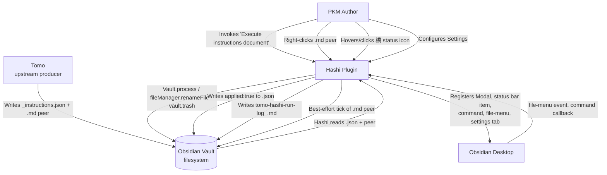
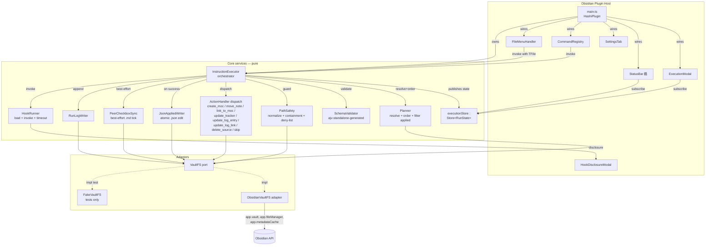
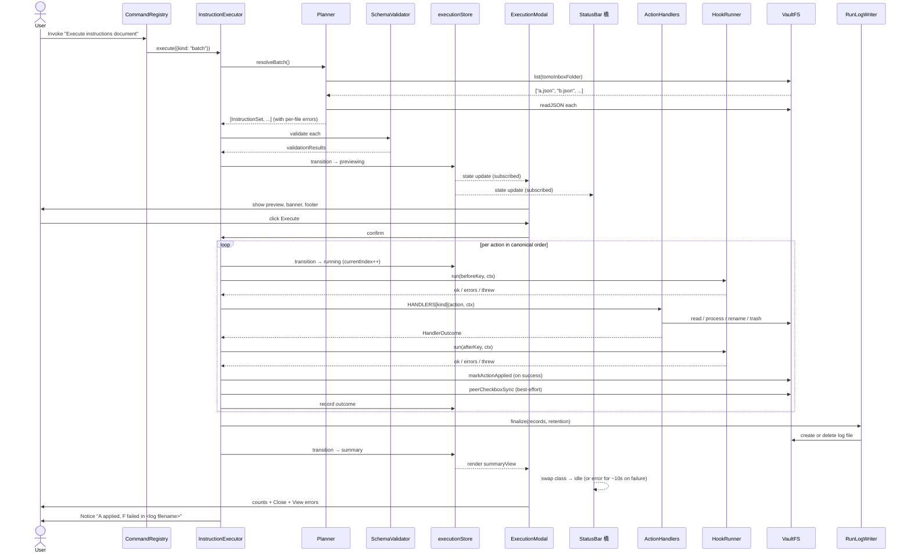
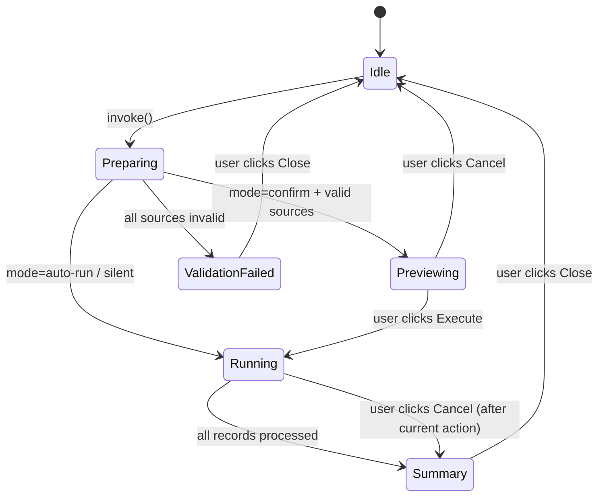

# Solution Design Document

## Validation Checklist

### CRITICAL GATES (Must Pass)

- [x] All required sections are complete
- [x] No [NEEDS CLARIFICATION] markers remain
- [x] Architecture pattern is clearly stated with rationale
- [x] **All architecture decisions confirmed by user** — 10/10 confirmed (2026-04-25; ADR-6 revised to color states)
- [x] Every interface has specification

### QUALITY CHECKS (Should Pass)

- [x] All context sources listed with relevance ratings
- [x] Project commands discovered from actual project files
- [x] Constraints → Strategy → Design → Implementation path is logical
- [x] Every component in diagram has directory mapping
- [x] Error handling covers all error types
- [x] Quality requirements are specific and measurable
- [x] Component names consistent across diagrams
- [x] A developer could implement from this design
- [x] Examples use real TypeScript types (not pseudocode)
- [x] Complex flows include traced walkthroughs

---

## Output Schema

### SDD Status Report

| Field | Value |
|-------|-------|
| specId | 002-instruction-executor |
| architecture.pattern | Layered plugin with stateless action handlers, ports-and-adapters at the vault edge, and a single execution-store reactive UI |
| architecture.keyComponents | InstructionExecutor (orchestrator), Planner, ActionHandler dispatcher (8 pure handlers), VaultFS port + ObsidianVaultFS adapter, SchemaValidator (ajv standalone), HookRunner, RunLogWriter, ExecutionModal, StatusBar 橋, SettingsTab, executionStore |
| architecture.externalIntegrations | Obsidian Plugin API (Vault, MetadataCache, FileManager, Modal, addStatusBarItem, addCommand) |
| adrs | 10 (all confirmed 2026-04-25) |

### Section Status

| Section | Status | Detail |
|---------|--------|--------|
| Constraints | COMPLETE | |
| Implementation Context | COMPLETE | |
| Solution Strategy | COMPLETE | Inherits 001's plain-TS-DOM and Store-helper decisions; novel ADRs limited to 002 surface |
| Building Block View | COMPLETE | |
| Interface Specifications | COMPLETE | |
| Runtime View | COMPLETE | |
| Deployment View | COMPLETE | No change vs 001 |
| Cross-Cutting Concepts | COMPLETE | |
| Architecture Decisions | COMPLETE | 10 ADRs confirmed (2026-04-25); ADR-6 revised to color states (no pulse); ADR-9 augmented with manual test vault |
| Quality Requirements | COMPLETE | |
| Acceptance Criteria | COMPLETE | EARS-format mapping of PRD F1–F11 |
| Risks and Technical Debt | COMPLETE | |
| Glossary | COMPLETE | |

---

## Constraints

CON-1 **Platform & language**: Obsidian Desktop (Electron). TypeScript `strict: true`, `noUncheckedIndexedAccess: true`, `useUnknownInCatchVariables: true`. Target ES6 (per `tsconfig.json`). `lib: ["DOM", "ES5", "ES6", "ES7"]`. Inherits CON-1 from spec 001.
CON-2 **Build**: esbuild CommonJS bundle to `main.js`. Externals exclude `obsidian` and node builtins. **NEW vs 001**: a *prebuild* script generates a standalone JSON Schema validator from `src/schema/instructions.schema.json` (ajv standalone codegen) before esbuild runs. The generated file is committed (deterministic build).
CON-3 **Desktop-only**: same drift as 001 (`manifest.json` `isDesktopOnly: false → true`). Spec 001's plan owns the fix; 002 inherits it.
CON-4 **Testing**: vitest unit (jsdom + obsidian mock) + vitest live (node, real `fs/promises` against a temp vault). Inherits 001's split. **NEW vs 001**: live tests for 002 do NOT need Docker — they exercise an `InMemoryVaultFS`-or-`fs/promises`-backed adapter against a temp directory.
CON-5 **No external inbound surface**: inherits CON-5 from 001. No ports, no MCP, no webhooks.
CON-6 **One run at a time**: enforced by a single-run lock at the orchestrator. No queue.
CON-7 **Bundle budget**: informal target ≤ 500 KB total `main.js`. ajv-standalone-generated validator adds < 20 KB. Comfortable.
CON-8 **Trust boundary**: instruction-set fields are NEVER passed to `eval`, `Function`, `exec`, or shell. Hooks are user-owned Node scripts and run with full plugin privilege (PRD F8) — compensating control is the *enabled / disabled / ask* setting plus the kill-switch.
CON-9 **Tomo handoff — already integrated**: PRD F5 requires Tomo to emit `applied: false` per action. Tomo shipped this on 2026-04-25 in v0.7.0 (`build_actions()` in `tomo/scripts/instruction-render.py`; shared `$defs/applied_field` in `tomo/schemas/instructions.schema.json` across all 8 variants; round-trip test in `tests/test-008-phase1.py`; consumer doc updated; branch `feat/applied-field-instructions`, commit `f3ad49d`). The graceful-fallback path (treat missing as `false`) is retained as defensive code but is no longer the v0.1 path.
CON-10 **No cross-spec coupling with 001**: post-pivot, 002 shares only the plugin shell (`main.ts`) and the `Store<T>` helper from `util/store.ts`. No shared services, no shared state, no shared error channel.

## Implementation Context

**IMPORTANT**: The following context sources MUST be read and understood before implementing any component.

### Required Context Sources

#### Documentation Context
```yaml
- doc: docs/XDD/specs/002-instruction-executor/requirements.md
  relevance: CRITICAL
  why: "PRD v2.0 — every requirement F1–F11 must map to an SDD component or ADR"

- doc: docs/XDD/specs/002-instruction-executor/research.md
  relevance: HIGH
  why: "5-perspective research synthesis — recommends ports-and-adapters, ajv standalone, fileManager.renameFile, vault.process"

- doc: docs/XDD/specs/002-instruction-executor/README.md
  relevance: HIGH
  why: "Scope boundaries, decisions log — the 2026-04-25 revision round logged here"

- doc: docs/XDD/specs/001-session-view/solution.md
  relevance: CRITICAL
  why: "Source of architectural patterns 002 inherits: plain TS + DOM (ADR-3), Store<T> helper (ADR-4), ports-and-adapters (ADR-5), vitest unit + live split (ADR-10)"

- doc: src/CLAUDE.md
  relevance: HIGH
  why: "TDD rules — RED/GREEN/REFACTOR; no `any`; strict mode"

- doc: test/CLAUDE.md
  relevance: HIGH
  why: "Test naming conventions, fixture isolation"

- url: https://ajv.js.org/standalone.html
  relevance: HIGH
  why: "ajv standalone codegen — emit a pure validator function at build time, eliminating ajv from the runtime bundle"

- url: https://docs.obsidian.md/Plugins/
  relevance: HIGH
  why: "Plugin API surfaces used: Modal, ItemView (NOT used), PluginSettingTab, addStatusBarItem, addCommand, registerEvent('file-menu'), Vault.process, FileManager.renameFile, Vault.trash, MetadataCache.getFileCache"

- url: https://github.com/Microsoft/TypeScript/wiki/Performance#enums-and-const-enums
  relevance: LOW
  why: "Action-kind discriminated union strategy — string literal unions over enums for tree-shake friendliness"
```

#### Code Context
```yaml
- file: src/main.ts
  relevance: CRITICAL
  why: "Plugin entry point — 002 wires the orchestrator, the modal, the status bar 橋, the settings tab, and the command + file-menu handlers on onload"

- file: src/settings/SettingsTab.ts
  relevance: HIGH
  why: "Will be extended with seven new settings (Tomo inbox folder, Execution mode, Run log retention, Hooks dir, Hooks setting, Disable all hooks, Debug logging) using Obsidian's `Setting` API"

- file: src/types/index.ts
  relevance: HIGH
  why: "PluginSettings type extended with the seven 002 settings"

- file: src/util/store.ts (NEW in 001 ADR-4 — to be authored as part of 001 plan)
  relevance: CRITICAL
  why: "002 reuses the Store<T> helper for executionStore"

- file: esbuild.config.mjs
  relevance: HIGH
  why: "Add a `prebuild` script for ajv standalone codegen; the build itself does not change"

- file: package.json
  relevance: HIGH
  why: "DevDeps to add: ajv (8.x), ajv-formats (3.x — only if Tomo's schema uses formats), json-schema-to-ts (for inferred TS types). Runtime deps unchanged: standalone codegen output is plain JS with no dependencies"

- file: tsconfig.json
  relevance: HIGH
  why: "Strict mode constraints; baseUrl='src' allows `executor/InstructionExecutor`, `vault/VaultFS`, etc."

- file: manifest.json
  relevance: CRITICAL
  why: "Inherits 001's `isDesktopOnly: true` flip"

- file: test/__mocks__/obsidian.ts
  relevance: HIGH
  why: "Extend with: Modal, fileManager.renameFile, vault.process, vault.trash, vault.createFolder, metadataCache.getFileCache returning `headings` and `sections`, registerEvent('file-menu'), addStatusBarItem"
```

#### External APIs
```yaml
- service: Obsidian Plugin API
  doc: https://docs.obsidian.md/Reference/TypeScript+API/
  relevance: HIGH
  why: "Vault.process (atomic read-modify-write, ≥1.4); FileManager.renameFile (link-preserving); Vault.trash; MetadataCache.getFileCache; Modal; addStatusBarItem; addCommand; registerEvent('file-menu'); PluginSettingTab; Notice"

- service: ajv (JSON Schema validator)
  doc: https://ajv.js.org/
  relevance: HIGH
  why: "Schema-v1 validation. Standalone codegen at build time emits a pure JS function — no ajv in the runtime bundle"

- service: Tomo consumer contract
  doc: /Volumes/Moon/Coding/MiYo/Tomo/docs/instructions-json.md (out-of-sandbox; updated 2026-04-25 with `applied` field doc)
  relevance: HIGH
  why: "Action payload shapes. Hashi vendors `tomo/schemas/instructions.schema.json` from Tomo v0.7.0+ — schema includes shared `$defs/applied_field` referenced by all 8 action variants. Initial vendoring step is part of Phase 1 of the plan."
```

### Implementation Boundaries
- **Must Preserve**: `main.ts` plugin class default export; ESLint config; esbuild output layout; the unit-vs-live test split (002 mirrors 001).
- **Can Modify**: Everything under `src/` (current state is a 001-targeted skeleton); `package.json` devDeps for ajv tooling; `esbuild.config.mjs` for the prebuild step; `styles.css` for modal + 橋 status bar styling.
- **Must Not Touch**: `_outbox/`, `_inbox/`, `.githooks/`, the `miyo-kouzou` repo (read-only from Hashi sessions per `~/Kouzou/standards/general.md`), `manifest.json` `isDesktopOnly` (owned by 001's plan).

### External Interfaces

#### System Context Diagram



#### Interface Specifications

```yaml
inbound:
  - name: "User → Command Palette"
    type: Obsidian Command (addCommand)
    format: Command invocation callback
    authentication: Trusted (plugin owner)
    data_flow: "Triggers run resolution: active file vs whole inbox"

  - name: "User → File Explorer Context Menu"
    type: Obsidian 'file-menu' workspace event
    format: Menu item callback with TFile argument
    authentication: Trusted
    data_flow: "Right-click on .md peer → run on that file"

  - name: "User → Execution Modal"
    type: Obsidian Modal
    format: DOM events (Execute / Cancel / Close)
    authentication: Trusted
    data_flow: "Confirm-or-cancel before/during run; close after"

  - name: "User → Hook Disclosure Modal (ask mode)"
    type: Obsidian Modal
    format: DOM events (Enable / Enable once / Disable)
    authentication: Trusted
    data_flow: "Per-hook decision; persists for the current session only"

  - name: "User → Settings Tab"
    type: Obsidian PluginSettingTab
    format: DOM events on Setting controls
    authentication: Trusted
    data_flow: "Configures 7 settings; persists via saveData"

  - name: "User → Status Bar 橋 Icon"
    type: HTMLElement on addStatusBarItem
    format: Hover (tooltip), Click (focus active modal)
    authentication: Trusted
    data_flow: "Displays idle / running state; click focuses modal"

outbound:
  - name: "Obsidian Vault — Edits"
    type: Obsidian Plugin API (Vault, FileManager)
    format: In-process function calls
    authentication: Sandboxed to plugin
    criticality: HIGH
    data_flow: "Move/rename files (fileManager.renameFile); atomic content edits (vault.process); trash (vault.trash); folder creation (vault.createFolder)"

  - name: "Obsidian Vault — JSON Applied-Flag Write"
    type: Obsidian Plugin API (Vault.process)
    format: Atomic read-modify-write of JSON file
    authentication: Sandboxed
    criticality: HIGH
    data_flow: "On each successful action: read source .json, set applied=true on the matching action, write back. JSON is reformatted with 2-space indent (matches Tomo emission)."

  - name: "Obsidian Vault — Run Log File"
    type: Obsidian Plugin API (Vault.create / Vault.process)
    format: Markdown file in Tomo inbox
    authentication: Sandboxed
    criticality: MEDIUM
    data_flow: "Per-run file `tomo-hashi-run-log_YYYY-MM-DDTHHMM.md`. Created on run start (header), appended during run, finalized at end. Deleted at end if retention=only-after-failed-runs and no failures."

  - name: "Obsidian Persistence (data.json)"
    type: Plugin loadData/saveData
    format: JSON blob
    authentication: Sandboxed
    criticality: LOW
    data_flow: "PluginSettings (7 fields) + per-hook ask-mode decisions for the current session"

data:
  - name: "Vendored JSON Schema"
    type: File at src/schema/instructions.schema.json
    connection: Read-only at build time by ajv standalone codegen; not loaded at runtime
    data_flow: "Source of truth for v1 schema validation logic; updated when Tomo bumps via the CHANGELOG handoff signal"

  - name: ".tomo-hashi/hooks/*.js (or configured equivalent)"
    type: Vault filesystem (Node require + fresh cache eviction)
    connection: Read at run start (delete require.cache, then require)
    data_flow: "User-authored hook modules. Loaded fresh per run (no cross-run caching)."
```

### Cross-Component Boundaries

- **001 ↔ 002**: only `util/store.ts` (`Store<T>`, `derived<T>`) is shared. No services, no events, no error channels. The plugin shell (`main.ts`) registers both 001's and 002's surfaces side-by-side.
- **Tomo ↔ 002**: a one-way file-based contract. Tomo writes `_instructions.json` + `.md` peer; Hashi reads both, writes `applied: true` back into the `.json`, optionally ticks the `.md` peer best-effort, writes a per-run log file. Schema-version mismatch fails closed (PRD F2). The vendored schema is the source of truth for Hashi's parser; the Tomo CHANGELOG handoff is the drift signal.
- **Hooks ↔ 002**: hooks are user-owned Node scripts. The contract is `(ctx: HookContext) => Promise<void> | void` returning `undefined` or `{ info?, warnings?, errors? }`. Throwing fails the hook. Full plugin privilege; no sandbox.
- **Breaking Change Policy**: 002's internal modules are not public. Schema-v1 is the only stable contract — bumping it requires a coordinated v2 handoff with Tomo.

### Project Commands

```bash
# Discovered from package.json + new prebuild step
Install:    npm install
Prebuild:   npm run schema:build       # NEW: regenerates src/schema/validator.gen.js from instructions.schema.json (ajv standalone)
Dev:        npm run dev                # esbuild watch mode (re-runs schema:build on schema change)
Build:      npm run build              # tsc --noEmit + schema:build + esbuild production
Test:       npm test                   # vitest unit (jsdom, obsidian mock)
Test-watch: npm run test:watch
Coverage:   npm run test:coverage
Test-live:  npm run test:live          # vitest live (node env, fs/promises against tmpdir vault)
Lint:       npm run lint
```

## Solution Strategy

- **Architecture Pattern**: **Layered plugin with stateless action handlers, ports-and-adapters at the vault edge, and a single execution-store reactive UI.** Mirrors spec 001's pattern (ADR-3 plain TS + DOM, ADR-4 `Store<T>`, ADR-5 ports-and-adapters, ADR-10 unit + live test split). One `InstructionExecutor` orchestrator drives the run; eight pure action handlers receive a `VaultFS` port and a `HandlerContext`; UI surfaces (modal, status bar, run log) subscribe to a typed `Store<RunState>`.
- **Integration Approach**: Every vault read/write goes through the `VaultFS` port. The Obsidian-backed `ObsidianVaultFS` adapter is the only module that imports from `obsidian`. Action handlers, the planner, the schema validator, the hook runner, the run-log writer — all are framework-free pure modules testable against an in-memory `FakeVaultFS`. The hook runner additionally exposes `app` to hooks as a documented escape hatch (PRD F8) — that is the one place where Obsidian leaks past the boundary, intentionally.
- **Justification**: PRD F4 demands deterministic per-action behavior with idempotency and dependency-aware halting. Pure handlers + pure planner + injectable VaultFS make every PRD AC unit-testable. The Obsidian boundary is narrow enough that integration tests against a real Obsidian instance are not required for v0.1 — `fs/promises`-backed live tests cover the realistic edge cases (filesystem race, atomic write semantics, real path resolution).
- **Key Decisions** (full rationale in Architecture Decisions section):
  - ADR-1 Schema validation = **ajv 8.x in standalone-codegen mode** (confirmed)
  - ADR-2 Schema source = **vendored copy in `src/schema/`, drift-signaled by Tomo CHANGELOG handoff** (confirmed)
  - ADR-3 Hook loader = **Node `createRequire` + per-run cache eviction** (confirmed)
  - ADR-4 Action handlers = **8 pure functions sharing a `HandlerContext`** (confirmed)
  - ADR-5 Modal architecture = **single `ExecutionModal` class with state-machine UI** (confirmed)
  - ADR-6 Status bar 橋 = **`addStatusBarItem` with idle/green/red color states, subscribed to `executionStore`** (confirmed; no pulse animation)
  - ADR-7 JSON applied-flag write = **`vault.process` for atomic read-mutate-write with stable 2-space JSON formatting** (confirmed)
  - ADR-8 Run log file = **Markdown with frontmatter + per-action table; per-run file in inbox** (confirmed)
  - ADR-9 Test split = **vitest unit (FakeVaultFS) + vitest live (`fs/promises` against tmpdir) + manual QA against `../temp/Privat-Test`** (confirmed)
  - ADR-10 Hook context shape = **`{ action, vault, app, runState, logger }` with `runState` as `Record<string, unknown>` reset per run** (confirmed)

## Building Block View

### Components



### Directory Map

```
.
├── src/
│   ├── main.ts                                      # MODIFY: wire 002's executor, modal, status bar, settings, commands
│   ├── types/
│   │   └── index.ts                                 # MODIFY: PluginSettings += 7 new fields
│   ├── settings/
│   │   └── SettingsTab.ts                           # MODIFY: render 7 new Setting controls
│   ├── executor/                                    # NEW: orchestration + state + planning
│   │   ├── InstructionExecutor.ts                   # NEW: orchestrator (single-run lock, run lifecycle, dispatch)
│   │   ├── executionStore.ts                        # NEW: Store<RunState> instance + derived slices
│   │   ├── state.ts                                 # NEW: RunState discriminated union; per-action outcome types
│   │   ├── planner.ts                               # NEW: source resolution (one-file vs inbox-batch); canonical order; applied-filter
│   │   ├── jsonAppliedWriter.ts                     # NEW: atomic JSON read-mutate-write via vault.process; 2-space indent
│   │   ├── peerCheckboxSync.ts                      # NEW: best-effort `.md` peer tick under `### I## — …` heading
│   │   └── runLog.ts                                # NEW: per-run log file writer + retention policy enforcement
│   ├── actions/                                     # NEW: 8 pure handlers + helpers
│   │   ├── index.ts                                 # NEW: dispatcher (kind → handler) + handler registry
│   │   ├── createMoc.ts                             # NEW
│   │   ├── moveNote.ts                              # NEW
│   │   ├── linkToMoc.ts                             # NEW (uses sectionLocator.ts)
│   │   ├── updateTracker.ts                         # NEW (3 sub-modes: inline_field / callout_body / checkbox)
│   │   ├── updateLogEntry.ts                        # NEW (uses logPosition.ts)
│   │   ├── updateLogLink.ts                         # NEW (uses logPosition.ts)
│   │   ├── deleteSource.ts                          # NEW
│   │   ├── skip.ts                                  # NEW
│   │   ├── sectionLocator.ts                        # NEW: heading + callout detection helpers (uses metadataCache)
│   │   └── logPosition.ts                           # NEW: after_last_line / before_first_line / at_time HH:MM placement
│   ├── schema/                                      # NEW: schema + generated validator
│   │   ├── instructions.schema.json                 # NEW: vendored from Tomo (drift-signaled by handoff)
│   │   ├── validator.gen.js                         # GENERATED: ajv standalone output (committed; regenerated by `npm run schema:build`)
│   │   ├── validator.ts                             # NEW: thin wrapper around validator.gen.js exporting a typed `validate(...)` and producing diagnostics
│   │   └── types.ts                                 # NEW: TS types via json-schema-to-ts (or hand-aligned discriminated union)
│   ├── vault/                                       # NEW: vault edge (port + adapter)
│   │   ├── VaultFS.ts                               # NEW: port interface
│   │   ├── ObsidianVaultFS.ts                       # NEW: real impl using app.vault, app.fileManager, app.metadataCache
│   │   └── FakeVaultFS.ts                           # NEW: test-only in-memory impl (also used in live tests via fs/promises wrapper)
│   ├── hooks/                                       # NEW
│   │   ├── HookRunner.ts                            # NEW: load (createRequire + cache evict), invoke (timeout), context build
│   │   ├── HookContext.ts                           # NEW: type definition (action, vault facade, app, runState, logger)
│   │   └── HookDisclosureModal.ts                   # NEW: ask-mode disclosure modal (Enable / Enable once / Disable)
│   ├── ui/
│   │   ├── ExecutionModal.ts                        # NEW: state-machine modal (preview / progress / summary)
│   │   ├── statusBar.ts                             # NEW: 橋 status bar item with idle/green/red color states (class swaps; no animation)
│   │   └── modalContent/
│   │       ├── previewView.ts                       # NEW: pre-run rendering (per-file headers, per-action rows, banner, footer disclosure)
│   │       ├── progressView.ts                      # NEW: in-run rendering (row glyphs, sticky error banner, Cancel)
│   │       └── summaryView.ts                       # NEW: post-run rendering (counts, View errors, Close)
│   ├── commands/
│   │   └── registerCommands.ts                      # NEW: addCommand("Execute instructions document"); registerEvent('file-menu', ...) for .md peers
│   └── util/
│       ├── store.ts                                 # SHARED with 001: NO modification
│       ├── paths.ts                                 # NEW: normalizePath wrapper, vault-root containment, deny-list match
│       ├── filenames.ts                             # NEW: build per-run log filename + collision-suffix
│       └── debugLog.ts                              # NEW: debug-level logger gated by Settings.debugLogging
├── test/
│   ├── unit/
│   │   ├── executor/
│   │   │   ├── InstructionExecutor.test.ts          # NEW (state transitions, single-run lock, halt-on-dependency)
│   │   │   ├── planner.test.ts                      # NEW (one-file vs batch resolution; canonical order; applied filter)
│   │   │   ├── jsonAppliedWriter.test.ts            # NEW (atomic; 2-space indent preservation)
│   │   │   ├── peerCheckboxSync.test.ts             # NEW (heading-found, heading-missing, pre-ticked-respected, peer-missing)
│   │   │   └── runLog.test.ts                       # NEW (header, per-action lines, retention policy)
│   │   ├── actions/
│   │   │   ├── createMoc.test.ts                    # NEW
│   │   │   ├── moveNote.test.ts                     # NEW
│   │   │   ├── linkToMoc.test.ts                    # NEW (section-found, section-fallback, MOC-missing)
│   │   │   ├── updateTracker.test.ts                # NEW (3 sub-modes; idempotency; conflict)
│   │   │   ├── updateLogEntry.test.ts               # NEW (3 positions; idempotency)
│   │   │   ├── updateLogLink.test.ts                # NEW (3 positions; format with/without HH:MM prefix)
│   │   │   ├── deleteSource.test.ts                 # NEW
│   │   │   ├── skip.test.ts                         # NEW
│   │   │   └── sectionLocator.test.ts               # NEW (heading + callout detection edge cases)
│   │   ├── schema/
│   │   │   └── validator.test.ts                    # NEW (valid v1; version mismatch; malformed JSON; schema diagnostics; applied-field tolerance)
│   │   ├── hooks/
│   │   │   └── HookRunner.test.ts                   # NEW (load/cache-evict, runState sharing, timeout, return-shape, throw)
│   │   ├── vault/
│   │   │   └── FakeVaultFS.test.ts                  # NEW (sanity for the test fake itself)
│   │   └── util/
│   │       ├── paths.test.ts                        # NEW (normalize, containment, deny-list patterns)
│   │       └── filenames.test.ts                    # NEW (timestamp + collision suffix)
│   ├── live/                                        # NEW: real fs/promises against tmpdir
│   │   └── executor.live.test.ts                    # NEW: end-to-end fixture sets (happy path, partial-resume, halt-on-dependency, batch run)
│   ├── fixtures/
│   │   └── instructions/                            # NEW: golden JSONs per scenario
│   │       ├── happy-path/
│   │       ├── partial-resume/
│   │       ├── halt-on-dependency/
│   │       ├── all-8-kinds/
│   │       ├── batch-multi-file/
│   │       ├── schema-invalid-version/
│   │       ├── schema-invalid-structure/
│   │       └── peer-missing/
│   └── __mocks__/
│       └── obsidian.ts                              # MODIFY: extend with Modal, fileManager.renameFile, vault.process, vault.trash, vault.createFolder, metadataCache.getFileCache, registerEvent
├── package.json                                     # MODIFY: devDeps += ajv, json-schema-to-ts; scripts += `schema:build`
├── esbuild.config.mjs                               # MODIFY: add prebuild trigger for schema:build (or chain in build script)
└── styles.css                                       # MODIFY: add .hashi-execution-modal, .hashi-row-glyph-*, .hashi-status-bar-bridge.is-idle / .is-running { color: green } / .is-error { color: red }
```

### Interface Specifications

#### Application Data Models

```typescript
// src/executor/state.ts
export type ActionOutcome =
  | { kind: "applied" }
  | { kind: "skipped-already" }
  | { kind: "skipped-dependency"; dependsOn: string /* I## */ }
  | { kind: "skipped-cancelled" }
  | { kind: "failed"; reason: string };

export interface ActionRecord {
  readonly fileId: string;        // source filename (basename of the _instructions.json)
  readonly id: string;             // I## (unique only within a fileId)
  readonly kind: ActionKind;
  readonly summary: string;        // payload-adaptive one-liner for the row
  outcome: ActionOutcome | null;   // null while pending; set before the row glyph updates
}

export type RunState =
  | { kind: "idle" }
  | { kind: "preparing"; mode: ExecutionMode; sources: ResolvedSource[] }
  | { kind: "previewing"; mode: ExecutionMode; records: readonly ActionRecord[]; remaining: number; total: number }
  | { kind: "running"; mode: ExecutionMode; records: readonly ActionRecord[]; currentIndex: number }
  | { kind: "summary"; mode: ExecutionMode; records: readonly ActionRecord[]; counts: RunCounts; logFilePath: string | null }
  | { kind: "validation-failed"; mode: ExecutionMode; perFileFailures: ReadonlyMap<string, ValidationFailure> };

export interface RunCounts {
  applied: number;
  skippedAlready: number;
  skippedDependency: number;
  skippedCancelled: number;
  failed: number;
  durationMs: number;
}

export type ExecutionMode = "confirm" | "auto-run" | "silent";

// Source-resolution + validation outcome shapes
export interface ResolvedSource {
  readonly fileId: string;                  // basename of the source `_instructions.json`
  readonly sourcePath: string;              // vault-relative path
  readonly instructionSet: InstructionSet;  // validated payload
}

export type ValidationOutcome =
  | { ok: true; data: InstructionSet }
  | { ok: false; failure: ValidationFailure };

export type ValidationFailure =
  | { kind: "parse-error"; detail: string }
  | { kind: "version-mismatch"; got: unknown }
  | { kind: "schema-diagnostics"; diagnostics: readonly Diagnostic[] };

export interface Diagnostic {
  readonly path: string;        // JSON Pointer to the offending field (e.g., /actions/3/payload/section)
  readonly message: string;     // ajv error message
  readonly params?: Record<string, unknown>;
}

// Clock injected for at_time HH:MM resolution; trivially mockable
export interface Clock {
  now(): Date;
}

// Read-only subset of Store<T> from src/util/store.ts (subscribe + value, no setter)
// Imported here so the InstructionExecutor.state property has a defined surface.
export type Readable<T> = import("../util/store").Readable<T>;

// src/schema/types.ts (excerpt; full types via json-schema-to-ts FromSchema)
export type ActionKind =
  | "create_moc"
  | "move_note"
  | "link_to_moc"
  | "update_tracker"
  | "update_log_entry"
  | "update_log_link"
  | "delete_source"
  | "skip";

export interface InstructionSet {
  readonly schema_version: 1;
  readonly md_peer?: string;       // optional vault-relative path; fallback to same-stem .md
  readonly actions: readonly Action[];
}

export type Action =
  | CreateMocAction | MoveNoteAction | LinkToMocAction
  | UpdateTrackerAction | UpdateLogEntryAction | UpdateLogLinkAction
  | DeleteSourceAction | SkipAction;

interface ActionBase {
  readonly id: string;             // I##
  readonly applied?: boolean;      // optional in schema; default false; Hashi flips to true on success
}

// (each variant adds `kind` and `payload` per Tomo's contract — full shapes in src/schema/types.ts)
```

#### VaultFS Port (port/adapter pattern)

```typescript
// src/vault/VaultFS.ts (port)
export interface VaultFS {
  // Reads
  read(path: string): Promise<string>;
  readJSON<T = unknown>(path: string): Promise<T>;
  exists(path: string): Promise<boolean>;
  list(folder: string): Promise<readonly string[]>;             // file paths inside folder, non-recursive
  metadata(path: string): Promise<FileMetadata | null>;          // headings + sections from MetadataCache

  // Writes (atomic at the file level)
  process(path: string, transform: (content: string) => string): Promise<void>;
  processJSON<T>(path: string, transform: (json: T) => T): Promise<void>;        // wraps process; uses 2-space stringify
  rename(fromPath: string, toPath: string): Promise<void>;       // link-preserving (FileManager.renameFile)
  createFolder(path: string): Promise<void>;                     // tolerates already-exists
  trash(path: string): Promise<void>;                            // system trash when available
  create(path: string, content: string): Promise<void>;          // for run log file creation
}

export interface FileMetadata {
  readonly headings: ReadonlyArray<{ heading: string; level: number; line: number }>;
  readonly sections: ReadonlyArray<{ type: string; line: number; endLine: number }>;
}
```

**Why a port**: action handlers, the JSON applied-writer, the peer checkbox syncer, the run-log writer, and the planner all consume `VaultFS` only — they have zero `import 'obsidian'` lines. Unit tests inject `FakeVaultFS` (in-memory `Map<path, string>`); live tests inject `FsPromisesVaultFS` (a wrapper around node's `fs/promises` against a tmpdir). The real `ObsidianVaultFS` is exercised manually in development; an automated end-to-end against real Obsidian is post-v0.1.

#### Action Handler Contract

```typescript
// src/actions/index.ts
export interface HandlerContext {
  readonly vault: VaultFS;
  readonly clock: Clock;                 // injected for at_time HH:MM resolution
  readonly runState: Map<string, unknown>;  // shared across hooks (NOT handlers); see hooks
}

export type Handler<A extends Action> = (action: A, ctx: HandlerContext) => Promise<HandlerOutcome>;

export type HandlerOutcome =
  | { kind: "applied" }
  | { kind: "skipped-already" }
  | { kind: "failed"; reason: string };

export const HANDLERS: { readonly [K in ActionKind]: Handler<Extract<Action, { kind: K }>> } = {
  create_moc: createMocHandler,
  move_note: moveNoteHandler,
  link_to_moc: linkToMocHandler,
  update_tracker: updateTrackerHandler,
  update_log_entry: updateLogEntryHandler,
  update_log_link: updateLogLinkHandler,
  delete_source: deleteSourceHandler,
  skip: skipHandler,
};
```

#### InstructionExecutor Service Surface

```typescript
// src/executor/InstructionExecutor.ts
export class InstructionExecutor {
  constructor(
    private readonly vault: VaultFS,
    private readonly validator: SchemaValidator,
    private readonly hookRunner: HookRunner,
    private readonly settings: PluginSettings,
    private readonly clock: Clock,
  );

  // Single user action — returns when run + log file finalization complete
  async execute(invocation: Invocation): Promise<RunCounts>;

  // Cancellation (called from modal Cancel button)
  cancel(): void;

  // State (modal + status bar subscribe)
  readonly state: Readable<RunState>;
}

export type Invocation =
  | { kind: "single-file"; sourcePath: string }   // user invoked on active .md peer or .json
  | { kind: "batch" };                              // user invoked with no instruction file active
```

#### Hook Context Surface

```typescript
// src/hooks/HookContext.ts
export interface HookContext {
  readonly action: Readonly<Action>;       // current action payload
  readonly vault: HookVault;                // narrowed facade (subset of VaultFS)
  readonly app: App;                        // Obsidian App — full escape hatch
  readonly runState: Record<string, unknown>;  // shared across all hooks in the same run
  readonly logger: HookLogger;              // routes to run log
}

export interface HookVault {
  read(path: string): Promise<string>;
  write(path: string, content: string): Promise<void>;
  exists(path: string): Promise<boolean>;
  getAbstractFileByPath(path: string): TFile | TFolder | null;
}

export interface HookLogger {
  info(msg: string): void;
  warn(msg: string): void;
  error(msg: string): void;
}

export type Hook = (ctx: HookContext) => Promise<HookReturn> | HookReturn;
export type HookReturn = void | { info?: string[]; warnings?: string[]; errors?: string[] };
```

#### Plugin Settings

```typescript
// src/types/index.ts (extended for 002)
export interface PluginSettings {
  // 001 fields
  chosenInstanceId: string | null;

  // 002 fields (NEW)
  tomoInboxFolder: string;          // vault-relative path; "" until configured
  executionMode: ExecutionMode;     // default "confirm"
  runLogRetention: "always" | "only-after-failed";   // default "always"
  hooksDir: string;                 // vault-relative; default ".tomo-hashi/hooks"
  hooksPolicy: "enabled" | "disabled" | "ask";       // default "ask"
  disableAllHooks: boolean;         // kill-switch; default false
  debugLogging: boolean;            // default false
}

export const DEFAULT_SETTINGS: PluginSettings = {
  chosenInstanceId: null,
  tomoInboxFolder: "",
  executionMode: "confirm",
  runLogRetention: "always",
  hooksDir: ".tomo-hashi/hooks",
  hooksPolicy: "ask",
  disableAllHooks: false,
  debugLogging: false,
};
```

Per-hook ask-mode decisions (Enable / Enable once / Disable) are NOT persisted in `data.json` — they live in an in-memory `Map` on the `HookRunner` and reset on plugin reload (PRD F8 / F11 explicit).

### Implementation Examples

#### Example: Atomic JSON Applied-Flag Write

**Why this example**: The applied-flag write must be atomic and must preserve Tomo's emission style (2-space indent) so the JSON file remains stable across round-trips. `vault.process` is Obsidian's atomic primitive — we use it to read, mutate, and stringify in a single call.

```typescript
// src/executor/jsonAppliedWriter.ts
export async function markActionApplied(
  vault: VaultFS,
  sourcePath: string,
  actionId: string,
): Promise<void> {
  await vault.processJSON<InstructionSet>(sourcePath, (set) => {
    return {
      ...set,
      actions: set.actions.map((a) =>
        a.id === actionId ? { ...a, applied: true } : a,
      ),
    };
  });
}
```

`processJSON` is implemented in `ObsidianVaultFS` as:

```typescript
async processJSON<T>(path: string, transform: (json: T) => T): Promise<void> {
  await this.process(path, (raw) => {
    const parsed = JSON.parse(raw) as T;
    const next = transform(parsed);
    return JSON.stringify(next, null, 2) + "\n";
  });
}
```

Trailing newline is intentional — most editors expect one and Tomo's emitter is required to match.

#### Example: Hook Loader with Per-Run Cache Eviction

**Why this example**: Hooks are user-authored Node modules. PRD F8 mandates fresh-load per run so editing a hook between runs takes effect immediately. Node's `require` caches modules by absolute path — we must evict the cache entry before each run.

```typescript
// src/hooks/HookRunner.ts (excerpt)
import { createRequire } from "node:module";

const require = createRequire(import.meta.url);

function loadHookFresh(absolutePath: string): Hook {
  // Evict cache so edits between runs take effect
  const resolved = require.resolve(absolutePath);
  delete require.cache[resolved];
  const mod = require(absolutePath) as { default?: Hook } | Hook;
  // Tolerate either CJS `module.exports = fn` or ESM-interop `default` export
  return typeof mod === "function" ? mod : (mod.default ?? noopHook);
}

const noopHook: Hook = () => undefined;
```

**Edge cases**:
- The hook file does not exist → `require` throws ENOENT; caller treats as "no hook defined".
- The hook file exports something that is not a function → `noopHook` substituted; debug log notes the malformed export.
- Two hook files match the same `(kind, phase)` key → `discoverHooks()` deterministically picks the first alphabetical match and logs the duplication; the others are silently ignored for the run.

**Traced walkthrough** (timeout fires):
- t=0 ms: `runHook(beforeKey, action)` called. Loader returns the user's hook function.
- t=0 ms: `Promise.race([hookPromise, timeoutPromise(30_000)])` started.
- t=30_000 ms: timeoutPromise resolves with a rejection. `Promise.race` settles.
- The hook's still-running async work continues in the background (we cannot kill it; Node doesn't let us). The orchestrator marks the action as failed *"before-hook timed out"* and proceeds to the next action.
- This is acceptable for v0.1 — the timeout is a defensive boundary, not a hard kill. Documented in PRD F8 acceptance criteria.

#### Example: Section Locator for `link_to_moc`

**Why this example**: `link_to_moc` appends a bullet inside a named section. The section may be (a) a heading, (b) a callout `> [!type]`, or (c) absent (in which case we fall back to the first editable callout per PRD F4). MetadataCache exposes `headings` and generic `sections`; callout detection requires re-parsing the section's first line.

```typescript
// src/actions/sectionLocator.ts
export interface SectionRange {
  readonly startLine: number;       // first content line inside the section
  readonly endLine: number;         // last content line (inclusive); -1 if section runs to EOF
  readonly kind: "heading" | "callout";
}

export function locateSection(
  metadata: FileMetadata,
  rawContent: string,
  desiredSectionName: string,
): SectionRange | null {
  // 1. Try heading match (level-2 or level-3 typical for MOC sub-sections)
  const heading = metadata.headings.find((h) => h.heading === desiredSectionName);
  if (heading) {
    const next = metadata.headings.find((h) => h.line > heading.line && h.level <= heading.level);
    return {
      startLine: heading.line + 1,
      endLine: next ? next.line - 1 : -1,
      kind: "heading",
    };
  }

  // 2. Try callout match — sections of type "callout" whose first line says `> [!type] desiredSectionName` (case-insensitive)
  const lines = rawContent.split("\n");
  for (const sec of metadata.sections) {
    if (sec.type !== "callout") continue;
    const firstLine = lines[sec.line] ?? "";
    const calloutMatch = /^>\s*\[!(\w+)\]\s*(.*)$/.exec(firstLine);
    if (!calloutMatch) continue;
    const calloutTitle = calloutMatch[2]!.trim();
    if (calloutTitle.toLowerCase() === desiredSectionName.toLowerCase()) {
      return { startLine: sec.line + 1, endLine: sec.endLine, kind: "callout" };
    }
  }

  // 3. Fallback: caller decides whether to use the first editable callout.
  return null;
}
```

The handler then chooses the insertion point — end of matched-callout-content, or end of heading-section — and uses `vault.process` to splice the bullet line.

## Runtime View

### Primary Flow: Inbox-Batch Execution (no instruction file active)

1. User triggers "Execute instructions document" with no instruction file active.
2. `CommandRegistry` calls `InstructionExecutor.execute({ kind: "batch" })`.
3. `Planner.resolveBatch()` reads the configured `tomoInboxFolder`, lists `*.json` files, and reads each in parallel.
4. For each file: `SchemaValidator.validate()` runs (CON-7: ≤ 200 ms per file). Failures are accumulated in a per-file map; valid files proceed.
5. `Planner.computeRemaining()` filters out actions with `applied: true`, applies canonical order, computes the merged record list with file headers.
6. `executionStore` transitions: `idle` → `preparing` → `previewing` (in *confirm* mode) or directly to `running` (in *auto-run* / *silent* modes).
7. UI: `ExecutionModal` opens (in confirm/auto-run); `StatusBar 橋` swaps to the green *running* class.
8. User clicks **Execute** (confirm mode), or modal continues automatically (auto-run), or no modal (silent).
9. Orchestrator iterates records: `HookRunner.run(beforeKey, ctx)` → `HANDLERS[kind](action, ctx)` → `HookRunner.run(afterKey, ctx)`.
10. Per success: `markActionApplied(vault, sourcePath, actionId)` writes `applied: true` atomically. `peerCheckboxSync.tickBestEffort(...)` ticks the peer if present.
11. Per failure: outcome recorded in `executionStore`; sticky banner updates in modal; execution continues with the next independent record.
12. Halt-on-dependency: if `create_moc I0X` failed, dependent `link_to_moc` records flip to `skipped-dependency` without invoking handlers.
13. End: `executionStore` transitions to `summary`. `RunLogWriter.finalize(...)` writes the per-run log file (or deletes it under `only-after-failed` retention if no failures). Run-end `Notice` fires (always) including the log filename.
14. UI: modal `summaryView` renders; `StatusBar 橋` returns to idle.



### Error Handling

| Error | Where surfaced | Recovery |
|---|---|---|
| Inbox folder not configured | `Notice` only | User opens settings; no run started |
| Inbox empty | `Notice` only | No run started |
| `_instructions.json` not valid JSON | Per-file header in modal + run log | Other files in batch proceed; this file skipped entirely |
| Schema-version mismatch | Per-file header in modal + run log | Same — file skipped, batch continues |
| Schema diagnostics (structural failure) | Per-file header in modal (up to 10 diagnostics) + run log | Same — file skipped, batch continues |
| Path on deny-list | Sticky banner in modal + run log | Action fails; subsequent independent actions continue |
| Source file missing (move-style) | Sticky banner + run log | Action fails; subsequent actions continue |
| Both source AND destination present | Sticky banner + run log | Action fails (no overwrite); subsequent continue |
| Section/MOC not resolvable for `link_to_moc` | Sticky banner + run log | Action fails; halt-on-dependency does not apply (this MOC was created in-set or pre-existing — already-resolved) |
| Tracker field exists with different value | Sticky banner + run log | Action fails (no overwrite) |
| Pre-hook throws / returns errors | Sticky banner + run log | Action skipped; `applied` stays false |
| Post-hook throws / returns errors | Sticky banner + run log | `applied: true` is still written; hook failure recorded separately |
| Hook timeout (30s) | Sticky banner + run log | Treated as hook throw per phase |
| Cancellation mid-run (Cancel button) | Modal title + run log | In-flight action commits; remaining flagged `skipped-cancelled` |
| Run log file write fails | `Notice` (warning) | The run itself is unaffected; user is informed log was lost |

### Complex Logic: Single-Run Lock and Cancellation

```
ALGORITHM: InstructionExecutor.execute(invocation)
INPUT: invocation (single-file or batch)
OUTPUT: RunCounts (or throws if input cannot be resolved)

1. ACQUIRE single-run lock atomically. If lock held → fire Notice "Execution already in progress" and return.
2. RESOLVE sources via Planner.
3. VALIDATE each source. Build per-file failure map.
4. COMPUTE remaining records (canonical order, applied filter) from valid sources.
5. SET store → preparing → previewing/running.
6. IF mode == confirm: AWAIT user click on Execute (or Cancel → release lock, transition store → summary with counts of all-skipped, fire Notice, return).
7. CREATE empty run log file (header only).
8. FOR each record in order:
   a. IF cancelled: mark remaining as skipped-cancelled; break.
   b. IF record's depended-on action failed: mark skipped-dependency; continue.
   c. RUN before-hook (if any). IF throws / returns errors: mark failed; continue.
   d. RUN handler. IF returns failed: mark failed; continue.
   e. RUN after-hook (if any). IF throws / returns errors: record hook failure but DO NOT change action outcome.
   f. WRITE applied:true to source .json.
   g. BEST-EFFORT tick peer .md.
   h. APPEND record outcome to run log.
9. FINALIZE run log per retention policy.
10. SET store → summary.
11. FIRE run-end Notice with log filename.
12. RELEASE single-run lock.
13. RETURN counts.
```

**Cancellation semantics** (PRD F3 + F8 edge case):
- `cancel()` sets a flag. The orchestrator's loop checks the flag at every iteration boundary — never mid-action. The currently-executing action commits naturally.
- Cancellation does NOT stop the after-hook of the in-flight action (the vault state is already mutated; running the after-hook completes the cycle).
- Cancellation occurs cleanly between actions only.

## Deployment View

No change vs spec 001. Single Obsidian plugin bundle (`main.js` + `manifest.json` + `styles.css`) installed under `.obsidian/plugins/miyo-tomo-hashi/`. The schema validator is generated at build time and bundled into `main.js`. Hooks live in the user's vault under the configured directory.

- **Environment**: client-side (Obsidian Desktop, Electron renderer).
- **Configuration**: 7 PluginSettings fields stored in `data.json`. Tomo inbox folder MUST be configured before batch invocation works.
- **Dependencies**: none external at runtime (ajv standalone codegen produces a pure-JS validator). DevDeps: ajv, json-schema-to-ts.
- **Performance**: Schema validation < 200 ms per file (CON-7). End-to-end run for 25 actions < 5 s on typical desktop hardware.

## Cross-Cutting Concepts

### Pattern Documentation

```yaml
# Existing patterns inherited from 001 (and reused here)
- pattern: "Plain TS + DOM via Obsidian primitives" (001 ADR-3)
  relevance: CRITICAL
  why: "002 builds the modal, status bar, and settings UI without a framework runtime."

- pattern: "Custom typed Store<T> helper" (001 ADR-4)
  relevance: CRITICAL
  why: "executionStore reuses the same primitive 001 introduced; SHARED module."

- pattern: "Ports & adapters at the boundary" (001 ADR-5)
  relevance: CRITICAL
  why: "VaultFS port + ObsidianVaultFS adapter; mirrors DockerClient/DockerodeAdapter."

- pattern: "vitest unit + vitest live split" (001 ADR-10)
  relevance: HIGH
  why: "002 keeps the same split; live tests use fs/promises against tmpdir (not Docker)."

# New patterns introduced by 002
- pattern: "Build-time JSON Schema codegen via ajv standalone"
  relevance: HIGH
  why: "Keeps runtime bundle lean; vendored schema + drift-by-handoff replaces a runtime ajv dependency."

- pattern: "State-machine modal" (single Modal class with phase-gated views)
  relevance: HIGH
  why: "Preview/progress/summary are phases of one modal — fewer Modal subclasses, simpler subscription teardown."
```

### User Interface & UX

**Information Architecture:**
- Single command: *"Execute instructions document"*. Single context-menu entry on `.md` peers. One status-bar item (橋). One settings tab section.
- The modal is the only modal-class UI (plus the hook disclosure modal for *ask* mode).

**Component States:**



**Accessibility (PRD F10 + general):**
- Modal uses Obsidian's `Modal` base — focus trap, Esc-closes, role=dialog.
- Action list rows: `role="listitem"` with `aria-label` combining `I## kind summary`.
- Progress: `aria-live="polite"` updates on each row state change (throttled).
- Error banner: `aria-live="assertive"` on first error in run, `polite` on subsequent.
- Status bar 橋: hover tooltip is screen-reader-readable; `aria-live="polite"` announces idle ↔ running ↔ error transitions. No animation, so no `prefers-reduced-motion` handling needed; color-only states are paired with a tooltip verb to remain discriminable for color-blind users.

### System-Wide Patterns

- **Error handling**: every action is failure-isolated. Halt-on-dependency is the only cross-action coupling. Run never aborts globally on a single action failure.
- **Performance**: actions execute serially (CON-6). Per-action handler runtime targets ≤ 100 ms typical, ≤ 1 s worst (large file edits). Schema validation is the only bulk-parallel step.
- **Logging**: two levels gated by `Settings.debugLogging`. Normal: run start/end + per-action outcomes. Debug: per-hook detail + per-vault-call timings.
- **Security**: PRD F9 (path safety + deny-list) runs before every vault write. Hook trust per PRD F8 (Templater-equivalent). No instruction field reaches `eval` / `exec` / shell.
- **Persistence**: Tomo's `.json` is durable applied-state; Obsidian's `data.json` holds plugin settings; everything else is ephemeral (modal state, run state, hook decisions).

## Architecture Decisions

- [x] **ADR-1 Schema validation**: ajv 8.x in **standalone-codegen mode** at build time. **Confirmed 2026-04-25.**
  - Rationale: Tomo owns the schema; Hashi consumes it as the single source of truth. Standalone codegen emits a pure JS validator function — no ajv dependency in the runtime bundle (~35 KB saved). `json-schema-to-ts` provides static types from the same schema. Tomo's shipped schema (v0.7.0) uses `$defs/applied_field` referenced via `$ref` from each of the 8 action variants — ajv 8.x supports this natively (draft-07 / 2020-12). Alternatives evaluated: zod (would hand-port schema, violates SSOT), valibot (same), runtime ajv (~35 KB bundle cost), hand-rolled (loses error-message quality).
  - Trade-offs: Adds a `prebuild` step (`npm run schema:build`) before esbuild; requires checking the generated `validator.gen.js` into git so dev-time sourcing is deterministic; schema drift requires re-running the prebuild.
  - User confirmed: **2026-04-25**

- [x] **ADR-2 Schema source**: vendored copy in `src/schema/instructions.schema.json`, drift-signaled by Tomo's CHANGELOG handoff. **Confirmed 2026-04-25.**
  - Rationale: Tomo repo is in a separate git tree; submodules are heavy for a small file; npm-publishing schema would couple two release cycles. Vendoring is simplest. The drift signal is the existing Tomo CHANGELOG handoff (already requested in PRD).
  - Trade-offs: Manual updates required when Tomo bumps the schema; round-trip fixtures (also requested in handoff) act as the integration check.
  - User confirmed: **2026-04-25**

- [x] **ADR-3 Hook loader**: Node `createRequire(import.meta.url)` + per-run `delete require.cache[resolved]` for fresh load. **Confirmed 2026-04-25.**
  - Rationale: PRD F8 requires fresh-load per run so editing a hook between runs takes effect. `createRequire` is the documented bridge to CJS `require` from an ESM/CJS-bundled context. Cache eviction is a one-line operation. Alternatives evaluated: dynamic `import()` (ESM resolver overhead; cache eviction harder), `vm.Script` sandbox (PRD explicitly rules out sandboxing), in-memory caching (violates fresh-load).
  - Trade-offs: A hook that imports other modules will have those modules cached too — only the hook entry file is evicted. Documented in F8 acceptance criteria as a known v0.1 limitation; user-mitigatable by structuring hooks as single-file modules.
  - User confirmed: **2026-04-25**

- [x] **ADR-4 Action handlers**: 8 pure async functions sharing a `HandlerContext` (vault, clock, runState). **Confirmed 2026-04-25.**
  - Rationale: Aligns with 001 ADR-5 (ports-and-adapters) — handlers have zero `import 'obsidian'` lines and are unit-tested against `FakeVaultFS`. Keeps each handler ≤ 100 LOC; tests are table-driven. Alternatives evaluated: class-based handler hierarchy (more ceremony, no real polymorphism gain), inline switch in orchestrator (mixes concerns).
  - Trade-offs: Function dispatch is a `const HANDLERS: { [K in ActionKind]: Handler<...> }` map — losing some type narrowing without explicit `Extract<>`-typed handlers. Mitigated by the `Handler<A>` generic.
  - User confirmed: **2026-04-25**

- [x] **ADR-5 Modal architecture**: single `ExecutionModal` class with state-machine UI (preview / progress / summary subviews). **Confirmed 2026-04-25.**
  - Rationale: One subscription, one teardown, one focus context. Subviews are pure-DOM render functions that take `RunState` and rebuild the modal body. Alternatives evaluated: separate Modal subclasses per phase (closes & opens between phases — bad UX, focus jumps), single render-on-every-change function (too coarse — flickers).
  - Trade-offs: Modal class becomes the orchestrator's UI agent; tests must drive `RunState` transitions through it. `ExecutionModal.test.ts` is non-trivial.
  - User confirmed: **2026-04-25**

- [x] **ADR-6 Status bar 橋**: `addStatusBarItem()` rendering the 橋 kanji with **three color states** (idle / green = running / red = error). No pulse animation. **Revised + confirmed 2026-04-25.**
  - Rationale: Idiomatic Obsidian. Subscribes to `executionStore` and toggles class names: `is-idle` (default theme color) ↔ `is-running` (green) ↔ `is-error` (red, persists for ~10s after a failed run, then returns to idle). Tooltip shows current state on hover (idle: *"Hashi: idle"* — running: *"Hashi: running — N of M actions"* — error: *"Hashi: last run had F failures — see <log filename>"*). Click handler focuses the active modal if any.
  - Trade-offs: No pulse means accessibility concerns about animation are moot; no `prefers-reduced-motion` handling needed. Color-only states require text in the tooltip to be discriminable for color-blind users — the kanji shape stays constant; the tooltip carries the verb. Two icons in the status bar (001's 友 + 002's 橋) consume horizontal space — fine for desktop.
  - User confirmed: **2026-04-25** — *"don't pulse the icon. just switch the color from normal to green for running and red for error (plus hovertip)."*

- [x] **ADR-7 JSON applied-flag write**: `vault.process` for atomic read-mutate-write, with `JSON.stringify(value, null, 2) + "\n"` formatting. **Confirmed 2026-04-25.**
  - Rationale: Obsidian's `vault.process` (≥ 1.4) serializes writes to the same file, eliminating race conditions when two operations update the same JSON in flight. 2-space indent + trailing newline match Tomo's emission style — round-trip preserves diff-readability.
  - Trade-offs: Tomo's renderer must commit to the same formatting, captured in the outbound handoff. JSON whitespace beyond indent (e.g., trailing comma tolerance) is NOT preserved; if Tomo adds JSON5 or similar, this ADR breaks and must be revised.
  - User confirmed: **2026-04-25**

- [x] **ADR-8 Run log file format**: Markdown with YAML frontmatter (run metadata) + per-source-file headings + per-action table rows. One file per run. **Confirmed 2026-04-25.**
  - Rationale: PRD F7 explicitly settles this. Markdown is human- and AI-readable (Tomo can ingest). Frontmatter holds machine-readable metadata. Per-action rows in a Markdown table give scannable structure. Alternatives evaluated: JSON (less human-friendly), plain text (loses structure), one rolling file (PRD chose per-run).
  - Trade-offs: A failed run produces a small file; a 100-action run produces a longer file. Retention setting handles cleanup. Filename collision (two runs in the same minute) handled by `_N` suffix.
  - User confirmed: **2026-04-25**

- [x] **ADR-9 Test split**: vitest unit (`FakeVaultFS`) + vitest live (`FsPromisesVaultFS` against `os.tmpdir()`) + **manual QA against the local test vault at `../temp/Privat-Test`** (highly manual, used pre-release). **Confirmed + augmented 2026-04-25.**
  - Rationale: Mirrors 001 ADR-10 for the automated split. Unit tests cover handlers, planner, applied-writer, hook runner, schema validator. Live tests cover end-to-end with realistic fs semantics (atomic write, concurrent open, real path resolution). The manual test vault at `../temp/Privat-Test` is the user's pre-release sanity-check path: copy the built plugin into the vault's `.obsidian/plugins/miyo-tomo-hashi/`, exercise real Tomo-emitted instruction sets, observe modal + status bar + log behavior in actual Obsidian.
  - Trade-offs: Manual QA is the only path that exercises the real `ObsidianVaultFS` adapter and the actual UI. It is documented as a release-gate checklist item, not an automated test target — the build provides a `--copy-to-test-vault` flag (commented sample already in `esbuild.config.mjs`) the user can enable.
  - User confirmed: **2026-04-25** — *"normal testing as described, but we also have a test vault for this ../temp/Privat-Test but using this is a highly manual task."*

- [x] **ADR-10 Hook context shape**: `{ action, vault: HookVault, app: App, runState: Record<string, unknown>, logger }` with `runState` reset per run. **Confirmed 2026-04-25.**
  - Rationale: Minimum surface (per F8 user feedback) plus an `app` escape hatch. `runState` satisfies the `before-hook sets X; after-hook reads X` use case the user raised, scoped to one run. `HookVault` is a narrowed facade — read/write/exists/getAbstractFileByPath only — to discourage hooks from reaching deep Obsidian APIs except via `app`. Alternatives evaluated: full VaultFS (too much surface), no app escape (too restrictive), runState as Map (less ergonomic for hooks).
  - Trade-offs: `app` is the documented escape hatch — power users get full Obsidian access; review of user-authored hooks is on the user. `runState` is `Record<string, unknown>` (not type-narrow) by design; future schema-aware runState types are a post-v0.1 idea.
  - User confirmed: **2026-04-25**

## Quality Requirements

- **Performance**:
  - Schema validation per file ≤ 200 ms for sets of ≤ 100 actions on typical desktop hardware (PRD F2).
  - End-to-end run for 25 actions ≤ 5 s on typical desktop hardware (single-file or single-source batch).
  - Status bar 橋 color states swap immediately on `executionStore` transition (no animation, no perceptible delay).
- **Usability**: Single command, single right-click entry, single status-bar icon, single modal class. PRD F1–F11 acceptance criteria define the rest.
- **Security**: PRD F9 (path safety + deny-list); PRD F8 (hook trust + kill-switch); CON-8 (no `eval`/`exec`).
- **Reliability**: All vault writes atomic at the file level. Single-run lock prevents concurrent runs. Cancellation safe between actions. Run log finalization is best-effort — its failure does not corrupt the rest of the run.
- **Testability**: Every PRD AC unit-testable against `FakeVaultFS` or live-testable against tmpdir. No PRD AC requires a real Obsidian for v0.1.

## Acceptance Criteria

EARS-format mapping of PRD requirements F1–F11. Each EARS statement traces to one or more PRD ACs.

**F1 Invocation:**
- WHEN the user invokes the "Execute instructions document" command with no instruction file active, THE SYSTEM SHALL resolve all `*.json` files in the configured Tomo inbox folder, validate each, and process the valid ones in alphabetical filename order with one merged preview.
- WHEN the user invokes the command with an `.md` peer or `_instructions.json` active, THE SYSTEM SHALL resolve only that one source.
- WHEN the user invokes the command and a run is already in progress, THE SYSTEM SHALL fire a `Notice` and decline the new invocation.
- WHEN the user right-clicks an `.md` peer in the file explorer, THE SYSTEM SHALL inject an "Execute instructions…" entry that runs the executor on that file.
- THE SYSTEM SHALL NOT auto-trigger the executor on file creation, file change, or vault load.

**F2 Schema validation:**
- WHEN any source `_instructions.json` fails JSON parsing, schema-version equality, or schema v1 structural validation, THE SYSTEM SHALL skip that file and record the failure in the run log; THE SYSTEM SHALL NOT write to that file's vault state.
- IF all sources in a batch fail validation, THEN THE SYSTEM SHALL transition `executionStore` to `validation-failed` and present per-file errors in the modal.

**F3 Tri-state mode + modal:**
- WHILE `executionMode === confirm`, THE SYSTEM SHALL open the modal in `previewing` state and require an Execute click before any vault write.
- WHILE `executionMode === auto-run`, THE SYSTEM SHALL open the modal in `running` state and start execution immediately.
- WHILE `executionMode === silent`, THE SYSTEM SHALL NOT open a modal and SHALL execute immediately.
- WHEN the user clicks Cancel during a run, THE SYSTEM SHALL halt execution after the current action commits and record remaining actions as `skipped-cancelled`.
- THE SYSTEM SHALL use the labels Execute / Cancel / Close on modal buttons; THE SYSTEM SHALL NOT use "Dismiss" anywhere.

**F4 Action kinds:**
- THE SYSTEM SHALL execute actions in canonical order: `create_moc → move_note → link_to_moc → update_tracker → update_log_entry → update_log_link → delete_source → skip`.
- IF a `create_moc I0X` action fails, THEN THE SYSTEM SHALL skip every dependent `link_to_moc` action with reason `dependency I0X failed`.
- IF a non-dependency action fails, THEN THE SYSTEM SHALL continue with the next action.
- THE SYSTEM SHALL use `app.fileManager.renameFile` for `create_moc` and `move_note` (for incoming-link preservation).
- THE SYSTEM SHALL use `app.vault.trash(file, /* system */ true)` for `delete_source`.

**F5 Applied-state in JSON:**
- WHEN an action succeeds, THE SYSTEM SHALL write `applied: true` for that action's id in the source `_instructions.json` atomically.
- THE SYSTEM SHALL NEVER unset `applied: true` to `false`.
- THE SYSTEM SHALL treat absent `applied` field as `false`.
- WHERE the `.md` peer exists with the matching `### I## — …` heading, THE SYSTEM SHALL best-effort tick its `- [ ] Applied` checkbox; failure of this best-effort tick SHALL NOT fail the action.

**F6 Partial-resume:**
- WHILE source files contain actions with `applied: true`, THE SYSTEM SHALL display a banner "N of M remaining (X already applied — re-run safe)".
- THE SYSTEM SHALL skip every action with `applied: true` without re-execution and without error.

**F7 Run log:**
- WHEN any run starts, THE SYSTEM SHALL create a run log file at `<tomoInboxFolder>/tomo-hashi-run-log_YYYY-MM-DDTHHMM.md` (with `_N` suffix on collision).
- WHEN a run ends, THE SYSTEM SHALL finalize the run log with totals and per-action outcomes.
- WHERE `runLogRetention === only-after-failed` AND the run had zero failures, THE SYSTEM SHALL delete the log file at end.
- THE SYSTEM SHALL fire a run-end `Notice` containing the log filename in all three execution modes.

**F8 Hooks:**
- WHILE `disableAllHooks === true`, THE SYSTEM SHALL NOT load or invoke any hook.
- WHILE `hooksPolicy === ask`, WHEN a hook is detected for the first time in the current session, THE SYSTEM SHALL open the disclosure modal before invoking the hook.
- THE SYSTEM SHALL fresh-load every hook at run start (`require.cache` eviction).
- WHEN a `before-` hook throws or returns errors, THE SYSTEM SHALL skip the action and record the hook failure.
- WHEN an `after-` hook throws or returns errors AFTER the vault write committed, THE SYSTEM SHALL leave `applied: true` AND record the hook failure separately.
- THE SYSTEM SHALL apply a 30-second timeout per hook invocation.
- THE SYSTEM SHALL pass `runState: Record<string, unknown>` shared across all hooks in the same run; SHALL reset `runState` at run start.

**F9 Path safety:**
- THE SYSTEM SHALL reject every path that resolves outside the vault root with reason `Path escapes vault root`.
- THE SYSTEM SHALL reject every path matching `^\.obsidian(/|$)`, `^\.git(/|$)`, `^\.trash(/|$)`, OR the configured `hooksDir` with reason `Path is on deny-list`.
- THE SYSTEM SHALL apply path safety in all three execution modes.

**F10 Status bar 橋:**
- WHILE no run is active AND the previous run had no failures, THE SYSTEM SHALL render the 橋 icon in idle color (default theme color).
- WHILE a run is active, THE SYSTEM SHALL render the 橋 icon in green.
- WHEN a run ends with at least one failure, THE SYSTEM SHALL render the 橋 icon in red for ~10 seconds, then return to idle color.
- WHEN the user hovers the icon, THE SYSTEM SHALL display a tooltip showing idle, running-with-progress, or last-run-failure-summary.
- THE SYSTEM SHALL NOT animate the icon (no pulse, no transition); state changes are immediate class swaps.

**F11 Plugin settings:**
- THE SYSTEM SHALL provide seven settings (Tomo inbox folder, Execution mode, Run log retention, Hooks dir, Hooks policy, Disable all hooks, Debug logging) and persist them via `data.json`.
- THE SYSTEM SHALL NOT persist per-hook ask-mode decisions across Obsidian sessions.

## Risks and Technical Debt

### Known Technical Issues
- `manifest.json` `isDesktopOnly: false` — same drift as 001; 001's plan owns the fix.
- `src/util/store.ts` does not yet exist (it will be created by 001's plan; 002 depends on it). Sequencing: 001 ships first, OR the `Store<T>` helper is extracted to a shared util on demand.

### Technical Debt
- ajv generated validator (`validator.gen.js`) committed to git is technically a generated artifact in source control. Acceptable v0.1 trade-off (deterministic builds without Tomo-side dep coordination); revisit when CI runs the prebuild.
- `runState: Record<string, unknown>` is intentionally untyped. Power hooks may want stricter contracts; v0.1 keeps it pragmatic.
- The `ObsidianVaultFS` adapter is exercised manually in development — no automated end-to-end against a real Obsidian instance. Integration confidence relies on `FsPromisesVaultFS` covering realistic semantics.

### Implementation Gotchas
- **`vault.process` was added in Obsidian 1.4** — `manifest.json` declares `minAppVersion: 1.5.0` so this is safe. Don't fall back to `read + modify` on older versions.
- **`fileManager.renameFile` updates incoming links** — but it returns a Promise; you MUST `await` it before any later action that reads the renamed file's metadata.
- **MetadataCache lag**: `app.metadataCache.getFileCache(file)` may return stale data immediately after a rename. For `link_to_moc`'s in-set fallback (target MOC was created earlier in this run), wait for `metadataCache.on('changed', ...)` or simply re-read the file content (more reliable for v0.1).
- **JSON formatting**: any whitespace mismatch between Tomo's emission and Hashi's write will produce a diff every round-trip. Lock to `JSON.stringify(v, null, 2) + "\n"` on both sides.
- **Hook `require.cache` eviction**: only evicts the entry file, not its transitive imports. Document in F8.
- **Status-bar item count**: Obsidian places status-bar items left-to-right in plugin-load order. 001's 友 and 002's 橋 may sit in either order depending on registration order in `main.ts`.
- **MetadataCache + callouts**: callout sections appear as generic `sections` entries with `type: "callout"`; the section's first line must be re-parsed to extract the callout title. Test fixtures should cover both Obsidian-recognized and edge-case callout syntaxes.

## Glossary

### Domain Terms

| Term | Definition | Context |
|------|------------|---------|
| **Instruction set** | A `_instructions.json` file plus its companion `.md` peer, produced by Tomo. The `.json` is the executable plan; the `.md` is for human reading. | Hashi reads both; `.json` is source of truth for applied-state. |
| **Action** | A single deterministic operation in an instruction set, identified by `I##` and a `kind`. | One of 8 kinds (PRD F4). |
| **Applied state** | Boolean per action indicating whether Hashi has successfully executed it. Stored in the `.json`'s `applied` field. | Source of truth for partial-resume (F6). |
| **Run** | One invocation of the executor, processing one or more instruction sets to completion or cancellation. | Single-run lock guarantees only one at a time. |
| **Run log** | Markdown file in the Tomo inbox recording one run's outcome. | Replaces in-peer `## Errors` block (PRD revision 2026-04-25). |
| **MOC** | Map of Content — a curated index note in `Atlas/200 Maps/`. | Created by `create_moc`, linked into by `link_to_moc`. |
| **Tomo inbox** | Vault folder where Tomo writes instruction sets. Configurable via `tomoInboxFolder` setting. | Used for batch invocation (F1). |
| **Hook** | User-authored Node script in the configured hooks directory, invoked before/after specific action kinds. | Templater-equivalent trust model (F8). |

### Technical Terms

| Term | Definition | Context |
|------|------------|---------|
| **Port (ports-and-adapters)** | An interface defining what the core needs from the outside world. | `VaultFS`, `Hook`, `SchemaValidator`. |
| **Adapter** | Concrete implementation of a port. | `ObsidianVaultFS`, `FakeVaultFS`, `FsPromisesVaultFS`. |
| **Standalone codegen (ajv)** | ajv mode that emits a self-contained JS validator function at build time, with no ajv runtime dependency. | Used to keep the runtime bundle lean (ADR-1). |
| **Discriminated union** | TypeScript pattern where a `kind` field narrows the type. | `Action`, `RunState`, `ActionOutcome`. |
| **`vault.process`** | Obsidian Plugin API method for atomic read-mutate-write on a single file. | Used everywhere we edit content in place. |
| **`fileManager.renameFile`** | Obsidian Plugin API method that renames or moves a file AND updates incoming `[[wikilinks]]` across the vault. | Required for `create_moc` and `move_note` (vs `vault.rename` which orphans links). |
| **MetadataCache** | Obsidian's parsed view of every Markdown file (headings, sections, links, frontmatter). | Used for section/heading detection in `link_to_moc`, `update_log_entry`, etc. |
| **EARS** | Easy Approach to Requirements Syntax. | Format used in §Acceptance Criteria. |

### API/Interface Terms

| Term | Definition | Context |
|------|------------|---------|
| **`schema_version`** | Top-level integer field in `_instructions.json`. v0.1 supports `1` only. | Fail-closed on mismatch (F2). |
| **`applied`** | Boolean per-action field added to schema v1. Default `false`. | Hashi flips to `true` on success (F5). |
| **`md_peer`** | Optional top-level string field in `_instructions.json` naming the companion `.md` peer. Falls back to same-stem sibling. | F1, F5. |
| **`I##`** | Action ID, a string like `I01` … `INN`, monotonic within a file. | Unique identifier for matching peer headings + tracking applied state. |
| **`HookContext`** | Object passed to user-authored hook functions: `{ action, vault, app, runState, logger }`. | F8 / ADR-10. |
| **`ExecutionMode`** | One of `confirm` / `auto-run` / `silent`. | F3 / F11. |
