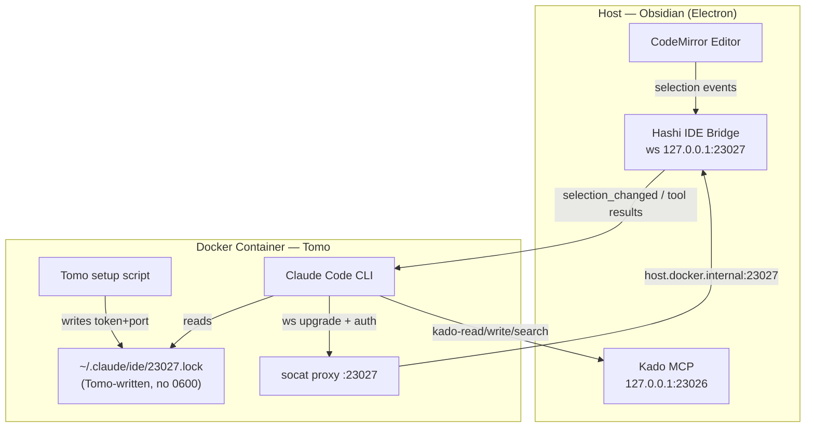
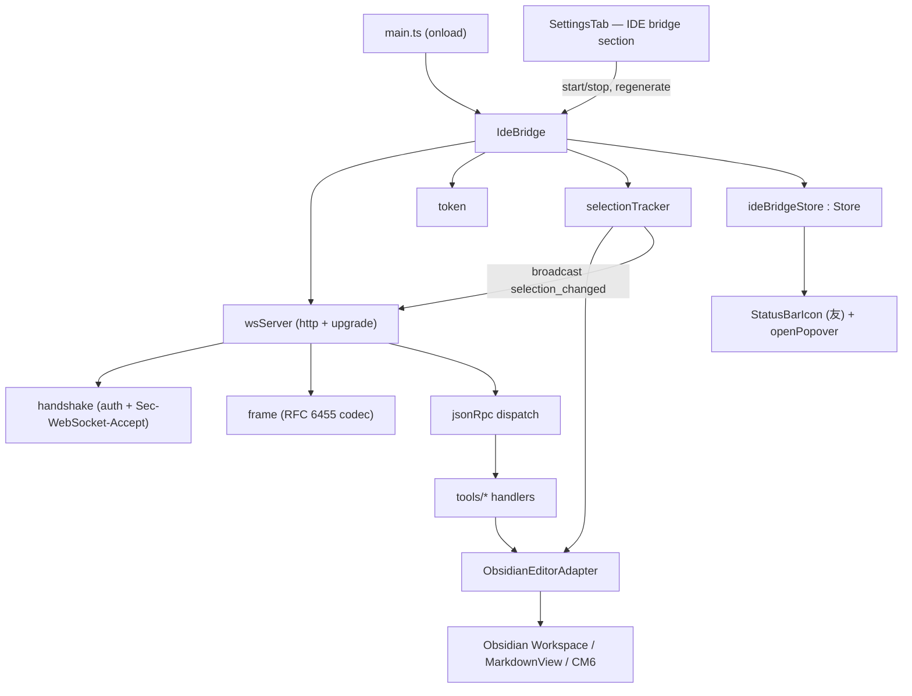

# Solution Design Document

## Validation Checklist

### CRITICAL GATES (Must Pass)

- [x] All required sections are complete
- [x] No [NEEDS CLARIFICATION] markers remain
- [x] Architecture pattern is clearly stated with rationale
- [x] **All architecture decisions confirmed by user**
- [x] Every interface has specification

### QUALITY CHECKS (Should Pass)

- [x] All context sources are listed with relevance ratings
- [x] Project commands are discovered from actual project files
- [x] Constraints → Strategy → Design → Implementation path is logical
- [x] Every component in diagram has directory mapping
- [x] Error handling covers all error types
- [x] Quality requirements are specific and measurable
- [x] Component names consistent across diagrams
- [x] A developer could implement from this design

---

## Constraints

- **CON-1** (Language/runtime): TypeScript strict mode, no `any`. Runs in Obsidian's Electron (Node 18+). Build via esbuild (CJS bundle, `__filename` available, `import.meta.url` empty). Desktop only (`isDesktopOnly: true`) — `net`/`http`/`fs`/`crypto` Node APIs are available.
- **CON-2** (Dependencies): Zero new runtime dependencies (Constitution L1/L2 — bounded deps, justify additions). The WebSocket server is hand-rolled. Existing deps: `dockerode`, `ajv`, `@xterm/*`.
- **CON-3** (Security/privacy): Bind `127.0.0.1` only. Auth token required on WebSocket upgrade. No vault I/O (Kado is the only inbound vault surface — Constitution L1). Selected text is ephemeral, never logged, never persisted (Constitution L2). No telemetry / background network.
- **CON-4** (Performance): No main-thread blocking. 100ms trailing-edge debounce on selection events; JSON dedup; <1MB memory overhead; selected-text cap 100KB (Constitution L1 performance).
- **CON-5** (Architecture): New work is **Component C** alongside A (Session View, `src/connection/` + `src/ui/`) and B (Instruction Executor, `src/executor/` + `src/actions/`). Small focused files (~300–500 LOC max per Constitution L2). Domain logic testable without an AI or a live Obsidian (Constitution L1 code quality, L3 fakes).
- **CON-6** (Protocol): Claude Code IDE protocol only (JSON-RPC 2.0 over WebSocket). No custom RPC extensions (ADR-019 / Kokoro).

## Implementation Context

**IMPORTANT**: Read and analyze ALL listed context sources before implementing.

### Required Context Sources

#### Documentation Context
```yaml
- doc: docs/XDD/specs/003-ide-bridge/requirements.md
  relevance: CRITICAL
  why: "PRD — the 16 features (F1–F16) and acceptance criteria this design must satisfy"

- doc: ~/Kouzou/projects/miyo/miyo-constitution.md
  relevance: HIGH
  why: "L1/L2 rules on privacy (localhost, no vault I/O), deps, perf, testing"

- url: https://code.claude.com/docs/en/ide-integrations
  relevance: HIGH
  why: "Official Claude Code IDE protocol surface"

- url: https://github.com/coder/claudecode.nvim
  relevance: MEDIUM
  why: "Full protocol reference (lock file, auth header, frame codec, keepalive)"

- url: https://github.com/petersolopov/obsidian-claude-ide
  relevance: HIGH
  why: "Working Obsidian reference: hand-rolled RFC 6455, Obsidian selection APIs, stub set"
```

#### Code Context
```yaml
- file: src/util/store.ts
  relevance: CRITICAL
  why: "Store<T> reactive primitive — ideBridgeStore reuses it (ADR-3)"

- file: src/connection/state.ts
  relevance: HIGH
  why: "Discriminated-union state pattern — IdeBridgeState mirrors ConnectionState"

- file: src/ui/status-bar/StatusBarIcon.ts
  relevance: CRITICAL
  why: "友 indicator — extended to surface IDE Bridge state (ADR-6)"

- file: src/ui/status-bar/openPopover.ts
  relevance: HIGH
  why: "Popover actions — gains 'Copy auth token' + 'IDE Bridge: …' line"

- file: src/settings/SettingsTab.ts
  relevance: CRITICAL
  why: "Settings host — new 'IDE bridge' section; addPathSetting/validation patterns"

- file: src/types/index.ts
  relevance: CRITICAL
  why: "PluginSettings — 3 new fields + settings_version bump + migration"

- file: src/connection/settingsPersistence.ts
  relevance: HIGH
  why: "loadSettings/saveSettings — migration block lands here"

- file: src/main.ts
  relevance: CRITICAL
  why: "Lifecycle — Component C constructed in onload, teardown to this.cleanups (ADR-8)"

- file: src/util/paths.ts
  relevance: MEDIUM
  why: "Path-safety helpers — reused by openFile input validation"

- file: @package.json
  relevance: MEDIUM
  why: "Build/test/lint scripts; confirms no ws dependency added"

- file: ../Kado/src/settings/tabs/ApiKeyTab.ts
  relevance: HIGH
  why: "Cleartext key + Copy + Regenerate→ConfirmModal pattern to mirror"

- file: ../Kado/src/settings/tabs/GeneralTab.ts
  relevance: HIGH
  why: "Port locked-while-running via control-swap; enable toggle → start/stop"
```

#### External APIs
```yaml
- service: Claude Code CLI (inside Tomo Docker container)
  doc: https://code.claude.com/docs/en/ide-integrations
  relevance: HIGH
  why: "The sole WebSocket client. Discovers via lock file, authenticates via header, consumes selection_changed + calls CLI-internal tools."
```

### Implementation Boundaries

- **Must Preserve**: Existing Component A (connection/chat/status bar) and Component B (executor) behavior. `PluginSettings` back-compat (settings_version migration must not drop existing fields). The 友 `StatusBarIcon` gains a second input (IDE Bridge state) but its existing Docker-connection coloring must remain correct when the bridge is disabled.
- **Can Modify**: `StatusBarIcon` (extend with IDE state + popover line), `openPopover` (new action), `SettingsTab` (new section), `PluginSettings` (additive fields), `main.ts` (wire Component C), `settingsPersistence` (migration v1→v2).
- **Must Not Touch**: Kado (no changes — separate repo). Vault read/write paths (Kado owns vault I/O). The executor (`src/executor/`, `src/actions/`) and schema (`src/schema/`).

### External Interfaces

#### System Context Diagram



#### Interface Specifications

```yaml
inbound:
  - name: "Claude Code IDE WebSocket"
    type: WebSocket (RFC 6455 over TCP)
    format: JSON-RPC 2.0 (TEXT frames) + PING/PONG
    authentication: "x-claude-code-ide-authorization header == stored token, validated on HTTP upgrade"
    bind: "127.0.0.1:{ideBridgePort} (default 23027)"
    data_flow: "Inbound: initialize, notifications/initialized, tools/list, tools/call. Outbound: selection_changed notifications + tool results."

outbound: []   # The IDE Bridge initiates no outbound network and writes no files. The discovery lock file is Tomo-generated inside the container (not by Hashi) — see Cross-Component Boundaries.

data:
  - name: "Plugin settings (data.json)"
    type: "Obsidian loadData/saveData"
    connection: "settingsPersistence.ts"
    data_flow: "ideBridgeEnabled, ideBridgePort, ideBridgeAuthToken persisted across restarts"
```

### Cross-Component Boundaries

- **API Contracts**:
  - *Lock file shape* is a contract consumed by Claude Code CLI — fields fixed by the Claude Code IDE protocol. **Tomo** writes it inside the container; Hashi's only stake is that the `authToken` in it matches Hashi's token and the `port` matches Hashi's server.
  - *`selection_changed` params* emit **plain vault-relative paths** in the standard `filePath`/`fileUrl` fields — the Kado namespace, with **no custom path-field extensions** (Kokoro ADR-019 §2.3, §5). `workspaceFolders` (lock file + `getWorkspaceFolders`) stays **empty**. Resolution to full-file reads is steered entirely by Tomo's container `CLAUDE.md` (→ `kado-read`); Hashi has no resolution logic.
- **Team Ownership**: Hashi owns the IDE Bridge server + the auth token. **Tomo** owns Docker-side wiring (socat, env vars) **and the container lock file** — handoff `_outbox/for-tomo/2026-05-27` + the lock-file-ownership amendment. Kado unchanged. (This supersedes ADR-019 §6, which had Hashi write the host lock file — Kokoro amendment raised 2026-05-28.)
- **Shared Resources**: `~/.claude/ide/` lives **inside the container** and is written by Tomo's setup. Hashi does not read or write it.
- **Breaking Change Policy**: The lock file shape and auth header are external contracts — any change requires a Kokoro note + Tomo handoff.

### Project Commands

```bash
Install: npm install
Dev:     npm run dev            # esbuild watch
Test:    npm test              # vitest run
Lint:    npm run lint          # eslint src/ manifest.json (obsidianmd rules)
Build:   npm run build         # tsc -noEmit + esbuild production
Deploy:  HASHI_DEPLOY_VAULT=1 npm run build   # build into test/Hashi vault
```

## Solution Strategy

- **Architecture Pattern**: Layered modular subsystem (Component C). Four layers, dependencies point inward:
  1. **Transport** — hand-rolled RFC 6455 WebSocket over `node:http` (`wsServer`, `frame`, `handshake`).
  2. **Protocol** — JSON-RPC 2.0 dispatch (`jsonRpc`) routing to tool handlers and emitting notifications.
  3. **Domain/Tools** — pure-ish handlers (`tools/*`) that read editor state via an injected Obsidian adapter; `selectionTracker` produces broadcasts.
  4. **Adapter** — thin Obsidian-facing seam (`ObsidianEditorAdapter`) so domain/tool logic is testable with a fake (Constitution L1/L3).
  The orchestrator `IdeBridge` owns lifecycle (start/stop), the token, and the `ideBridgeStore`. It writes no lock file (Tomo-generated, container-side).

- **Integration Approach**: Wire as Component C in `main.ts` exactly like A and B — construct in `onload`, start if `ideBridgeEnabled`, push teardown to `this.cleanups`. Settings drive start/stop (Kado enable-toggle flow). The 友 `StatusBarIcon` subscribes to `ideBridgeStore` (in addition to `connectionStore`) and surfaces IDE state.

- **Justification**: Mirrors two existing, shipped components → low cognitive load, consistent teardown discipline, reuses `Store<T>` and the status-bar/settings patterns. Hand-rolled WS keeps the dependency footprint at zero (Constitution L1) and is proven by the obsidian-claude-ide reference for this exact protocol subset.

- **Key Decisions**: See ADR-1…ADR-8. Headlines: hand-rolled RFC 6455 (ADR-1); `src/ide-bridge/` module (ADR-2); `Store<T>` reuse (ADR-3); token `hashi_<UUID>` in data.json cleartext (ADR-4); CodeMirror `updateListener` + debounce (ADR-5); 友 kanji combined-health color (ADR-6); plain vault-relative paths + empty workspaceFolders (ADR-7); **ADR-8 superseded — lock file is Tomo-generated, Hashi writes none**.

## Building Block View

### Components



### Directory Map

**Component**: ide-bridge (NEW)
```
src/
├── ide-bridge/
│   ├── IdeBridge.ts            # NEW: orchestrator — start()/stop()/isRunning()/regenerateToken(); owns server+token+tracker+store (no lock file)
│   ├── state.ts                # NEW: IdeBridgeState discriminated union
│   ├── ideBridgeStore.ts       # NEW: export const ideBridgeStore = new Store<IdeBridgeState>(...)
│   ├── wsServer.ts             # NEW: http.createServer + 'upgrade' handler; client set; broadcast(); ping loop
│   ├── frame.ts                # NEW: RFC 6455 encode/decode (TEXT, PING, PONG, CLOSE); masking
│   ├── handshake.ts            # NEW: validate upgrade req (auth header, Sec-WebSocket-Key → Accept)
│   ├── jsonRpc.ts              # NEW: parse + route JSON-RPC; error responses (-32700/-32600/-32601)
│   ├── token.ts                # NEW: ensureToken() → `hashi_${crypto.randomUUID()}`; pure generate()  (lockFile.ts removed — Tomo generates the container lock file)
│   ├── selectionTracker.ts     # NEW: CM6 updateListener + active-leaf-change → 100ms debounce → dedup → broadcast
│   ├── ObsidianEditorAdapter.ts# NEW: editor seam — getCurrentSelection(), getOpenEditors(), openFile(), workspaceRoot()
│   ├── protocol.ts             # NEW: protocol types (RpcRequest, RpcResponse, SelectionChangedParams, ToolName)
│   └── tools/
│       ├── index.ts            # NEW: tool registry — name→{description,inputSchema,handler}; builds tools/list
│       ├── selection.ts        # NEW: getCurrentSelection, getLatestSelection
│       ├── openFile.ts         # NEW: openFile (path-safety validated)
│       ├── openEditors.ts      # NEW: getOpenEditors
│       ├── workspace.ts        # NEW: getWorkspaceFolders
│       └── stubs.ts            # NEW: getDiagnostics, checkDocumentDirty, saveDocument, close_tab, closeAllDiffTabs
├── ui/
│   ├── status-bar/
│   │   ├── StatusBarIcon.ts    # MODIFY: also subscribe ideBridgeStore; 友 kanji color = combined worst-state (Docker+IDE); fold into aria; pass popover data (no dot)
│   │   └── openPopover.ts      # MODIFY: render "IDE Bridge: <state> :<port>" line + "Copy auth token" action
│   └── ConfirmModal.ts         # NEW: minimal confirm modal (mirrors Kado) for token regenerate
├── settings/
│   └── SettingsTab.ts          # MODIFY: add "IDE bridge" section (toggle, port lock-while-running, token+Copy+Regenerate)
├── types/
│   └── index.ts                # MODIFY: +ideBridgeEnabled/+ideBridgePort/+ideBridgeAuthToken; DEFAULT_SETTINGS; version→2
├── connection/
│   └── settingsPersistence.ts  # MODIFY: v1→v2 migration (default the 3 new fields)
├── commands/
│   └── registerCommands.ts     # MODIFY: add "Toggle IDE bridge" command (F13) → ideBridge.start()/stop()
└── main.ts                     # MODIFY: construct IdeBridge (Component C), start-if-enabled, push teardown to cleanups
```

**Docs** (NEW/MODIFY, repo root)
```
PRIVACY.md                      # MODIFY: document the IDE Bridge network surface (F14) — 127.0.0.1 bind, data sent (paths/cursor/selection, ephemeral), auth header
README.md                       # MODIFY: add IDE Bridge to feature list + setup pointer (Tomo Docker wiring handoff)
```

> **F15 (Auto-restart on crash) is a Could-Have — deferred.** v0.1 ships the single 500ms EADDRINUSE re-listen only (Kado hot-reload race). Full crash auto-restart is out of the v0.1 build; revisit if real-world crashes are observed.

### Interface Specifications

#### Application Data Models

```pseudocode
ENTITY: IdeBridgeState (NEW)  # src/ide-bridge/state.ts — mirrors ConnectionState shape
  | { kind: "stopped" }
  | { kind: "listening"; port: number }
  | { kind: "connected"; port: number; clientCount: number }   # clientCount >= 1
  | { kind: "error"; reason: string }                          # e.g. "port 23027 in use"

ENTITY: PluginSettings (MODIFIED)  # src/types/index.ts
  FIELDS (existing): settings_version?, chosenInstanceName, zoomLevel,
                     tomoInboxFolder, executionMode, runLogRetention,
                     hooksDir, hooksPolicy, debugLogging
  + ideBridgeEnabled: boolean          (NEW; default false)
  + ideBridgePort: number              (NEW; default 23027)
  + ideBridgeAuthToken: string         (NEW; default "" — generated on first enable; format hashi_<UUID>)
  ~ settings_version: 2                 (CHANGED; was 1)

ENTITY: SelectionChangedParams (NEW)  # src/ide-bridge/protocol.ts
  FIELDS:
    text: string                       # selected text, capped 100KB ("" if cursor-only)
    filePath: string                   # PLAIN VAULT-RELATIVE path, e.g. "notes/plan.md" (Kokoro ADR-019 §5)
    fileUrl: string                    # file:// URL whose path is the vault-relative path (standard field kept for presence; carries NO host absolute path)
    selection: { start: Pos; end: Pos; isEmpty: boolean }
  Pos: { line: number; character: number }   # 0-based (Obsidian getCursor is already 0-based)
  # NO separate vaultRelativePath field — that would be a §2.3-forbidden custom path-field extension. The standard filePath IS vault-relative.

# LockFile entity REMOVED — the discovery lock file is written by Tomo inside the container, not by Hashi.
# For reference, the shape Tomo writes (Hashi does not produce it): { pid, workspaceFolders:[], ideName, transport:"ws", authToken: hashi_<UUID> }.
# Hashi's only stake: the authToken matches Hashi's stored token and the port matches Hashi's server.
```

#### Internal API Changes — IdeBridge orchestrator

```yaml
Class: IdeBridge   # src/ide-bridge/IdeBridge.ts
  constructor(deps:
    app: App,
    getSettings: () => PluginSettings,        # getter (settings object is reassigned on persist — see main.ts M4)
    persist: (next: PluginSettings) => Promise<void>,
    log: { debug; warn; error })              # debug gated by settings.debugLogging
  Methods:
    start(): Promise<void>                     # idempotent; ensureToken→listen; sets store listening/error (no lock file written)
    stop(): Promise<void>                      # idempotent; close clients→close server; store stopped
    isRunning(): boolean                       # single source of truth for settings UI (Kado pattern)
    regenerateToken(): Promise<void>           # new hashi_<UUID>, persist, disconnect clients; user must re-copy into Tomo (no lock to rewrite)
    getToken(): string                         # current token (for Copy)
    # registers CM6 extension + workspace event via the plugin so register* auto-cleans
```

#### Tool registry (JSON-RPC `tools/call` targets)

```yaml
# Real handlers (CLI-internal RPC except where noted)
getCurrentSelection:  returns { text, filePath (vault-relative), fileUrl, selection } or empty when no MarkdownView
getLatestSelection:   returns last broadcast SelectionChangedParams or empty
getOpenEditors:       returns { tabs: [{ filePath (vault-relative), isDirty:false }] } from getLeavesOfType("markdown")
openFile:             params { filePath: vault-relative }; path-safety validated; opens via workspace.openLinkText; error on missing/unsafe
getWorkspaceFolders:  returns EMPTY { workspaceFolders: [] } — host vault path meaningless in the container (Kokoro ADR-019 §5)

# Stubs (protocol completeness)
getDiagnostics:       { diagnostics: [] }
checkDocumentDirty:   { isDirty: false }
saveDocument:         { saved: true }   # no-op (Obsidian auto-saves)
close_tab:            { closed: true }  # no-op
closeAllDiffTabs:     { closed: 0 }     # no-op
# Unknown method → JSON-RPC error -32601
# Out of scope (NOT registered): openDiff, executeCode
```

#### Settings UI (SettingsTab "IDE bridge" section)

```yaml
Section: "IDE bridge" (setHeading), placed AFTER "Tomo connection", BEFORE "Instruction executor"
Controls:
  - Status (desc-only): "Running on 127.0.0.1:{port} — {clientCount} client(s)" | "Stopped" | "Error: {reason}"
  - Enable (addToggle):
      onChange(value): settings.ideBridgeEnabled=value; persist; value? ideBridge.start() : ideBridge.stop(); re-render
  - Port (addText | desc-swap):
      WHILE running → desc "{port} (locked while running)"   # Kado control-swap, NOT setDisabled
      WHILE stopped → text input; validate 1024..65535 & integer & != 23026 (Kado); persist on valid
  - Auth token (cleartext display, no masking):
      .descEl span with token text (hashi_<UUID>)
      addButton "Copy"      → navigator.clipboard.writeText(token); label→"Copied!" 1.5s
      addButton "Regenerate"→ ConfirmModal("Regenerate token?", "Connected clients will be disconnected and must use the new token.") → ideBridge.regenerateToken(); re-render; Notice
Rendering: single page if it fits; if crowded, adopt Kado-style tabs (deferred — start single-page)
```

### Implementation Examples

#### Example: Selection broadcast (debounce + dedup + dual path)

**Why this example**: The core value path (F5) and the one place that touches the UI thread on every keystroke — must be allocation-light and correctly debounced.

```typescript
// src/ide-bridge/selectionTracker.ts (illustrative — not prescriptive)
const DEBOUNCE_MS = 100;
const MAX_TEXT = 100_000;

let timer: number | null = null;
let lastKey = "";           // dedup key of the last broadcast
let latest: SelectionChangedParams | null = null;  // for getLatestSelection

function onEditorActivity(): void {
  if (timer !== null) activeWindow.clearTimeout(timer);   // activeWindow, not window (popout-safe)
  timer = activeWindow.setTimeout(flush, DEBOUNCE_MS);    // trailing-edge
}

function flush(): void {
  timer = null;
  const snap = adapter.getCurrentSelection();             // sync read of MarkdownView/editor
  if (snap === null) return;                              // non-editor context → no broadcast
  const params = toParams(snap);                          // builds plain vault-relative filePath/fileUrl (no host abs path)
  if (params.text.length > MAX_TEXT) params.text = params.text.slice(0, MAX_TEXT);
  const key = `${params.filePath}|${params.selection.start.line}:${params.selection.start.character}|`
            + `${params.selection.end.line}:${params.selection.end.character}|${params.text}`;
  if (key === lastKey) return;                            // dedup (Rule 3)
  lastKey = key;
  latest = params;
  wsServer.broadcast({ jsonrpc: "2.0", method: "selection_changed", params });
}
```

#### Example: Upgrade auth (reject BEFORE handshake)

**Why this example**: SEC-2 — the 401 must happen on the HTTP upgrade, never after a completed WebSocket handshake.

```typescript
// src/ide-bridge/wsServer.ts (illustrative)
httpServer.on("upgrade", (req, socket) => {
  const presented = req.headers["x-claude-code-ide-authorization"];
  if (typeof presented !== "string" || presented !== token()) {
    log.warn(`[hashi/ide] auth rejected: ${String(presented)}`);  // F16: log rejected token; no remote addr
    socket.write("HTTP/1.1 401 Unauthorized\r\n\r\n");
    socket.destroy();
    return;                                                        // no upgrade, no client added
  }
  const accept = secWebSocketAccept(req.headers["sec-websocket-key"]);
  socket.write(
    "HTTP/1.1 101 Switching Protocols\r\n" +
    "Upgrade: websocket\r\nConnection: Upgrade\r\n" +
    `Sec-WebSocket-Accept: ${accept}\r\n\r\n`,
  );
  registerClient(socket);
});
```

#### Test Examples as Interface Documentation

```typescript
// Domain logic is testable with a fake adapter — no live Obsidian (Constitution L1/L3).
describe("openFile tool", () => {
  it("rejects traversal paths", async () => {
    const res = await tools.openFile({ filePath: "../../etc/passwd" }, fakeAdapter);
    expect(res).toEqual({ error: { code: -32602, message: expect.stringContaining("unsafe") } });
  });
  it("opens an existing vault file", async () => {
    fakeAdapter.files.add("notes/plan.md");
    await tools.openFile({ filePath: "notes/plan.md" }, fakeAdapter);
    expect(fakeAdapter.opened).toBe("notes/plan.md");
  });
});

describe("upgrade auth", () => {
  it("returns 401 and never upgrades on wrong token", async () => {
    const { status, upgraded } = await rawUpgrade({ token: "wrong" });
    expect(status).toBe(401);
    expect(upgraded).toBe(false);
  });
});
```

## Runtime View

### Primary Flow: Selection → Claude Code context

1. User moves cursor / changes selection in a Markdown editor.
2. CM6 `updateListener` (or `active-leaf-change`) fires → `selectionTracker.onEditorActivity()` (re)arms a 100ms timer.
3. Timer fires → `flush()` reads current selection via the adapter; non-editor context → return.
4. Build `SelectionChangedParams` (plain vault-relative `filePath`/`fileUrl`, text capped 100KB); dedup against last key.
5. `wsServer.broadcast()` frames a TEXT JSON-RPC notification to every connected client.
6. Claude Code injects it into the next prompt ("Selected N lines from …"). For the full file it calls `kado-read` with the vault-relative path — steered by Tomo's CLAUDE.md routing rule (Kokoro ADR-019 §5).

```mermaid
sequenceDiagram
    actor User
    participant CM as CodeMirror
    participant Tracker as selectionTracker
    participant WS as wsServer
    participant CC as Claude Code
    participant Kado
    User->>CM: move cursor / select
    CM->>Tracker: updateListener
    Tracker->>Tracker: debounce 100ms + dedup
    Tracker->>WS: broadcast(selection_changed)
    WS->>CC: TEXT frame (JSON-RPC notification)
    CC->>Kado: kado-read(vault-relative path)  %% only if full file needed; Tomo CLAUDE.md routing
    Kado-->>CC: file content
```

### Secondary Flow: Connect & handshake

1. Claude Code reads the container lock file `~/.claude/ide/23027.lock` (written by Tomo's setup) → gets port + authToken.
2. Opens WebSocket via socat → host `127.0.0.1:23027`, sends `x-claude-code-ide-authorization`.
3. `wsServer` upgrade handler validates token → 401+destroy on mismatch, else 101 + register client → store `connected{clientCount}`.
4. MCP handshake: `initialize` → server returns `{protocolVersion, capabilities:{tools:{}}, serverInfo}`; `notifications/initialized`; `tools/list` → registry minus out-of-scope tools.
5. 友 indicator turns "IDE connected"; ping loop (30s) starts.

### Secondary Flow: openFile

1. Claude calls `tools/call` `openFile {filePath}` (vault-relative).
2. `tools/openFile` runs path-safety (`src/util/paths.ts` — reject absolute/`..`/empty-seg).
3. Resolve via `vault.getAbstractFileByPath` → missing → JSON-RPC error `-32602`.
4. `workspace.openLinkText(path, "")` opens in active leaf → success result.

### Error Handling

- **Port in use (EADDRINUSE)**: `listen` errors → store `error{reason:"port {p} in use"}`; settings Status shows it; Notice on enable. No auto-retry beyond a single 500ms EADDRINUSE re-listen (Kado hot-reload race pattern).
- **Bad upgrade / wrong token**: 401 + `socket.destroy()` before handshake; `warn` log includes rejected token (F16); no client added.
- **Malformed JSON-RPC**: parse error → `-32700`; unknown method → `-32601`; bad params → `-32602`. Never throw out of the frame loop.
- **Dead client (no pong in 30s)**: server closes that socket; store recomputes clientCount; if zero → `listening`.
- **Selection in non-editor context**: no broadcast (not an error).
- **Plugin unload mid-debounce**: pending timer cleared by register*-scoped teardown; no broadcast.

## Deployment View

### Single Application Deployment
- **Environment**: Obsidian desktop (Electron, macOS primary; Linux theoretical; Windows user-contribution). `isDesktopOnly: true`.
- **Configuration**: `ideBridgeEnabled` (default off), `ideBridgePort` (default 23027), `ideBridgeAuthToken` (auto-generated). No env vars on the Hashi side.
- **Dependencies**: None new. Node `http`/`net`/`fs`/`crypto` from Electron.
- **Performance**: <1MB overhead; <200ms editor-change→frame; 10 fps max (100ms debounce).

### Multi-Component Coordination
- **Deployment Order**: Hashi ships independently. Tomo Docker wiring (socat, container lock file generation, env) is a separate Tomo change (handoff sent) — required for end-to-end but not for Hashi to build/run.
- **Version Dependencies**: Lock file shape + auth header must match what the user's Claude Code CLI expects (protocol stable across VS Code/Neovim).
- **Feature Flags**: The enable toggle is the de-facto flag (default off).
- **Rollback**: Disable toggle stops the server. No persistent external state to migrate back (Hashi writes no lock file).

## Cross-Cutting Concepts

### Pattern Documentation
```yaml
- pattern: src/util/store.ts (Store<T>)
  relevance: CRITICAL
  why: "ideBridgeStore — reactive state for the status indicator"
- pattern: src/ui/status-bar/StatusBarIcon.ts (kanji + state-class indicator)
  relevance: CRITICAL
  why: "Extended to surface IDE Bridge state on 友 (ADR-6)"
- pattern: ../Kado/src/settings/tabs (enable→start/stop, port lock-while-running, key Copy/Regenerate)
  relevance: HIGH
  why: "Settings UX mirrored for the IDE bridge section"
- pattern: src/util/paths.ts (normalize→contain path safety)
  relevance: MEDIUM
  why: "openFile input validation"
```

### User Interface & UX

**Entry Points**
```
Status bar:  友          (友 kanji color = combined session health: Docker + IDE Bridge, worst-state-wins; no separate dot)
Click 友 → popover:
┌──────────────────────────┐
│ Tomo: my-instance        │   ← Docker connection (existing)
│ IDE Bridge: connected(1) │   ← NEW line
│   :23027                 │
│ ───────────────────────  │
│ Copy auth token          │   ← NEW action (only when running)
│ Reconnect                │
│ Open chat                │
│ Settings                 │
└──────────────────────────┘

Settings → "IDE bridge" section:
┌─────────────────────────────────────────────┐
│ IDE bridge                                    │
│ Status: Running on 127.0.0.1:23027 — 1 client │
│ Enable                              [ on  ]  │
│ Port            23027 (locked while running)  │
│ Auth token   hashi_3f2a…   [Copy] [Regenerate]│
└─────────────────────────────────────────────┘
```

**Interaction Design**
- **State Management**: `ideBridgeStore: Store<IdeBridgeState>`. Single writer: `IdeBridge`. `StatusBarIcon` subscribes to **both** `connectionStore` and `ideBridgeStore` and computes the 友 kanji color from the combined worst-state (ADR-6). `SettingsTab` re-renders on toggle (Kado full-rebuild style).
- **Combined color rule**: precedence `error` > `reconnecting`/`disconnected` > `connected`/`healthy`. Docker `disconnected` OR IDE Bridge `error` → the kanji shows the degraded color; both healthy → connected color. The popover line disambiguates which axis is degraded.
- **No indicator dot**: IDE Bridge state is surfaced via the 友 kanji color + the popover line + tooltip only.
- **Feedback**: Notices on enable ("IDE Bridge started on :23027"), regenerate ("Token regenerated — copy the new value into Tomo"), copy ("Copied!"), port-in-use error.
- **Accessibility**: 友 root keeps `role` + `aria-live`; combined state folded into the existing `aria-label`/announcer (color is not the sole signal — popover text + tooltip carry it). ConfirmModal focuses Cancel by default (Kado pattern).

### System-Wide Patterns
- **Security**: `127.0.0.1` bind; token on upgrade (401 pre-handshake); selected text never logged/persisted; token is not treated as a secret (cleartext in data.json by design — ADR-4). Lock-file permissions are Tomo's concern (container-side).
- **Error Handling**: Local-first — every transport/RPC error maps to a JSON-RPC error code or a store `error` state; nothing throws out of the frame/event loop.
- **Performance**: 100ms trailing debounce + dedup + 100KB cap; async libuv I/O; `activeWindow` timers (popout-safe).
- **Logging/Auditing**: `console.debug` gated by `settings.debugLogging` (prefix `[hashi/ide]`); `warn`/`error` always. No audit journal in v0.1 (consistent with Hashi charter). No vault content in logs.

## Architecture Decisions

- [x] **ADR-1 WebSocket implementation: hand-rolled RFC 6455 over `node:http`**
  - Rationale: zero new dependencies (Constitution L1/L2); the protocol uses only TEXT + PING/PONG (no binary/fragmentation/extensions); proven by obsidian-claude-ide (~70 LOC codec) and claudecode.nvim.
  - Trade-offs: we own frame-parsing correctness and its tests. Accepted — the subset is small and well-bounded.
  - User confirmed: **Yes (2026-05-28)**

- [x] **ADR-2 Module structure: new `src/ide-bridge/` (Component C)**
  - Rationale: mirrors Components A (`connection/`) and B (`executor/`); small focused files along transport/protocol/domain/adapter seams (Constitution L2).
  - Trade-offs: more files vs one module; chosen for testability and the 300–500 LOC rule.
  - User confirmed: **Yes — follows established repo convention (2026-05-28)**

- [x] **ADR-3 State: reuse `Store<T>` with `ideBridgeStore`**
  - Rationale: identical need to connectionStore/executionStore; status indicator subscribes; single-writer discipline.
  - Trade-offs: none material.
  - User confirmed: **Yes — follows established repo convention (2026-05-28)**

- [x] **ADR-4 Token: `hashi_<UUID>` in `data.json`, cleartext, no masking**
  - Rationale: Kado ADR-5 (single data.json) + ADR-6 (`<prefix>_<UUID>`). The token must be copied as plaintext into Tomo's config (and ends up cleartext in Tomo's container lock file) → separate-file/masking protects nothing; synced token is inert elsewhere (PRD decision).
  - Trade-offs: Constitution L2 "creds outside data.json" consciously waived (documented in PRD + here).
  - User confirmed: **Yes — set in PRD review (2026-05-28)**

- [x] **ADR-5 Selection tracking: CM6 `EditorView.updateListener` + `active-leaf-change`, 100ms trailing debounce, JSON dedup**
  - Rationale: proven by obsidian-claude-ide; `registerEditorExtension`/`registerEvent` auto-clean on unload; main-thread safe; `activeWindow` timers for popout windows.
  - Trade-offs: cursor-only moves DO broadcast (different position) — intended; Claude uses cursor line.
  - User confirmed: **Yes — follows established repo convention (2026-05-28)**

- [x] **ADR-6 Status surface: fold IDE Bridge state into the 友 kanji as combined session-health color; no indicator dot; details in the popover**
  - Choice: `StatusBarIcon` subscribes to both `connectionStore` and `ideBridgeStore`. The 友 kanji color = worst-state across both axes (precedence `error` > `reconnecting`/`disconnected` > `connected`/`healthy`). No separate indicator dot. The popover gains an "IDE Bridge: <state> :<port>" line + "Copy auth token" action.
  - Rationale: user directive — reuse the existing kanji and colorcode it; avoid a bespoke widget; IDE Bridge is a Session View subsystem.
  - Trade-offs: one kanji color encodes two concerns; the popover line + tooltip disambiguate which axis is degraded. Cannot identify a *specific* Tomo instance (PRD limitation) — shows connection-presence.
  - User confirmed: **Yes — combined session health, no dot (2026-05-28)**

- [x] **ADR-7 Path scheme: emit plain vault-relative paths in standard fields; empty `workspaceFolders`; no custom path-field extensions**
  - Rationale: Kokoro ADR-019 §5 (binding contract). A host absolute path is meaningless in the unmounted container; emitting vault-relative paths in the Kado namespace + empty `workspaceFolders` forces Tomo's CLAUDE.md routing rule (→ `kado-read`) — the documented resolution mechanism (a). §2.3 forbids custom path-field extensions, so no separate `vaultRelativePath` field and no `kado:` prefix.
  - Trade-offs: deviates from the absolute-path convention used by VS Code / obsidian-claude-ide — accepted, because absolute host paths are useless in the container and the field is consumed as prompt context, not opened locally. Mechanism (b) (`kado:`-prefixed paths) is rejected; do not pre-build.
  - User confirmed: **Yes — Kokoro handoff applied 2026-05-28 (ADR-019 §5)**

- [~] **ADR-8 Lock file management — SUPERSEDED (2026-05-28): Hashi writes no lock file**
  - Original decision (withdrawn): Hashi writes/cleans its own `{port}.lock` on the host with real PID + atomic write + stale-by-PID cleanup.
  - Supersession: the discovery lock file is generated by **Tomo** inside the container (from the user-copied token + port). Hashi has no lock-file responsibility — no host file, no directory creation, no stale cleanup. This removes `lockFile.ts` and the `LockFile` entity.
  - Rationale: per user decision — Tomo is already implementing container-side generation. The host lock file was only needed for host-side `claude --ide` discovery and auto token propagation via a mount; both are explicitly given up.
  - Contract impact: **supersedes ratified ADR-019 §6** (Hashi writes host lock + Tomo mounts RO). A Kokoro ADR-019 amendment handoff was raised 2026-05-28 (`_outbox/for-kokoro/...lock-file-ownership`).
  - User confirmed: **Yes — superseded per user (2026-05-28)**

## Quality Requirements

- **Performance**: editor-change→frame < 200ms (100ms debounce + <1ms serialize + localhost); memory overhead < 1MB; ≤ 10 fps broadcast; no measurable typing latency.
- **Usability**: enable→running with a single toggle; token copyable in one click; port-in-use surfaces a named error; status visible on 友 + its popover.
- **Security**: 127.0.0.1 only (0.0.0.0 bind is a review blocker); 401 before handshake on bad/missing token; selected text never logged/persisted. (Lock-file permissions are Tomo's concern, container-side.)
- **Reliability**: idempotent start/stop; graceful client close on unload; dead clients reaped at 30s; nothing throws out of the event loop.

## Acceptance Criteria

**Main Flow (PRD F1, F5):**
- [ ] WHERE `ideBridgeEnabled` is true, WHEN the plugin loads, THE SYSTEM SHALL listen on 127.0.0.1:{ideBridgePort}.
- [ ] WHEN a Markdown selection change settles past 100ms, THE SYSTEM SHALL broadcast one `selection_changed` with plain vault-relative paths (no host absolute path, no custom path-field extension) and ≤100KB text.
- [ ] WHILE no Markdown editor is active, THE SYSTEM SHALL NOT broadcast `selection_changed`.

**Auth (PRD F3, F4):**
- [ ] IF the upgrade header is missing or != stored token, THEN THE SYSTEM SHALL respond 401 and not complete the WebSocket handshake.
- [ ] WHEN the IDE Bridge is first enabled, THE SYSTEM SHALL generate a `hashi_<UUID>` token, store it in `data.json`, and display it for copy.
- [ ] THE SYSTEM SHALL write no lock file (the discovery lock file is Tomo-generated, container-side — ADR-8 superseded).

**Tools (PRD F6, F7, F8, F11):**
- [ ] WHEN `tools/call openFile` targets an existing vault file, THE SYSTEM SHALL open it; IF the path is absolute or contains `..`, THEN THE SYSTEM SHALL return error -32602.
- [ ] WHEN `tools/call getCurrentSelection`/`getLatestSelection`/`getOpenEditors` is invoked, THE SYSTEM SHALL return the specified shape with plain vault-relative paths (empty when no editor).
- [ ] WHEN `tools/call getWorkspaceFolders` is invoked, THE SYSTEM SHALL return an empty `workspaceFolders` array (Kokoro ADR-019 §5) regardless of editor state.
- [ ] WHEN an unknown method is called, THE SYSTEM SHALL return error -32601.

**Settings & Status (PRD F10, F12, F13, F16):**
- [ ] WHILE the bridge is running, THE SYSTEM SHALL render the port read-only; WHILE stopped, editable with 1024–65535 validation (≠23026).
- [ ] WHEN the user clicks Regenerate and confirms, THE SYSTEM SHALL mint a new `hashi_<UUID>`, disconnect clients, display the new token, and notice the user to re-copy it into Tomo.
- [ ] THE SYSTEM SHALL fold IDE Bridge state into the 友 kanji color (combined worst-state with the Docker connection) and a popover line (with port + client count); no separate indicator dot.
- [ ] WHEN auth is rejected, THE SYSTEM SHALL `warn`-log the rejected token (no remote address).
- [ ] WHERE the command palette is used, THE SYSTEM SHALL provide "Toggle IDE bridge".

**Performance (PRD NFRs):**
- [ ] THE SYSTEM SHALL debounce selection events at 100ms and dedup identical states.
- [ ] THE SYSTEM SHALL keep WebSocket I/O off the synchronous UI path (no measurable typing latency).

## Risks and Technical Debt

### Known Technical Issues
- esbuild CJS bundle: `import.meta.url` is empty; use `__filename` if a `createRequire` is ever needed (none expected here). `activeWindow` (not `window`) for timers — popout-window correctness.
- Obsidian editor APIs (`getCursor`, `registerEditorExtension`, `MarkdownView`) are stable but version-sensitive (peer `obsidian >=1.5.0`).

### Technical Debt
- 友 indicator now multiplexes two concerns. If a third arises, revisit whether a dedicated IDE kanji is warranted (deferred per ADR-6).
- Single-page settings; may migrate to Kado-style tabs if the section grows (deferred).

### Implementation Gotchas
- **Reject before upgrade**: validate auth in the `upgrade` handler and `socket.destroy()` on failure — do NOT complete the handshake then close (SEC-2).
- **Sec-WebSocket-Accept**: SHA-1 of `Sec-WebSocket-Key` + the RFC magic GUID, base64 — get this exact or clients won't connect.
- **Frame masking**: client→server frames are masked (must unmask); server→client frames are unmasked. Handle PING→PONG and CLOSE.
- **No lock file in Hashi**: the discovery lock file is Tomo-generated (container-side). Do not add lock-file writing/cleanup to Hashi — its job is server + token only (ADR-8 superseded).
- **`workspace` ready timing**: defer selection-tracker wiring until layout-ready if reading active leaf during `onload`.
- **Settings re-render**: follow Kado's full-rebuild-on-change; do not cache control references across `display()`.
- **Token getter vs snapshot**: pass settings as a getter to `IdeBridge` (persist reassigns `this.settings`).

## Glossary

### Domain Terms
| Term | Definition | Context |
|------|------------|---------|
| Ambient context | Editor state (file + selection) Claude receives automatically each prompt | The core value of the bridge |
| Component C | The IDE Bridge subsystem, alongside A (Session View) and B (Executor) | Repo structure |

### Technical Terms
| Term | Definition | Context |
|------|------------|---------|
| RFC 6455 | The WebSocket protocol (framing, handshake) | Hand-rolled in `frame.ts`/`handshake.ts` |
| JSON-RPC 2.0 | Request/response + notification envelope over the socket | `jsonRpc.ts` |
| Lock file | `~/.claude/ide/{port}.lock` discovery file Claude Code reads — **Tomo-generated** inside the container; Hashi writes none | Tomo setup |
| `activeWindow` | Obsidian global for the active (possibly popout) window | Timer host |
| socat | TCP forwarder bridging container loopback → host | Tomo-side wiring |

### API/Interface Terms
| Term | Definition | Context |
|------|------------|---------|
| `selection_changed` | Notification carrying plain vault-relative file path + selection | Primary broadcast |
| `x-claude-code-ide-authorization` | Upgrade header carrying the auth token | `handshake.ts` |
| CLI-internal tool | Tool used by Claude Code's CLI, not shown to the model | Most tools here |
| Model-visible tool | `getDiagnostics`, `executeCode` reach the model | We stub getDiagnostics; skip executeCode |
