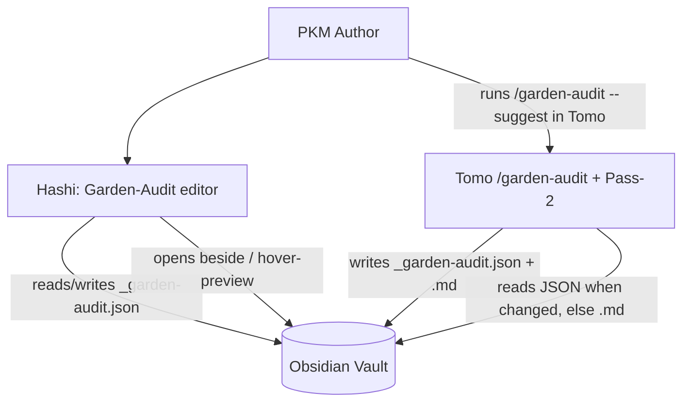
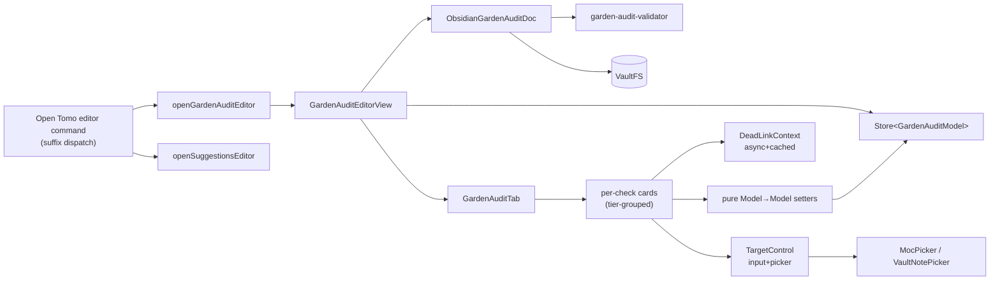
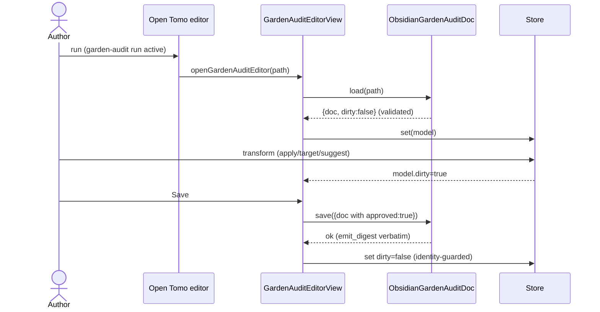
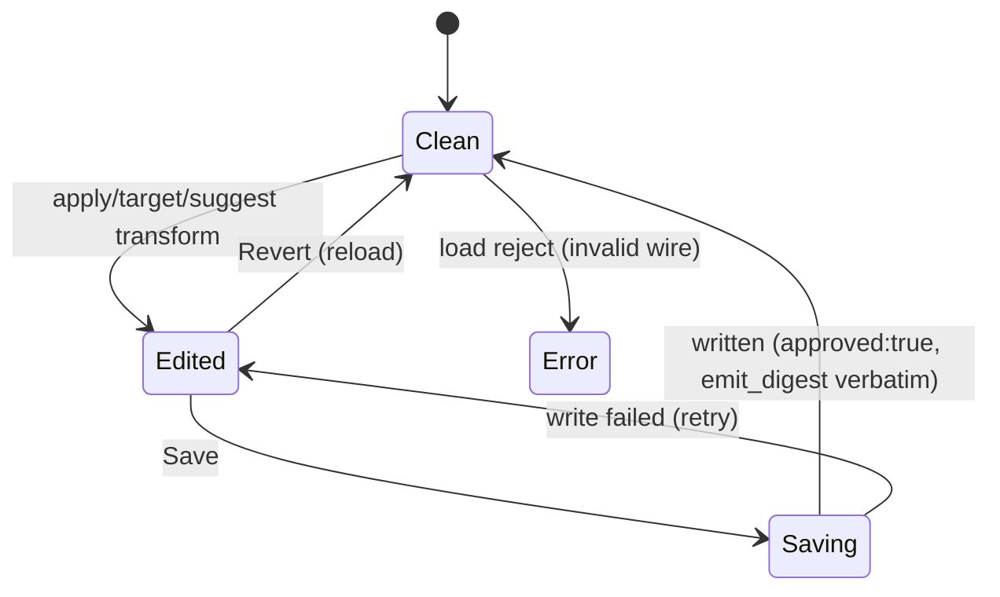

# Solution Design Document

## Validation Checklist

### CRITICAL GATES (Must Pass)

- [x] All required sections are complete (N/A sections marked, not left as clarifications)
- [x] No [NEEDS CLARIFICATION] markers remain
- [x] Architecture pattern is clearly stated with rationale (parallel view + ports-and-adapters)
- [x] **All architecture decisions confirmed by user** (ADR-1..7 confirmed 2026-07-22)
- [x] Every interface has specification

### QUALITY CHECKS (Should Pass)

- [x] All context sources are listed with relevance ratings
- [x] Project commands are discovered from actual project files
- [x] Constraints → Strategy → Design → Implementation path is logical
- [x] Every component in diagram has directory mapping
- [x] Error handling covers all error types
- [x] Quality requirements are specific and measurable
- [x] Component names consistent across diagrams
- [x] A developer could implement from this design
- [x] Implementation examples use actual field names (verified against Tomo's schema)
- [x] Complex logic (digest/change-detection, per-check apply) includes traced walkthroughs

---

## Constraints

- **CON-1 (Platform):** Obsidian desktop plugin, TypeScript strict + `noUncheckedIndexedAccess`,
  esbuild bundle, `obsidian` API mocked in tests. `isDesktopOnly` posture. Node/Electron
  runtime (hooks `.cjs` only; not relevant here).
- **CON-2 (Reuse):** MUST reuse the spec-004 suggestions-editor infrastructure — the tab
  contract, picker family, generic `Store`, `ConfirmModal`, `openNote`, and the `hashi-se-*`
  CSS — rather than re-inventing chrome. ESLint (`eslint-plugin-obsidianmd`) must pass; UI
  text sentence-case.
- **CON-3 (Contract / privacy):** The garden-audit wire schema is **Tomo-owned**; Hashi
  vendors and Ajv-validates it and treats `emit_digest` as an opaque passthrough (never
  recomputed). Local-first, no external surface, no telemetry; run behavior stays
  metadata-only (MiYo Constitution L1). Filesystem + validation paths need happy +
  failure/denial tests (Constitution L1 Testing); heavy work off the main thread
  (Constitution Perf L1).

## Implementation Context

**IMPORTANT**: The implementer MUST read these sources before writing code.

### Required Context Sources

#### Documentation Context
```yaml
- doc: docs/XDD/specs/005-garden-audit-editor/README.md
  relevance: CRITICAL
  why: "Verified contract, resolved OQ1-OQ5, decision log"
- doc: docs/XDD/specs/005-garden-audit-editor/requirements.md
  relevance: CRITICAL
  why: "PRD — the 9 features + Gherkin ACs this design must satisfy"
- doc: docs/XDD/specs/004-suggestions-editor/
  relevance: HIGH
  why: "The editor this parallels — same tab/adapter/save idiom"
- doc: _inbox/from-tomo/2026-07-22_tomo-to-hashi_garden-audit-wire-schema-and-answers.md
  relevance: HIGH
  why: "Tomo's answers; §2 has a verified current-shape wire example"
- doc: docs/suggestions-editor.md
  relevance: MEDIUM
  why: "The save=approve + emit_digest-verbatim user contract to mirror"
```

#### Code Context
```yaml
- file: src/ui/suggestions-view/SuggestionsEditorView.ts
  relevance: CRITICAL
  why: "Leaf lifecycle, save/revert, dirty identity-guard — GardenAuditEditorView mirrors it"
- file: src/suggestions/ObsidianSuggestionsDoc.ts
  relevance: CRITICAL
  why: "load→validate→{doc,dirty}, dirty-gated verbatim JSON write, emit_digest passthrough"
- file: src/vault/SuggestionsDoc.ts
  relevance: HIGH
  why: "The adapter port shape to mirror (GardenAuditDoc)"
- file: src/ui/suggestions-view/tabContract.ts
  relevance: HIGH
  why: "EditorTab / TabContext contract — reused (generic over model)"
- file: src/ui/suggestions-view/tabs/SuggestionsTab.ts
  relevance: HIGH
  why: "Card/row render idiom, decision control, pickers, candidate rows, note links"
- file: src/ui/suggestions-view/pickers/{FuzzyFieldPicker,MocPicker,VaultNotePicker,SuggestionsDocPicker}.ts
  relevance: HIGH
  why: "Picker family reused; GardenAuditDocPicker is a 1-line subclass; target widget wraps a picker"
- file: src/util/store.ts
  relevance: MEDIUM
  why: "Generic Store<T> reused for GardenAuditModel"
- file: src/schema/suggestions-validator.ts
  relevance: HIGH
  why: "Ajv2020 validator pattern for garden-audit-validator.ts"
- file: src/commands/registerCommands.ts
  relevance: HIGH
  why: "Open command + resolveSuggestionsDocPath discovery — dispatch extension point"
- file: src/main.ts
  relevance: HIGH
  why: "registerView wiring (lines ~574) — add VIEW_TYPE_GARDEN_AUDIT_EDITOR"
- file: /Volumes/Moon/Coding/MiYo/Tomo/tomo/schemas/garden-audit-wire.schema.json
  relevance: CRITICAL
  why: "Authoritative wire schema to vendor (local; not yet on GitHub main)"
- file: @package.json
  relevance: MEDIUM
  why: "ajv, build/test/lint scripts"
```

#### External APIs
Not applicable — no network. The only cross-process contract is the on-disk garden-audit
wire produced/consumed by Tomo (a sibling repo), documented above.

### Implementation Boundaries

- **Must Preserve:** the suggestions-editor surface (untouched); the `emit_digest`
  passthrough contract (carry verbatim, never recompute); the vendored wire schema's fidelity
  to Tomo's authoritative copy; existing command id `open-suggestions-editor` (hotkeys) and
  view type `miyo-suggestions-editor` (leaf persistence).
- **Can Modify:** `src/main.ts` (add a `registerView` + wire the new opener); the open-command
  dispatch in `registerCommands.ts` (route by suffix); `styles.css` (only genuinely new
  elements — typed-target input, pending-suggest hint, tier count pills, context snippet).
- **Must Not Touch:** Tomo's schema / `compute_garden_audit_digest` / `build_from_wire`
  (Tomo-owned); the `edit_note_text` executor (already shipped); any Tomo repo file.

### External Interfaces

#### System Context Diagram



#### Interface Specifications

The only interface is the on-disk garden-audit wire (a vault file), not a network API:

```yaml
data:
  - name: "Garden-audit wire (.json)"
    type: Obsidian vault file (vault-relative), JSON, schema_version "1"
    connection: VaultFS port (cachedRead / process / write)
    doc: docs/XDD/specs/005-garden-audit-editor/README.md (verified contract)
    data_flow: "Hashi read-modify-write of decision blocks + top-level approved; emit_digest verbatim"
  - name: "Garden-audit report (.md)"
    type: Obsidian vault file
    connection: read-only from Hashi's perspective in v1 (peer; not the write channel)
    data_flow: "Human channel; Hashi does not write it (see ADR-6 note)"
  - name: "Affected note bodies"
    type: Obsidian vault files
    connection: VaultFS cachedRead (async, cached)
    data_flow: "Dead-link context extraction (read-only)"
```

### Cross-Component Boundaries

- **API Contract (cannot break):** the garden-audit wire schema + the `emit_digest`
  apply-decision field set. Owned by Tomo; Hashi consumes. A breaking change requires a
  coordinated Tomo↔Hashi handoff (per MiYo Constitution Architecture L2).
- **Team Ownership:** Tomo owns the wire/schema/Pass-2; Hashi owns the editor.
- **Breaking Change Policy:** additive-only on the wire (`schema_version` stays "1"); the
  vendored schema is re-synced from Tomo's authoritative copy, not forked.

### Project Commands

```bash
Install: npm install
Dev:     npm run dev            # esbuild watch
Test:    npm test               # vitest
Lint:    npm run lint           # eslint (obsidianmd) + stylelint
Build:   npm run build          # tsc -noEmit + esbuild production
Deploy:  HASHI_DEPLOY_VAULT=1 npm run build   # into test/Hashi test vault
```
No database / migration / seed commands (plugin, no DB).

## Solution Strategy

- **Architecture Pattern:** Ports-and-adapters (as spec 002/004) + a **parallel leaf view**.
  garden-audit gets its own `GardenAuditEditorView` (`VIEW_TYPE_GARDEN_AUDIT_EDITOR`) that
  reuses the suggestions editor's *machinery* (tab contract, pickers, generic `Store`,
  `ConfirmModal`, `openNote`, `hashi-se-*` CSS, and the adapter read-modify-write pattern)
  but keeps its own concretely-typed model, adapter, and leaf-head.
- **Integration Approach:** One "Open Tomo editor" command dispatches by active-file suffix
  (`_suggestions.*` → suggestions view; `_garden-audit.*` → garden-audit view). Both present
  as "Tomo editor" surfaces. Execution stays with the already-shipped `edit_note_text` path
  via Tomo Pass-2 — this feature only produces the reviewed wire.
- **Justification:** The garden-audit wire is a *different schema/model* than suggestions
  (not the `suggestions`↔`suggestions-fan` single-schema case). Forcing generics through the
  concrete 430-line suggestions view (store, `EditModel`, `renderLeafHead`) is more churn and
  risk than duplicating the lifecycle while sharing the reusable, model-agnostic pieces
  (ADR-1, user-confirmed).
- **Key Decisions:** ADR-1 parallel view; ADR-2 mirror the adapter/dirty/digest pattern;
  ADR-3 composite target control (pick + free-typed + empty); ADR-4 local async dead-link
  context; ADR-5 editor sets `decision.action` for broken_up; ADR-6 command dispatch by
  suffix + `.md` write policy; ADR-7 vendored schema + Ajv validator.

## Building Block View

### Components



### Directory Map

**Component**: Hashi plugin (`src/`)
```
.
├── src/
│   ├── types/
│   │   └── garden-audit.ts                 # NEW: GardenAuditWire, Finding, Decision, GardenAuditModel
│   ├── schema/
│   │   ├── garden-audit-wire.schema.json   # NEW: vendored from Tomo (authoritative)
│   │   └── garden-audit-validator.ts       # NEW: Ajv2020 validate() (sibling of suggestions-validator)
│   ├── vault/
│   │   └── GardenAuditDoc.ts                # NEW: adapter port { load, save }
│   ├── garden-audit/                        # NEW: model + adapter + transforms (mirrors src/suggestions/)
│   │   ├── ObsidianGardenAuditDoc.ts        # NEW: production adapter (VaultFS-injected)
│   │   ├── store.ts                         # NEW (or reuse generic Store<GardenAuditModel>)
│   │   ├── transforms.ts                    # NEW: pure setters (selected/repoint/replace/file_under/suggest_requested/action)
│   │   └── deadLinkContext.ts               # NEW: async, cached context extractor
│   ├── ui/garden-audit-view/                # NEW: parallels src/ui/suggestions-view/
│   │   ├── index.ts                         # NEW: VIEW_TYPE_GARDEN_AUDIT_EDITOR + exports
│   │   ├── GardenAuditEditorView.ts         # NEW: leaf ItemView (mirror SuggestionsEditorView)
│   │   ├── openGardenAuditEditor.ts         # NEW: opener (mirror openSuggestionsEditor)
│   │   ├── GardenAuditDocPicker.ts          # NEW: FuzzyFieldPicker subclass
│   │   ├── TargetControl.ts                 # NEW: composite input+picker widget (ADR-3)
│   │   └── tabs/GardenAuditTab.ts           # NEW: tier-grouped findings render
│   ├── commands/registerCommands.ts         # MODIFY: dispatch open command by suffix; GARDEN_AUDIT_JSON_RE, resolveGardenAuditDocPath, listGardenAuditDocs
│   └── main.ts                              # MODIFY: registerView(VIEW_TYPE_GARDEN_AUDIT_EDITOR, …) + wire opener/command
├── styles.css                               # MODIFY: only new elements (typed-target input, pending hint, tier pill, context snippet)
└── test/
    ├── unit/garden-audit/…                  # NEW: adapter (happy+reject), validator (accept+reject), transforms
    ├── unit/ui/garden-audit-view/…          # NEW: view lifecycle, tab render per check, target control, empty/error
    ├── unit/schema/garden-audit-validator.test.ts  # NEW
    └── fixtures/garden-audit/current-wire.json     # NEW: regenerated current-shape fixture (OQ3)
```

### Interface Specifications

#### Data Storage Changes
No database. "Storage" = the garden-audit wire vault file, whose schema is Tomo-owned and
vendored read-only. No Obsidian `data.json` settings change (discovery is by file suffix;
the existing `tomoInboxFolder` setting already scopes where runs live).

#### Internal API Changes
No HTTP API. The "interfaces" are TypeScript ports + a validator:

```yaml
Port: GardenAuditDoc (src/vault/GardenAuditDoc.ts)
  load(docPath: string): Promise<GardenAuditModel>   # read → parse → validate → {doc, dirty:false}; throws on bad JSON/schema
  save(model: GardenAuditModel): Promise<void>        # dirty-gated; verbatim JSON write; sets approved; emit_digest untouched

Function: validate(raw: unknown) (src/schema/garden-audit-validator.ts)
  → { ok: true, data: GardenAuditWire } | { ok: false, message: string }   # Ajv2020, mirrors suggestions-validator

Discovery (src/commands/registerCommands.ts):
  GARDEN_AUDIT_JSON_RE = /_garden-audit\.json$/
  resolveGardenAuditDocPath(activePath): string | null   # .json→itself; .md peer→.json sibling
  listGardenAuditDocs(): string[]                         # every *_garden-audit.json in the vault
```

#### Application Data Models

```pseudocode
# Mirror of Tomo's authoritative garden-audit-wire.schema.json (schema_version "1")
ENTITY: GardenAuditWire (NEW, read-modify-write; whole object round-trips verbatim)
  FIELDS:
    schema_version: "1"
    generated: string
    run_id: string
    profile: string | null
    emit_digest: string           # OPAQUE passthrough — never read/recompute
    approved?: boolean            # Hashi sets true on Save (JSON state gate)
    findings: Finding[]

ENTITY: Finding
  FIELDS:
    id: string                    # F01…
    check: "broken_up" | "dead_link" | "unparented" | "orphan" | "duplicate_stem" | "stale_moc"
    tier: "integrity" | "structure" | "advisory"
    fixable: boolean
    target: { path: string, stem: string | null }
    detail: object                # read-only per-check (up_target | {dead_target,count} | {candidate_mocs[]} | {dupes[]} | {mtime})
    decision?: Decision           # ONLY on fixable findings; ABSENT on advisory

ENTITY: Decision (fixable only; additionalProperties:false)
  FIELDS:
    selected: boolean             # APPLY toggle (apply-decision → in digest)
    action: string | null         # editor sets it (ADR-5)
    repoint?: string              # broken_up target      (apply-decision → in digest)
    replace?: string              # dead_link target      (apply-decision → in digest)
    file_under?: string           # unparented/orphan target (apply-decision → in digest)
    candidates?: {stem,score}[]   # DISPLAY-ONLY LLM picks (excluded from digest)
    suggest_requested?: boolean   # editor signal (excluded from digest)

ENTITY: GardenAuditModel (NEW; the store's value)
  FIELDS:
    doc: GardenAuditWire
    dirty: boolean
  # Every editable change = a pure transform returning a NEW object with dirty:true.
```

#### Integration Points
```yaml
- from: Hashi GardenAuditEditorView
  to: Obsidian vault (VaultFS)
  protocol: file read/write (cachedRead / process / create)
  data_flow: "read the wire, write decisions + approved verbatim, read note bodies for context"
- from: Hashi
  to: Tomo (offline, via the vault file)
  protocol: on-disk wire; Tomo Pass-2 reads it on /inbox
  critical_data: "decision.{selected,repoint,replace,file_under,action}, approved, emit_digest(verbatim)"
```

### Implementation Examples

#### Example: The apply-decision write + emit_digest passthrough (why: the load-bearing correctness rule)

```typescript
// GardenAuditModel wraps the WHOLE wire; transforms only touch decision fields + approved.
// emit_digest rides along inside doc and is serialized untouched — never recomputed.
// (Mirrors ObsidianSuggestionsDoc: JSON.stringify(model.doc, null, 2) + "\n".)
function setReplaceTarget(m: GardenAuditModel, id: string, value: string): GardenAuditModel {
  const findings = m.doc.findings.map(f =>
    f.id === id && f.decision
      ? { ...f, decision: { ...f.decision, replace: value } }   // apply-decision field → flips Tomo's digest
      : f);
  return { doc: { ...m.doc, findings }, dirty: true };
}
// On Save: set approved:true, then adapter writes JSON.stringify(model.doc) verbatim.
// Hashi NEVER computes a digest; Tomo re-stamps emit_digest on its next emit.
```

#### Example: broken_up action-gating (ADR-5) — traced

```
Tomo build_from_wire (broken_up) dispatches on decision.action:
  action == "add_relationship" → reads repoint (empty ⇒ falls back to up_target)
  action == "edit_note_text"   → removes the up:: line (ignores repoint)
  action == null / other       → FINDING SILENTLY SKIPPED   ← the trap

Editor rule (deterministic):
  user sets a non-empty repoint target  → decision.action = "add_relationship"
  user leaves repoint empty (= remove)   → decision.action = "edit_note_text"
Trace:
  F02 broken_up, user picks "[[020 Active MOC]]" → {selected:true, action:"add_relationship", repoint:"[[020 Active MOC]]"} → repointed
  F03 broken_up, user leaves empty              → {selected:true, action:"edit_note_text", repoint:""}                → line removed
  (Never emit action:null for a selected broken_up finding.)
```

#### Example: dead_link empty = UNLINK (not delete) — the label contract

```
Tomo (garden-audit-parser.py:288-301): match = "[[dead_target]]";
  replace = "[[<user target>]]" if target else dead_target   # empty → bare text, brackets stripped
So the editor labels the empty state "unlink (keep text)", NOT "remove".
Hashi writes only decision.replace ("" or "[[target]]"); the unlink construction is Tomo-side.
```

## Runtime View

### Primary Flow: review and approve a garden-audit run

1. Author activates a `_garden-audit.json`/`.md` and runs "Open Tomo editor".
2. Command dispatch sees the `_garden-audit` suffix → `openGardenAuditEditor(path)`.
3. `GardenAuditEditorView` loads via `ObsidianGardenAuditDoc.load` → validate → `{doc, dirty:false}`.
4. The tab renders findings grouped by tier; fixable cards show Apply + target control + candidates + suggest toggle; advisory cards read-only.
5. Author edits → pure transforms → `Store` update → `dirty:true` → "Edited" badge + Save enabled.
6. Save → set `approved:true` → adapter writes the wire verbatim (emit_digest untouched) → dirty cleared (view identity-guard).
7. Author runs `/inbox`; Tomo reads the changed JSON (digest mismatch or approved) and applies via `edit_note_text`/`add_relationship`/`link_to_moc`.



### Secondary Flow: two-run --suggest
Mark `suggest_requested` on findings → Save (dirty lights even though digest unchanged) →
author runs `/garden-audit --suggest` in Tomo (outside Hashi) → Tomo writes `decision.candidates`
and re-emits → reopen → chips render → click-to-pick populates the target field.

### Error Handling

- **Invalid/mismatched wire (schema reject):** `load` throws; the view catches and renders
  "Couldn't load garden audit: <reason>" — never enters an editable state over bad data.
  (The stale pre-spec-030 fixtures are correctly rejected — loud failure is the feature.)
- **Bad JSON:** fail-loud parse error, same error surface.
- **Target note missing at open (context/link):** degrade gracefully — render the path as
  plain text + "note not found"; do not throw or break the card.
- **Save write failure:** notify + rethrow from the adapter; the view swallows the rethrow
  without double-reporting; `dirty` stays set so the user can retry.
- **Concurrent model change during save:** dirty-clear only if the store/model identity is
  unchanged post-save (mirror `SuggestionsEditorView` guard).

### Complex Logic — change-detection (reference, Hashi does NOT implement it)

```
Tomo compute_garden_audit_digest(wire): per finding → { id, decision:{selected,repoint,replace,file_under present} }
  → JSON canonical → sha256.  EXCLUDES action, candidates, suggest_requested, detail, approved, generated/run_id/profile.
Tomo _is_wire_edited(wire): schema_version=="1" AND ( approved==true OR recomputed_digest != stored emit_digest )
Hashi's only obligations: write apply-decision fields to change the digest; set approved; carry emit_digest VERBATIM.
```

## Deployment View

Single application (Obsidian plugin) — **no deployment change**. Ships in the same `main.js`
bundle; enabled by the same plugin. New view type registers on `onload`; no migration, no
coordination. Tomo-side (schema/scripts) ships independently in the Tomo repo (currently
local, not yet pushed — a coordination note, not a Hashi deploy step).

## Cross-Cutting Concepts

### Pattern Documentation
```yaml
- pattern: ports-and-adapters (VaultFS port; ObsidianGardenAuditDoc adapter)
  relevance: CRITICAL
  why: "Keeps domain logic testable against FakeVaultFS; mirrors spec 002/004"
- pattern: whole-document-model + pure transforms (Store<{doc,dirty}>)
  relevance: CRITICAL
  why: "Guarantees verbatim round-trip incl. emit_digest passthrough"
- pattern: parallel leaf ItemView reusing shared tab machinery
  relevance: HIGH
  why: "ADR-1 — reuse without generic-izing the concrete suggestions view"
```

### User Interface & UX

**Information Architecture:** three tier sections — **Integrity** (broken_up, dead_link),
**Structure** (unparented, orphan), **Advisory** (duplicate_stem, stale_moc) — each with a
count pill; findings in wire order; leaf-head meta `run {run_id} · profile {profile} · {N} findings`.

**Entry point:**
```
┌──────────────────────────────────────────────┐
│ 🧭 Tomo editor — run a5aeddd3… · miyo · 25    │  ● Edited   [Revert] [Save]
├──────────────────────────────────────────────┤
│ INTEGRITY · 9                                 │
│  ┌ F01 · broken up:: in 021 Fleeting MOC ────┐│
│  │ up:: → 020 Active MOC        [Apply|Skip] ││
│  │ Repoint to: [ 020 Active MOC ▾ ] (empty=  ││
│  │             remove)                        ││
│  │ suggested: ⟨020 Active MOC .60⟩            ││  ← click-to-pick chip
│  └────────────────────────────────────────────┘│
│  ┌ F04 · dead link in 020 Active MOC ─────────┐│
│  │ [[023 Sparks MOC]] (1×)                    ││
│  │ …context: "- see [[023 Sparks MOC]] for…"  ││  ← local dead-link context (ADR-4)
│  │ Replace with: [ ________ ▾ ] (empty=unlink)││
│  └────────────────────────────────────────────┘│
│ ADVISORY · 11                                  │
│  ┌ F20 · stale MOC 020 Active MOC (read-only)─┐│  ← dim, no controls
│  └────────────────────────────────────────────┘│
└──────────────────────────────────────────────┘
```

**Component states:**


**Interaction rules (from UX research + PRD):**
- **Apply/Skip** = `decision.selected` (segmented control reused; `aria-pressed` on both).
- **Target control (ADR-3):** text input (bare stem or `[[wikilink]]`) + picker button; accepts
  free-typed non-existent targets; explicitly-empty is a first-class "(unlink)"/"(remove)"
  state (label per check type). An explicit value always beats candidates.
- **Candidates:** `decision.candidates` (LLM) and, for orphans, `detail.candidate_mocs` (scan)
  render as distinct scored chip rows; click writes the stem into the target field (never
  auto-applied). Chips are `<button>`s (keyboard-activatable).
- **Suggest targets** = `decision.suggest_requested`; pending hint when ticked-but-no-candidates;
  "no suggestions found" note when suggest returned empty.
- **Advisory** cards: read-only, dimmed, only the note link interactive.
- **Note navigation (F9):** click opens the affected note in a **side-split leaf**; hover
  triggers Obsidian's page hover-preview (`hover-link` workspace trigger).
- **Accessibility:** sentence-case UI ("Repoint to", "Replace with", "File under", "Suggest
  targets", "Apply"/"Skip"); keyboard trio (role/tabindex/keydown) on custom controls; theme
  via existing `hashi-se-*` vars.

### System-Wide Patterns
- **Security/Privacy:** local-first; the wire and run log stay metadata-shaped; no network,
  no telemetry. The editor reads note bodies only to render context locally.
- **Error handling:** load-reject → error surface; save-fail → notify+retry; missing note →
  graceful degrade.
- **Performance:** dead-link context extraction is **async and cached per note**, off the main
  thread; only `dead_link` findings trigger it (broken_up context is Could-have). Large runs
  (25+ findings) render incrementally per the existing tab render (subtree rebuilt on change).
- **Logging/Auditing:** none new; the executor's existing metadata-only run log covers apply.

### Multi-Component Patterns
- **Communication:** async, file-mediated (Hashi writes the wire; Tomo reads on /inbox).
- **Data consistency:** the `emit_digest` + `approved` gate is the single source of truth for
  "which channel wins"; Hashi's verbatim passthrough preserves it.
- **Shared code:** none shared as code across repos (MiYo contract-not-shared-code rule); the
  wire schema is vendored (copied), re-synced from Tomo's authoritative file.

## Architecture Decisions

- [x] **ADR-1 — Parallel view, not a shared tabbed view.** Choice: new `GardenAuditEditorView`
  + `VIEW_TYPE_GARDEN_AUDIT_EDITOR`, reusing tab contract/pickers/Store/ConfirmModal/CSS/adapter
  pattern. Rationale: garden-audit is a different wire/model; generic-izing the concrete
  430-line suggestions view is more churn/risk than duplicating the lifecycle. Trade-offs:
  some lifecycle duplication (~leaf-head, save/revert wiring) vs. a clean, independently-typed
  view. **User confirmed: YES (2026-07-22).**

- [x] **ADR-2 — Mirror the ObsidianSuggestionsDoc adapter/dirty/digest pattern.** Choice:
  `ObsidianGardenAuditDoc` does load→validate→`{doc,dirty}`, dirty-gated verbatim JSON write,
  `emit_digest` passthrough via whole-doc wrap; dirty-clear in the view with the identity guard.
  Rationale: proven, keeps the round-trip byte-faithful and the digest signal intact.
  Trade-offs: none material. **User confirmed: YES (2026-07-22)**.

- [x] **ADR-3 — Composite target control (input + picker + empty).** Choice: a text input
  (bare stem or `[[wikilink]]`) with a picker button, supporting pick-from-vault, free-typed
  non-existent targets, and an explicit empty state (labelled per check type). Rationale: the
  existing `FuzzySuggestModal` pickers can only return existing notes — they can't express
  typed-new or empty. Trade-offs: one genuinely new widget + minor CSS. **User confirmed: YES (2026-07-22)**.

- [x] **ADR-4 — Derive dead-link context locally, async + cached.** Choice: Hashi reads the
  affected note body (`cachedRead`) and extracts the occurrence line(s) + nearest heading;
  off the main thread, cached per note; `dead_link` only (broken_up context Could-have).
  Rationale: no wire change, always fresh, no Tomo round-trip. Trade-offs: extra reads (bounded
  by fixable dead_link count; cached). **User confirmed: YES (2026-07-22)**.

- [x] **ADR-5 — Editor sets `decision.action` for broken_up.** Choice: non-empty repoint →
  `add_relationship`; empty (remove) → `edit_note_text`; never emit `null` for a selected
  broken_up finding. Rationale: Tomo's `build_from_wire` silently skips broken_up when
  `action` is null/other (verified). Trade-offs: the editor encodes a Tomo-side dispatch rule —
  **flag a confirm handoff to Tomo** (editor-sets vs. Tomo-defaults). **User confirmed: YES (2026-07-22)**.

- [x] **ADR-6 — One command dispatches by suffix; Hashi does not write the `.md` in v1.**
  Choice: keep command id `open-suggestions-editor`, route by `_suggestions.*` vs
  `_garden-audit.*` to the right opener/view; the garden-audit editor writes only the `.json`
  (the machine channel) and does not rewrite the human `.md` (Tomo re-renders it). Rationale:
  the JSON is Hashi's channel; writing the `.md` risks digest/peer drift and isn't needed for
  Pass-2. Trade-offs: the `.md` peer can look stale until Tomo re-renders — acceptable
  (JSON authoritative when changed/approved). **User confirmed: YES (2026-07-22)**.

- [x] **ADR-7 — Vendor the wire schema + Ajv2020 validator (no code-shared contract).** Choice:
  copy `garden-audit-wire.schema.json` from Tomo's authoritative file into `src/schema/`,
  Ajv-compile it (mirror `suggestions-validator`), re-sync on schema change. Rationale: MiYo
  "contracts not shared code"; loud validation is the safety gate. Trade-offs: manual re-sync
  discipline (the schema is currently local-only on Tomo — vendor from the local file, re-verify
  when Tomo pushes). **User confirmed: YES (2026-07-22)**.

## Quality Requirements

- **Performance:** No main-thread stall on open for a 25-finding run; dead-link context
  extraction async + cached (Constitution Perf L1). Save is a single verbatim JSON write.
- **Usability:** Full run reviewable + approvable without touching the `.md`; sentence-case,
  keyboard-navigable controls; explicit "unlink/remove" states never ambiguous.
- **Security/Privacy:** No network, no telemetry; metadata-only run behavior; note bodies read
  locally only.
- **Reliability/Correctness:** `emit_digest` carried byte-verbatim (proven by a round-trip
  test); invalid wire fails loud (never edits over bad data); advisory findings can never be
  mutated; broken_up never emits `action:null` when selected.

## Acceptance Criteria (EARS — system-level, tracing PRD ACs)

**Discovery & load (PRD F1, F8):**
- [ ] WHEN a `_garden-audit.json`/`.md` is active and "Open Tomo editor" runs, THE SYSTEM SHALL open the garden-audit view for that run.
- [ ] WHEN a `_suggestions.*` is active, THE SYSTEM SHALL open the suggestions view (dispatch by suffix).
- [ ] IF the wire fails schema validation, THEN THE SYSTEM SHALL show a load error and SHALL NOT enter an editable state.

**Rendering (PRD F2, F6):**
- [ ] THE SYSTEM SHALL group findings under Integrity/Structure/Advisory with counts, in wire order, each showing its finding id.
- [ ] WHILE rendering an advisory finding, THE SYSTEM SHALL expose no Apply/target/candidate/suggest control.

**Decisions (PRD F3, F4, F5):**
- [ ] WHEN the user toggles Apply/Skip or sets a target, THE SYSTEM SHALL mark the run dirty and record the decision.
- [ ] WHERE a target is left empty, THE SYSTEM SHALL record the per-check empty intent (dead_link=unlink, broken_up=remove, orphan/unparented=fallback) and label it accordingly.
- [ ] WHEN the user types a non-existent target, THE SYSTEM SHALL accept it as the explicit target.
- [ ] WHEN the user clicks a candidate chip, THE SYSTEM SHALL write its stem into the target field; THE SYSTEM SHALL NOT auto-apply candidates.
- [ ] WHEN the user toggles "Suggest targets", THE SYSTEM SHALL mark the run dirty even though the apply-digest is unchanged.

**Save (PRD F7):**
- [ ] WHEN the user Saves, THE SYSTEM SHALL write decisions + `approved:true` and SHALL carry `emit_digest` unchanged (never recompute).
- [ ] IF a selected broken_up finding is saved, THEN THE SYSTEM SHALL set `decision.action` (`add_relationship` for non-empty repoint, `edit_note_text` for empty) — never null.
- [ ] WHILE there are no unsaved edits, THE SYSTEM SHALL disable Save and show no edited indicator.

**Navigation & context (PRD F3, F9):**
- [ ] WHEN the user clicks a finding's note reference, THE SYSTEM SHALL open the note in a side-split leaf (not replace the editor).
- [ ] WHERE the note reference is hovered, THE SYSTEM SHALL make Obsidian hover-preview available.
- [ ] WHEN a dead_link finding renders, THE SYSTEM SHALL show its surrounding body context, extracted asynchronously without blocking the UI.

## Risks and Technical Debt

### Known Technical Issues
- The garden-audit schema/scripts are **local-only on Tomo** (not pushed to `miyo-tomo` main).
  Vendor from the local authoritative file; re-verify when Tomo pushes (a drift-sync task).

### Technical Debt
- Some `GardenAuditEditorView` lifecycle mirrors `SuggestionsEditorView` (ADR-1 duplication).
  Acceptable for v1; a later generic `TabbedDocEditorView<M>` refactor is possible if a third
  doc_type appears (documented seam: promote `adapter`/`tabs`/`leafHead` to a generic deps type).

### Implementation Gotchas
- **Tests:** side-effect `import "obsidian"` (installs the DOM shim); `cls` array form under
  the mock; no `registerDomEvent` in tabs/pickers (not `Component`s — bare `addEventListener`,
  subtree rebuilt each render); `Plugin` is abstract (type against `Pick<>`).
- **`metadataCache` async-rebuild race:** resolve any body/structure read from `cachedRead`
  content, not `vault.metadata()`, during multi-read renders (context extraction).
- **Stale fixtures (OQ3):** the two vault fixtures are pre-spec-030 shape/old-digest and WILL
  be rejected by the validator — regenerate a current-shape fixture from Tomo's
  `build_wire_payload` (local) and/or use the verified handoff §2 example as the round-trip baseline.
- **Process/PR:** `main` is PR-only; feature branch `feat/garden-audit-editor`; the rename
  (`feat/rename-tomo-editor`) and `edit_note_text` (`feat/edit-note-text-action`) branches are
  prerequisites for the full UX but the editor build can proceed in parallel and integrate.

## Glossary

### Domain Terms
| Term | Definition | Context |
|------|------------|---------|
| garden-audit | Tomo skill scanning vault health (dead links, broken `up::`, orphans, stale MOCs) | Produces the wire this editor reviews |
| finding | One detected problem, with a check type + tier + (if fixable) a decision | The unit of the editor's cards |
| tier | Severity band: integrity / structure / advisory | Grouping in the UI |
| MOC | Map of Content note | Target of `file_under`/`repoint` |
| unlink | Strip `[[ ]]` brackets, keep the text | dead_link empty-target semantic |

### Technical Terms
| Term | Definition | Context |
|------|------------|---------|
| emit_digest | SHA-256 over apply-decision fields; Tomo's change signal | Hashi carries it verbatim, never recomputes |
| apply-decision fields | `id` + `decision.{selected,repoint,replace,file_under}` | The only fields in the digest |
| two-channel | `.json` = machine/Hashi channel, `.md` = human channel | Tomo reads JSON-when-changed else `.md` |
| VaultFS | Hashi's vault I/O port | Adapter seam, faked in tests |
| Store<T> | Generic observable value with pure-transform updates | Holds `GardenAuditModel` |

### API/Interface Terms
| Term | Definition | Context |
|------|------------|---------|
| decision.action | Proposed action name gating Tomo's broken_up apply | Editor sets it (ADR-5) |
| candidates | Display-only scored picks (`decision.candidates` LLM / `detail.candidate_mocs` scan) | Click-to-pick, never auto-applied |
| approved | Top-level JSON gate Hashi sets on Save | Forces JSON path in Pass-2 |
