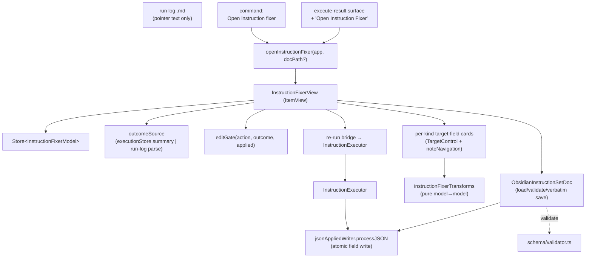
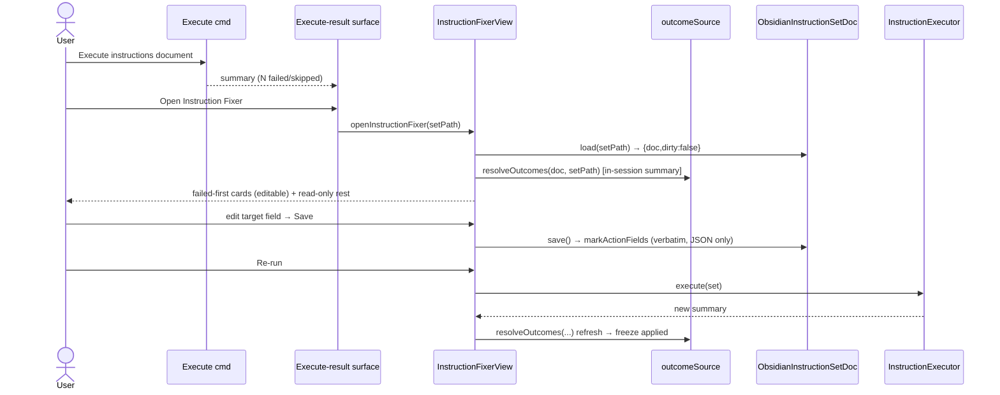

# Solution Design Document

## Validation Checklist

### CRITICAL GATES (Must Pass)

- [x] All required sections are complete
- [x] No [NEEDS CLARIFICATION] markers remain
- [x] Architecture pattern is clearly stated with rationale
- [x] **All architecture decisions confirmed by user** (ADR-1..9)
- [x] Every interface has specification

### QUALITY CHECKS (Should Pass)

- [x] All context sources are listed with relevance ratings
- [x] Project commands are discovered from actual project files
- [x] Constraints → Strategy → Design → Implementation path is logical
- [x] Every component in diagram has directory mapping
- [x] Error handling covers all error types
- [x] Quality requirements are specific and measurable
- [x] Component names consistent across diagrams
- [x] A developer could implement from this design

---

## Output Schema

### SDD Status Report

| Field | Value |
|-------|-------|
| specId | 006-instruction-editor |
| architecture | Parallel `ItemView` "Instruction Fixer" over the existing instruction wire; adapter + pure-transforms + outcome-sourced fail-closed edit gate; re-run via the existing executor |
| adrs | ADR-1..9 — all CONFIRMED |
| validationPassed | pending (run in step 5) |
| nextSteps | Continue to PLAN |

### Architecture Summary

- **Pattern:** Reuse the spec-005 garden-audit editor shape — a parallel Obsidian `ItemView` +
  `Store<{doc,dirty}>` + a load/validate/verbatim-write adapter + pure `model→model` transforms —
  specialized to the *instruction set* wire, plus a new **outcome-sourced fail-closed edit gate**.
- **Key components:** `InstructionFixerView`, `openInstructionFixer`, `InstructionSetDoc` port +
  `ObsidianInstructionSetDoc` adapter, `instructionFixerTransforms`, per-kind target-field cards,
  `outcomeSource` (run-log parse + in-session summary), re-run bridge to `InstructionExecutor`.
- **External integrations:** none. Local-first Obsidian plugin; no ports, no network.

---

## Constraints

- **CON-1 (Language/runtime):** TypeScript strict (`noUncheckedIndexedAccess`), esbuild bundle,
  Obsidian desktop (`isDesktopOnly`). Production code must stay testable against the `obsidian`
  mock (`test/__mocks__/obsidian.ts`) — no reliance on the live runtime.
- **CON-2 (ADR-027 boundaries):** the Fixer edits only **failed/skipped, not-yet-applied** actions
  (fail closed on no trustworthy signal); Hashi **never authors actions** (no add/remove/reorder,
  no free-form JSON); **no `schema_version` bump**; the `.md` peer is left untouched (JSON
  authoritative post-repair).
- **CON-3 (Tomo contract):** validate against the vendored `instructions.schema.json`
  (`additionalProperties:false`, strict); **never** modify the `.md` frontmatter `tomo.sources`
  block; instruction sets are terminal on the Hashi side (Tomo never re-reads them — confirm #2/#3).
- **CON-4 (Constitution):** local-first, no telemetry; audit/log metadata only; keep the Obsidian
  main thread responsive (derive any hints off-thread); permission/critical paths tested for BOTH
  authorize and reject (Testing L1).

## Implementation Context

**IMPORTANT**: The implementer MUST read the listed sources — they carry the exact reuse patterns.

### Required Context Sources

#### Documentation Context
```yaml
- doc: docs/XDD/specs/006-instruction-editor/requirements.md
  relevance: CRITICAL
  why: "The 7 active features (F5 descoped) + 26 ACs this design must satisfy."
- doc: docs/XDD/specs/006-instruction-editor/README.md
  relevance: CRITICAL
  why: "Resolved contract — ADR-027 framing + tightenings, Tomo's 4 confirms, research findings."
- doc: docs/XDD/specs/005-garden-audit-editor/solution.md
  relevance: HIGH
  why: "The architecture this SDD mirrors (parallel view, adapter pattern, transforms, TargetControl)."
- doc: docs/design/instruction-editor-charter.md
  relevance: MEDIUM
  why: "Origin story (run-log deep-link bug) + reuse map."
```

#### Code Context (reuse surface — mirror these)
```yaml
- file: src/ui/garden-audit-view/GardenAuditEditorView.ts
  relevance: CRITICAL
  why: "ItemView lifecycle, setState-docPath handoff, Store subscription, save/dirty race guard. Template for InstructionFixerView."
- file: src/ui/garden-audit-view/openGardenAuditEditor.ts
  relevance: HIGH
  why: "Reveal-or-create opener. Template for openInstructionFixer."
- file: src/ui/garden-audit-view/tabContract.ts
  relevance: HIGH
  why: "count/render/apply triad the fixer's card renderer plugs into."
- file: src/ui/garden-audit-view/TargetControl.ts
  relevance: CRITICAL
  why: "Plain-function target-field widget (text + picker + empty caption). Reused for the target-field edits."
- file: src/ui/garden-audit-view/noteNavigation.ts
  relevance: HIGH
  why: "renderNavigableNoteLink + HOVER_LINK_SOURCE — transfer VERBATIM (already named 'Tomo editor')."
- file: src/garden-audit/ObsidianGardenAuditDoc.ts
  relevance: CRITICAL
  why: "load→validate→{doc,dirty} + verbatim JSON save. Template for ObsidianInstructionSetDoc."
- file: src/garden-audit/transforms.ts
  relevance: HIGH
  why: "Pure model→model transforms, same-ref no-op, dirty flag. Template for instructionFixerTransforms."
- file: src/vault/GardenAuditDoc.ts
  relevance: MEDIUM
  why: "The port interface shape. Template for InstructionSetDoc."
- file: src/schema/instructions.schema.json
  relevance: CRITICAL
  why: "The wire — 14 action defs (additionalProperties:false each), applied_field/action_id $defs. REUSED as-is."
- file: src/schema/types.ts
  relevance: CRITICAL
  why: "InstructionSet + 14-variant Action union (discriminant `action`). REUSED as-is."
- file: src/schema/validator.ts
  relevance: CRITICAL
  why: "validate(raw)→{ok,data|message} + validateInstructionSet. REUSED by the adapter as-is."
- file: src/executor/InstructionExecutor.ts
  relevance: HIGH
  why: "Re-run path. Outcome enum (state.ts). Editor invokes this for re-run."
- file: src/executor/state.ts
  relevance: HIGH
  why: "ActionOutcome (applied/skipped-already/skipped-dependency/skipped-cancelled/failed) + RunState/summary."
- file: src/executor/executionStore.ts
  relevance: HIGH
  why: "In-memory Store<RunState> — the fresh in-session outcome source after a run."
- file: src/executor/jsonAppliedWriter.ts
  relevance: CRITICAL
  why: "processJSON atomic write path. The fixer's field write EXTENDS this module (no second writer)."
- file: src/executor/peerCheckboxSync.ts
  relevance: MEDIUM
  why: "Confirms the .md peer boundary — only the checkbox line is written."
- file: src/executor/runLog.ts
  relevance: HIGH
  why: "renderIdCell (the malformed deep-link to drop) + run-log format (| I## | kind | summary | outcome | error |) for outcome parsing + the Fixer pointer line."
- file: src/commands/registerCommands.ts
  relevance: HIGH
  why: "Command registration + the execute-result surface to extend with the 'Open Instruction Fixer' option."
```

### Implementation Boundaries
- **Must Preserve:** the executor's `applied` monotonicity + atomic `processJSON` write; the
  `peerCheckboxSync` checkbox-only write; the vendored schema contract (verbatim round-trip);
  the existing "Execute instructions document" command (untouched); the run log's structure.
- **Can Modify:** `runLog.renderIdCell` (drop the malformed deep-link → plain `I##`; add the Fixer
  pointer line); the execute-result surface (add the "Open Instruction Fixer" option).
- **Must Not Touch:** the `.md` peer content + its `tomo.sources` frontmatter; the `tomo` block in
  the JSON; Tomo's authoritative schema (we vendor); any add/remove/reorder of actions.

### External Interfaces
No external interfaces. The Fixer is a local Obsidian `ItemView`; all I/O is via the injected
`VaultFS` port and Obsidian workspace APIs. No inbound/outbound network, no MCP, no ports
(Constitution Privacy L1; architecture §6.8 scope boundary — Hashi has no external surface).

### Project Commands
```bash
Install: npm install
Dev:     npm run dev            # esbuild watch
Test:    npm test              # vitest
Lint:    npm run lint          # eslint (eslint-plugin-obsidianmd)
Build:   npm run build         # tsc -noEmit -skipLibCheck && esbuild production
Deploy:  HASHI_DEPLOY_VAULT=1 npm run build   # into test/Hashi vault
```

## Solution Strategy

- **Architecture Pattern:** Mirror the spec-005 garden-audit editor — a parallel `ItemView` with an
  injected adapter (`InstructionSetDoc`), a `Store<InstructionFixerModel>`, pure transforms, and
  card rendering — specialized to the *instruction* wire. Add one genuinely new subsystem: an
  **outcome source** that feeds a **fail-closed edit gate**.
- **Integration Approach:** Reuse the *existing* instruction wire/validator/executor wholesale (no
  new schema, no `schema_version` bump). The Fixer is a read+repair surface layered over artifacts
  the executor already produces; re-run delegates back to `InstructionExecutor` through its single
  atomic write path.
- **Justification:** The reuse map (spec-005 infra + existing instruction runtime) makes the feature
  small and low-risk. The only novel logic is outcome-sourcing + the gate, which is exactly where
  ADR-027 places the load-bearing safety (fail closed).
- **Key Decisions:** ADR-1..9 below. The defining ones: reuse the wire (ADR-1); a target-fields-only
  editable surface (ADR-5); no skip/disable and thus no schema change (ADR-6); entry via
  command + apply-modal option + run-log pointer, **not** click-to-open (ADR-3); outcome-sourced
  fail-closed gate (ADR-4).

## Building Block View

### Components



### Directory Map

**Component**: Hashi plugin (`src/`)
```
src/
├── ui/
│   └── instruction-fixer/                     # NEW — mirrors ui/garden-audit-view/
│       ├── index.ts                           # NEW: VIEW_TYPE_INSTRUCTION_FIXER const + re-exports
│       ├── InstructionFixerView.ts            # NEW: ItemView (mirror GardenAuditEditorView)
│       ├── openInstructionFixer.ts            # NEW: reveal-or-create opener
│       ├── fixerContract.ts                   # NEW: render context/spec (mirror tabContract)
│       ├── cards/
│       │   ├── renderActionCard.ts            # NEW: dispatch by action.action → per-kind card
│       │   └── targetFields.ts                # NEW: per-kind target-field descriptor map (7 kinds)
│       └── outcomeSource.ts                   # NEW: resolve per-I## outcome (summary | run-log) + gate
├── instruction-fixer/
│   ├── ObsidianInstructionSetDoc.ts           # NEW: adapter (mirror ObsidianGardenAuditDoc)
│   └── transforms.ts                          # NEW: pure setTargetField-by-id transforms
├── vault/
│   └── InstructionSetDoc.ts                   # NEW: port interface (mirror GardenAuditDoc)
├── executor/
│   ├── jsonAppliedWriter.ts                   # MODIFY: add markActionFields(vault, path, id, patch) sibling
│   └── runLog.ts                              # MODIFY: renderIdCell → plain I## (drop deep-link); add Fixer pointer line
├── commands/
│   └── registerCommands.ts                    # MODIFY: register 'Open instruction fixer'; add option to execute-result surface
└── main.ts                                    # MODIFY: registerView(VIEW_TYPE_INSTRUCTION_FIXER, …)
```
Reused verbatim (no change): `ui/garden-audit-view/noteNavigation.ts` (`HOVER_LINK_SOURCE`),
`ui/suggestions-view/pickers/*`, `schema/{instructions.schema.json,types.ts,validator.ts}`,
`executor/{InstructionExecutor,state,executionStore,peerCheckboxSync}.ts`, `util/store.ts`.
Reused with generalization (NOT verbatim): `ui/garden-audit-view/TargetControl.ts` — today it is
coupled to garden-audit's `FindingCheck` union (its `EMPTY_LABEL`/`EMPTY_TOOLTIP` are
`Record<FindingCheck,string>`). The Fixer must decouple the per-key empty-caption maps from
`FindingCheck` (parameterize by a caller-supplied key/label set) or wrap it; the plain-function
widget core (text input + picker + caption + `onChange`, `pathToStem`) is what transfers.

### Interface Specifications

#### Application Data Models

```pseudocode
# The wire is REUSED as-is (src/schema/types.ts) — NOT redefined here.
ENTITY: InstructionSet (EXISTING, unchanged)
  FIELDS: schema_version:"2", type, generated, profile, action_count?, md_peer?, tomo?, actions: Action[]

ENTITY: Action (EXISTING union, unchanged) — discriminant `action`; each carries id:"I##", applied?:boolean

# NEW — editor-only model wrapping the wire (no wire fields added)
ENTITY: InstructionFixerModel (NEW)
  FIELDS:
    doc: InstructionSet        # the wire, owned whole (verbatim round-trip)
    dirty: boolean             # true after a target-field edit
  # NOTE: outcomes + gate are DERIVED per render (not stored on the model), so a
  #        re-run refresh recomputes them; the model persists only doc + dirty.

ENTITY: ActionOutcome (EXISTING, src/executor/state.ts) — reused for display
  VARIANTS (discriminant `kind`): applied | skipped-already | skipped-dependency
    | skipped-cancelled | failed(reason) ;  null → pseudo-state `pending`
```

#### Interfaces (inline)

```yaml
interfaces:
  - name: InstructionSetDoc (port)   # src/vault/InstructionSetDoc.ts (NEW)
    shape: |
      load(path: string): Promise<{ doc: InstructionSet; dirty: false }>   # throws on validate fail
      save(model: InstructionFixerModel): Promise<void>                    # dirty-gated; verbatim JSON; no .md write
    why: "Mirror of GardenAuditDoc — own the whole document; strict verbatim round-trip."

  - name: instructionFixerTransforms   # src/instruction-fixer/transforms.ts (NEW)
    shape: |
      setTargetField(model, actionId, fieldKey, value): InstructionFixerModel
      # pure; locates action by id; applies only to a whitelisted target field for that kind;
      # returns SAME reference on no-op/reject (Store/=== cheap change detection); flips dirty on real change.
    why: "Pure model→model idiom from garden-audit transforms; keyed by action.id, not a decision block."

  - name: outcomeSource   # src/ui/instruction-fixer/outcomeSource.ts (NEW)
    shape: |
      resolveOutcomes(set: InstructionSet, sourcePath: string, deps): Map<ActionId, ActionOutcome> | NO_TRUSTED_SIGNAL
      # priority: (1) in-session executionStore summary if it covers this sourcePath;
      #           (2) newest run-log whose frontmatter `sources:` confidently includes sourcePath, parsed by table row;
      #           else NO_TRUSTED_SIGNAL.
      editGate(action, outcome, appliedFlag): "editable" | "frozen-applied" | "read-only-no-signal"
      # editable  iff  appliedFlag !== true  AND  outcome ∈ {failed, skipped-*}
      # frozen-applied      iff appliedFlag === true
      # read-only-no-signal otherwise (never-attempted OR NO_TRUSTED_SIGNAL) → offer to run
    why: "The load-bearing fail-closed gate (ADR-4). No durable per-action outcome store exists."

  - name: markActionFields   # src/executor/jsonAppliedWriter.ts (NEW sibling)
    shape: |
      markActionFields(vault, sourcePath, actionId, patch: Partial<Action>): Promise<void>
      # one processJSON transform: actions.map(a => a.id===id ? {...a, ...patch} : a); atomic, per-path serialized.
    why: "Reuse the single atomic write path — no second writer racing the executor's applied-flush."
```

#### Data Storage Changes
None. No schema change, no `schema_version` bump, no new persisted fields (ADR-6). The Fixer writes
only existing target fields of existing actions via the existing `processJSON` path.

#### Run-log change (src/executor/runLog.ts)
```yaml
renderIdCell:
  before: '[[<peerStem>#<headingText>|<id>]]'   # malformed when headingText contains nested [[ ]]
  after:  '<id>'                                  # plain text — deep-link dropped (Tomo confirm #4 = (b))
frontmatter/body:
  add: one informational line — "Errors can be viewed and repaired in the Instruction Fixer
        (command: 'Open instruction fixer')."  # pointer only; no link, no click-to-open
```

## Runtime View

### Primary Flow: repair after a partial apply

1. User runs **Execute instructions document**; the run finishes with ≥1 `failed`/`skipped` action.
2. The execute-result surface shows the summary and an option **"Open Instruction Fixer"** (ADR-3a).
3. `openInstructionFixer(app, activeSetPath)` reveals-or-creates the `InstructionFixerView` on that set.
4. The view loads the set (adapter → validate), sources outcomes from the **in-session
   `executionStore` summary** (fresh — the run just happened), and renders **failed/skipped actions
   first** as editable cards; applied/never-run render read-only.
5. Per failed card: `I##`, kind, intent line (plain text — no deep-link), outcome + error reason, a
   **note link** (open-beside + hover), and the **target field(s)** for that kind (TargetControl).
6. User repoints a target field (e.g. `link_to_moc.target_moc` → an existing MOC); the edit is held
   in the Store, `dirty` flips, Save activates.
7. On **Save**: the edited set is validated against `instructions.schema.json`; invalid → rejected
   with a message; valid → written verbatim via `markActionFields` (JSON channel only; `.md`
   untouched).
8. User clicks **Re-run**: `InstructionExecutor` runs the set; monotonic `applied` skips
   already-applied actions and applies the repaired one; `peerCheckboxSync` ticks only the checkbox.
9. Outcomes **refresh in place** from the new run summary; a now-applied action freezes.



### Secondary Flow: cold open via command (fail-closed)
1. User runs **Open instruction fixer** with an `_instructions.json` active (or picks one) — no recent run.
2. `outcomeSource.resolveOutcomes` finds no in-session summary; it searches for the newest run-log
   whose `sources:` confidently includes this set.
3. **If found & mapped** → show those outcomes; failed/skipped unlock per the gate.
4. **If not found / unmappable / stale** → `NO_TRUSTED_SIGNAL`: the whole set renders **read-only**
   and the view offers **"Run"** to produce fresh outcomes (fail closed — ADR-4).

### Error Handling
- **Invalid edit at Save:** schema validation fails → reject the write, surface the validator
  message, keep the edit pending (no partial write).
- **Adapter load fails (invalid/corrupt set):** view shows a load error (mirrors garden-audit),
  no editing offered.
- **No trusted outcome signal:** fail closed (read-only + offer to run) — never guess from bare
  `applied:false`.
- **Target note doesn't resolve:** note link degrades to inert "(note not found)".
- **Re-run of an action that now applies:** card freezes; further edits blocked (monotonic `applied`).
- **Edit-during-save / revert-during-save:** reuse GardenAuditEditorView's reference-identity save
  guard (`savedStore`/`savedModel` re-check + `saving` flag).

### Complex Logic — the fail-closed edit gate
```
ALGORITHM: editGate(action, outcomeMapResult, appliedFlag)
INPUT: one Action, resolveOutcomes(...) result, action.applied
OUTPUT: "editable" | "frozen-applied" | "read-only-no-signal"

1. IF appliedFlag === true          → RETURN "frozen-applied"           # nothing to repair
2. IF outcomeMapResult === NO_TRUSTED_SIGNAL → RETURN "read-only-no-signal"   # offer to run
3. LET o = outcomeMapResult.get(action.id)
4. IF o is undefined OR o.kind === "pending"  → RETURN "read-only-no-signal"  # never-attempted
5. IF o.kind === "failed" OR o.kind starts with "skipped"  → RETURN "editable"
6. OTHERWISE (o.kind === "applied" without applied flag; defensive) → "frozen-applied"
```
Traced: after a run where I07 `failed(anchor not found)`, I09 `applied`, I12 never reached —
opened from the apply modal (summary present): I07 → editable; I09 → frozen-applied; I12 → o is
undefined → read-only-no-signal. Opened cold with no run-log: ALL → read-only-no-signal (offer run).

## Deployment View
No change to deployment. Ships inside the existing `miyo-tomo-hashi` plugin bundle
(`tsc` + esbuild). Desktop-only. One new `registerView` + one new command + one modified command
registration in `main.ts`/`registerCommands.ts`. No migration, no config, no feature flag.

## Cross-Cutting Concepts

### User Interface & UX
- **Information Architecture:** a dedicated `ItemView` ("Instruction Fixer", `wrench` lucide icon) in
  the family of "Tomo editor" surfaces. Failed/skipped actions surfaced first; applied/never-run
  read-only.
- **Interaction Design:** dirty/Save affordance + Re-run button (reuse `hashi-se-*` / editor CSS);
  target-field edits via `TargetControl`; note links via `renderNavigableNoteLink` (open-beside +
  hover). State via `Store<InstructionFixerModel>`; outcomes/gate derived per render.
- **Entry points (ADR-3):** (a) "Open Instruction Fixer" option on the execute-result surface;
  (b) an informational pointer line in the run log; (c) the "Open instruction fixer" command. No
  click-to-open from the log; no `obsidian://` handler.
- **Accessibility:** keyboard-operable controls; empty/read-only states carry `aria-label`s
  (garden-audit precedent); Obsidian CSS-lint rules honored (border-bottom over text-decoration).

### System-Wide Patterns
- **Security/Privacy:** local-only; no telemetry; no note content in any log (metadata only).
- **Error Handling:** local per-view; validator-gated writes; fail-closed gate as the safety spine.
- **Performance:** run-log parse + any target hints run off the main thread (Perf L1); one set per
  view (no unbounded scans); reuse Obsidian metadata/vault APIs.
- **Logging/Audit:** re-run produces the existing run log; the Fixer adds no new persistent log.

### Pattern Documentation
```yaml
- pattern: spec-005 garden-audit editor (parallel ItemView + adapter + transforms + TargetControl)
  relevance: CRITICAL
  why: "The reuse spine — the Fixer is a specialization of this shape."
- pattern: ADR-026 §0 mechanism-is-Hashi's
  relevance: HIGH
  why: "Outcome sourcing, run-log parse, gate, and re-run mechanics are Hashi's to choose."
```

## Architecture Decisions

- [x] **ADR-1 — Reuse the existing instruction wire + validator** (`src/schema/*`); do not define a
  new editor wire.
  - Rationale: `InstructionSet`/`Action`/`validate` already exist and match the adapter contract;
    the set is the same artifact the executor runs. Avoids drift and a `schema_version` bump.
  - Trade-offs: the editor model wraps a wire built for execution (14-kind union, no `decision`
    block) — richer per-kind card logic than garden-audit; strict `additionalProperties:false`
    demands exact verbatim round-trip.
  - User confirmed: **Yes** (research-forced; accepted).

- [x] **ADR-2 — Parallel `InstructionFixerView` (`ItemView`) + `InstructionSetDoc` adapter**, mirroring
  the garden-audit editor (Store, setState-docPath, save/dirty guard, verbatim save).
  - Rationale: maximal reuse, minimal new surface; consistent with the "Tomo editor" family.
  - Trade-offs: a new view type + opener + registration vs. cramming into an existing view.
  - User confirmed: **Yes**.

- [x] **ADR-3 — Entry via command + apply-modal option + run-log pointer; NOT click-to-open.**
  - Rationale: user-specified. Keeps the run log stable, avoids the `_instructions.json`
    command-collision with "Execute instructions document", and needs no protocol handler.
  - Trade-offs: no one-click jump from a specific error row to that action (mitigated: the Fixer
    shows all errors and scrolls/surfaces failed-first).
  - User confirmed: **Yes** (explicit: a/b/c/d).

- [x] **ADR-4 — Outcome-sourced, fail-closed edit gate.** Editable iff a trusted outcome
  (`failed`/`skipped-*`) exists AND `applied !== true`; else read-only (`frozen-applied` or
  `read-only-no-signal` → offer to run). Trusted source = in-session `executionStore` summary, else
  a confidently source-matched newest run-log; bare `applied:false` is never trusted.
  - Rationale: ADR-027 makes outcome-sourcing load-bearing; no durable per-action outcome store
    exists (`failed`/`skipped-*`/never-run all collapse to `applied:false`).
  - Trade-offs: a cold open with no run-log can edit nothing until the user runs — deliberate.
  - User confirmed: **Yes** (fail-closed accepted; primary flow arrives fresh from the run).

- [x] **ADR-5 — Editable surface = the target fields on 7 repair kinds**, validated schema-shape at
  Save; everything else read-only.
  - Kinds/fields: `link_to_moc`(target_moc, target_moc_path, anchor), `insert_under_marker`
    (target_path, anchor), `replace_section`(target_path, anchor), `add_relationship`
    (target_moc_path, marker, line), `edit_note_text`(path, match, replace), `remove_up_link`
    (path, link), `resolve_dead_link`(path, target, replace).
  - Rationale: user framing — mechanical failure is "what the action points at isn't there"; repoint
    the target. Covers the motivating anchor-not-found + the link-repair family.
  - Trade-offs: kinds like `move_note`/`update_tracker`/`update_log_*`/`create_moc`/`delete_source`/
    `skip` are view-only in v1 (rarely a repointable mechanical failure). Roster is extensible.
  - User confirmed: **Yes** ("mainly those that make sense — the target fields").

- [x] **ADR-6 — No skip/disable; no schema change.** A "skipped" action is simply `applied:false`;
  an unfixed action stays unapplied and just isn't applied on re-run.
  - Rationale: user — the Fixer only *fixes*, it does not edit/disable the set. Avoids adding a
    field under `additionalProperties:false` and any Tomo-schema drift.
  - Trade-offs: no explicit "never run this" marker; an unfixable action re-attempts (harmlessly)
    on each re-run until fixed or the set is discarded.
  - User confirmed: **Yes**.

- [x] **ADR-7 — `.md` peer untouched; JSON authoritative** (ADR-027 Decision ②). Write only the JSON
  channel; the shipped `peerCheckboxSync` checkbox tick stays; never touch `tomo.sources`.
  - Rationale: the `.md` is the approval receipt; Tomo never re-reads the JSON (confirm #2/#3), so
    the divergence is free.
  - Trade-offs: post-repair the `.md` describes the original failed form — accepted; JSON is truth.
  - User confirmed: **Yes** (ADR-027; Tomo #2 = NO resolved the contingency).

- [x] **ADR-8 — Run-log `I##` cell drops the malformed deep-link → plain `I##`; add a Fixer pointer
  line.** Keep the log otherwise as-is.
  - Rationale: the malformed nested-`[[]]` deep-link is the origin bug; Tomo confirm #4 = (b) drop
    deep-linking and surface intent in the editor. Pointer line advertises the Fixer.
  - Trade-offs: the log no longer links anywhere from `I##` — intentional (no click-to-open).
  - User confirmed: **Yes**.

- [x] **ADR-9 — Re-run reuses `InstructionExecutor` + the single `processJSON` write path;** the
  Fixer's field write is a sibling in `jsonAppliedWriter` (`markActionFields`), not a second writer.
  - Rationale: monotonic `applied` gives idempotent re-run for free; one atomic per-path writer
    avoids racing the executor's applied-flush.
  - Trade-offs: none material; the Fixer depends on executor internals it already reuses.
  - User confirmed: **Yes** (reuse-forced; accepted).

## Quality Requirements
- **Performance:** no main-thread blocking; run-log parse off-thread; one set per view.
- **Usability:** failed-first ordering; clear outcome + error per card; obvious dirty/Save/Re-run;
  read-only vs editable visually distinct; "offer to run" when no signal.
- **Security/Privacy:** local-only; JSON channel only; no `.md`/`tomo.sources` mutation; no telemetry.
- **Reliability:** verbatim round-trip (unedited load→save is a no-op that re-validates clean);
  fail-closed gate never edits a non-failed/skipped action; re-run idempotent.

## Acceptance Criteria (EARS — maps PRD F1..F8)

**Entry (PRD F1 / ADR-3):**
- [ ] WHEN the user runs "Open instruction fixer" with an `_instructions.json` active, THE SYSTEM SHALL open the Instruction Fixer on that set.
- [ ] WHEN an execute run finishes with ≥1 failed/skipped action, THE SYSTEM SHALL offer an "Open Instruction Fixer" option on the execute-result surface.
- [ ] THE SYSTEM SHALL leave the "Execute instructions document" command behavior unchanged.
- [ ] THE SYSTEM SHALL render the run-log `I##` cell as plain text (no deep-link) and include a pointer line to the Fixer.

**Cards + outcomes (PRD F2):**
- [ ] WHEN the Fixer renders a set with a trusted outcome map, THE SYSTEM SHALL show each action's `I##`, kind, plain-text intent, target field(s), and outcome (+ error reason), failed/skipped first.

**Fail-closed gate (PRD F3 / ADR-4):**
- [ ] IF an action's trusted last outcome is `failed` or `skipped-*` AND `applied !== true`, THEN THE SYSTEM SHALL render its target field(s) editable.
- [ ] IF an action has `applied === true`, THEN THE SYSTEM SHALL render it read-only.
- [ ] IF there is no trusted outcome signal (never-attempted, or missing/stale/unmappable run-log), THEN THE SYSTEM SHALL render read-only and offer to run.
- [ ] WHEN a live in-session run reports `failed`/`skipped-*` for an action, THE SYSTEM SHALL make it editable on outcome refresh.

**Edit + validate + round-trip (PRD F4 / ADR-5):**
- [ ] WHEN the user changes a target field of an editable action, THE SYSTEM SHALL mark the model dirty and activate Save.
- [ ] IF a pending edit is schema-invalid, THEN THE SYSTEM SHALL reject the write with a message and not persist it.
- [ ] WHEN an edited set is saved, THE SYSTEM SHALL round-trip every untouched field verbatim (re-save re-validates clean).

**Peer boundary (PRD F8 / ADR-7):**
- [ ] WHEN any Fixer save occurs, THE SYSTEM SHALL write only the `_instructions.json` and SHALL NOT modify the `.md` content or its `tomo.sources` block.

**Note nav (PRD F6):**
- [ ] WHEN the user clicks a card's note link, THE SYSTEM SHALL open the note beside the editor; WHEN hovered, THE SYSTEM SHALL show Obsidian's page preview; IF unresolved, THEN inert "(note not found)".

**Re-run (PRD F7 / ADR-9):**
- [ ] WHEN the user re-runs from the Fixer, THE SYSTEM SHALL invoke `InstructionExecutor`, skip already-`applied` actions, apply the repaired one via the atomic write path, and refresh outcomes in place.

## Risks and Technical Debt

### Known Technical Issues
- The run-log `renderIdCell` deep-link is malformed for enriched headings (nested `[[]]`) — this
  spec removes it (ADR-8).
- No durable per-action outcome store — the gate must fail closed (ADR-4); a clean run under
  `only-after-failed` retention writes no run-log, so a cold open has no signal.

### Technical Debt
- `stringifyScalar` is duplicated across validators (pre-existing); not addressed here.
- The 7-kind fix-field roster is a deliberate v1 subset; extending to more kinds is future work.

### Implementation Gotchas
- **`additionalProperties:false`** on every action + top-level: a dropped field on save fails
  re-validation → own-the-whole-document verbatim save is mandatory (test an unedited round-trip).
- **`metadataCache` async-rebuild race** in same-file batches (memory: #68) — if any target hint
  reads the cache during a multi-action context, resolve from `cachedRead` content instead.
- **Obsidian mock**: side-effect `import "obsidian"` needed so the HTMLElement prototype shim
  installs; `createEl` multi-class needs array form (`cls:["a","b"]`).
- **`Modal`/`SettingTab` don't extend `Component`** → no `registerDomEvent`; the execute-result
  surface option must attach + clean up listeners by hand.
- **Run-log source matching** must be *confident* — a fuzzy path match that wrongly maps a stale log
  would defeat fail-closed; require the log's `sources:` to include the exact set path.

## Glossary

### Domain Terms
| Term | Definition | Context |
|------|------------|---------|
| Instruction set | A Tomo-emitted `_instructions.json` of `actions[]` executed by Hashi | The artifact the Fixer repairs |
| Action | One executable step; discriminated by `action`; id `I##` | 14 kinds; 7 get editable target fields |
| Target field | The field naming what an action points at (MOC/note/path/anchor) | The only editable surface (ADR-5) |
| Repair / fix | Correcting a target field so a re-run of a failed action can succeed | The Fixer's sole purpose |
| Approval receipt | The `_instructions.md` peer the user approved | Left untouched (ADR-7) |

### Technical Terms
| Term | Definition | Context |
|------|------------|---------|
| Fail closed | Default to read-only unless a trusted failed/skipped signal exists | The gate's safety posture (ADR-4) |
| Outcome source | In-session `executionStore` summary or a source-matched run-log | Feeds the gate |
| Monotonic `applied` | Hashi only writes false→true; Tomo never re-emits true | Gives idempotent re-run |
| Verbatim round-trip | Untouched fields serialized back unchanged | Required by `additionalProperties:false` |
| `executionStore` | Module-level in-memory `Store<RunState>` | The fresh post-run outcome source |
