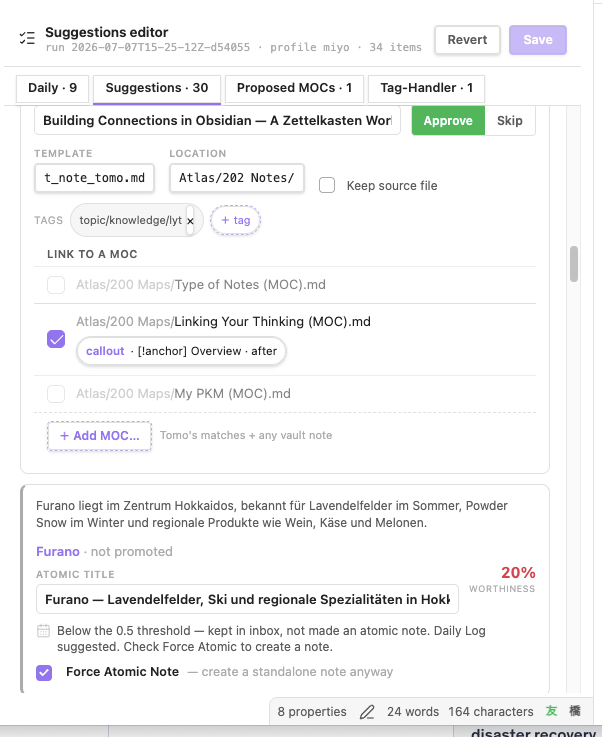
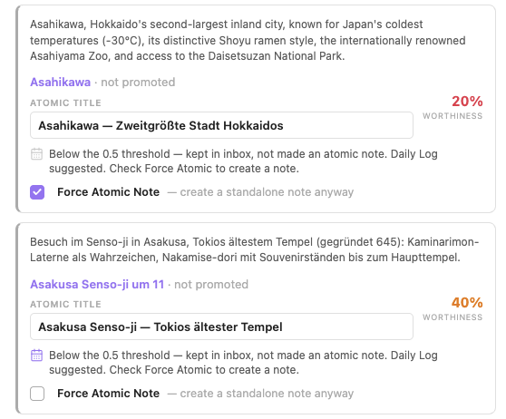
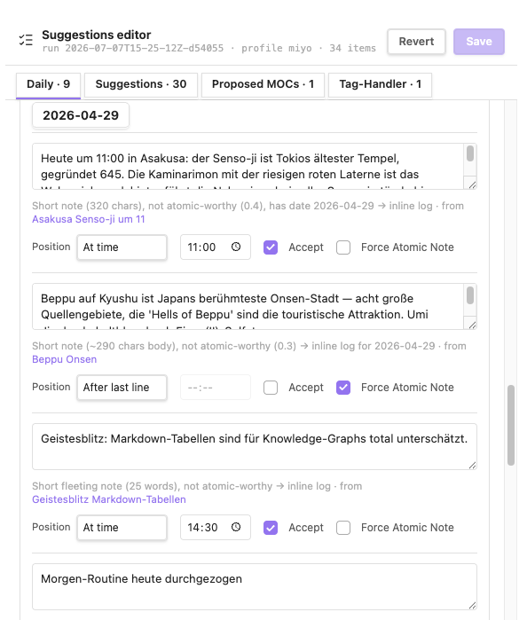
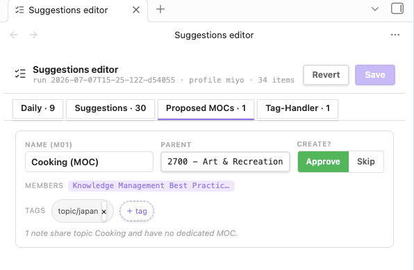
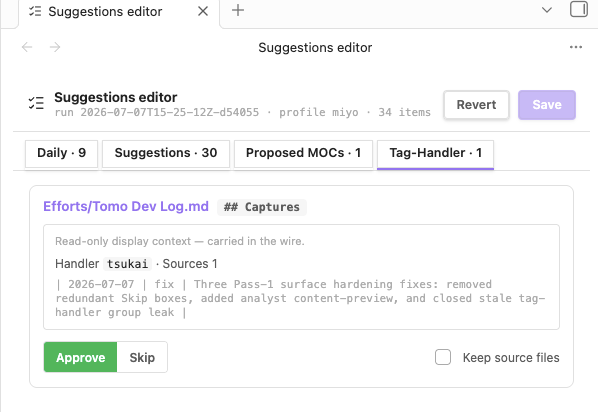
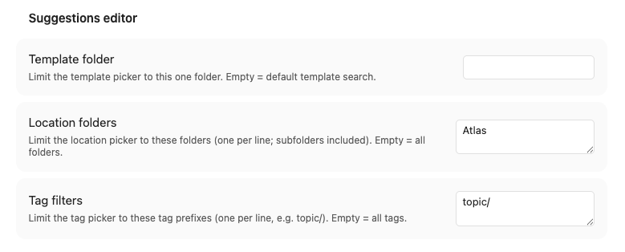

# Suggestions Editor

The Suggestions Editor is a structured review surface for the `_suggestions.json`
documents Tomo publishes after an `/inbox` Pass 1. Instead of hand-editing flat
checkboxes in the sibling `.md`, you review and refine every proposed decision —
note titles, destinations, MOC links and their placement, MOC proposals, daily-note
updates and tag-handler captures — in one tabbed editor, then **Save** to approve
the whole run for Pass 2.

> Screenshot — Suggestions tab: the leaf header (run id · profile · item count · Revert / Save), the four-tab strip, one worthy card and one suppressed card.

  

## Opening it

Run **Open Tomo editor** from the command palette (`Ctrl/Cmd+P`):

| Active file | Behaviour |
|---|---|
| A `_suggestions.json` (or its `.md` peer) | Opens that run directly |
| Anything else (or nothing) | Opens a picker over every `*_suggestions.json` in the vault |
| No suggestions doc exists anywhere | Shows *"Open a Tomo _suggestions.json (or its .md) first"* |

The editor is a **singleton leaf** — reopening it retargets the existing leaf rather
than spawning a duplicate. Tomo emits two review surfaces that both open here and share
the same schema: the primary `_suggestions.json` and the **Force-Atomic Resolve**
`_suggestions-fan.json` (a follow-up pass for items you forced into atomic notes).

## The four tabs

Each tab header shows a live count of its items. Empty tabs still appear (with a `· 0`
count) so nothing is hidden.

### Suggestions

One card per proposed atomic note, in two modes decided by Tomo's worthiness scoring:

- **Worthy** cards carry the full editable surface: the note **title** (the filename
  derives from it), an **Approve / Skip** decision, **Template** and **Location** pickers,
  a **Keep source file** toggle, editable **tags**, and a **Link to a MOC** section. Each
  candidate MOC is an independent checkbox; a selected one exposes an anchor chip
  (`type · value · placement`, e.g. `callout · [!anchor] Overview · after`) that opens the
  spot picker to choose exactly where the link lands. **+ Add MOC…** fuzzy-adds any vault
  note beyond Tomo's own matches.
- **Suppressed** cards are notes Tomo kept in the inbox as light blocks (below the 0.5
  worthiness threshold). They show the origin note as an openable link, an editable atomic
  title, the worthiness badge, and a single real decision — **Force Atomic Note**, which
  promotes the note anyway.

A grey one-sentence **summary** leads each card — an analyst-authored gist of what the
note is about, so you can decide without opening the source.

#### Force Atomic and the daily-log indicator

When Tomo also proposed a **daily-log entry** for a suppressed note's source, the hint line
leads with a calendar icon that reflects that entry's live state: **accent-highlighted** when
the daily-log entry is accepted (activated), **muted/grey** when it is not. It is an
at-a-glance cue for whether the source already has an active daily-log destination — no need
to switch to the Daily tab to check. Force Atomic stays in sync with the matching daily-log
entry by source stem, so toggling it here flips the daily mirror too.

> Screenshot — two suppressed cards: Asahikawa (20% worthiness, Force Atomic **on**, daily-log icon highlighted) and Asakusa (40%, Force Atomic **off**, daily-log icon muted).

  

### Daily

One card per proposed daily-note update, grouped under each date. Log entries carry an
editable **content** textarea, a **Position** (at a time / after the last line / before the
first line), an optional **time**, an **Accept** toggle, and **Force Atomic Note** (kept in
sync with the matching Suggestions card). A read-only reason line explains why Tomo proposed
the entry and links its origin note. Tracker updates and log-links (links from the daily note
to a promoted atomic) render read-only alongside.

> Screenshot — Daily tab: a date header with several log-entry cards, each with a content box, Position, time, Accept and Force Atomic Note controls.

  

### Proposed MOCs

One card per new MOC Tomo proposes. Editable: **Name** (rename), **Parent** (reparent,
fuzzy), the **Members** (notes linked by their `S##` id), and **Tags**; plus an
**Approve / Skip** decision (default skip). Proposals can be **merged** into one another —
folding members and tags together and retargeting the reason count. Suggestion cards
cross-reference the proposed MOC they belong to, so a rename or merge shows through.

> Screenshot — Proposed MOCs tab: a card with Name, Parent, Create? (Approve/Skip), Members, and Tags.

  

### Tag-Handler

One card per tag-handler group Tomo claimed. Editable: **Approve / Skip** and **Keep source
files**. The card carries read-only display context from the wire — the target note and its
marker (e.g. `Efforts/Tomo Dev Log.md ## Captures`), the claiming **handler**, the source
count, and a preview of the composed block that will be inserted.

> Screenshot — Tag-Handler tab: a group card with its target note and marker, read-only handler/sources/preview context, Approve/Skip, and Keep source files.

  

## Saving — Save is the approve

**Save persists the whole document and approves the run.** It writes the edited
`_suggestions.json` and refreshes the sibling `.md`, and:

- Preserves the `.md`'s **frontmatter verbatim** — Tomo discovers the run by its
  `tomo.state: pending-approval` frontmatter, so it is never stripped or rewritten.
- Flips the Pass-2 gate to `- [x] Approved` — because saving from the editor **is** the
  approval.
- Never recomputes `emit_digest`. The stale digest is exactly how Tomo learns the JSON was
  edited: Pass 2 then rebuilds its entire output from the JSON alone (**JSON-only** — the
  markdown body is not re-read), so every untouched field (`daily_updates`,
  `tag_handler_groups`, read-only metadata) round-trips unchanged.

An **Edited** badge appears once the model is dirty; **Revert** reloads from disk and
discards in-memory edits. After saving, run `/inbox` in Tomo for Pass 2 to apply everything.

## Settings

**Settings → Suggestions editor** scopes the fuzzy pickers so they only offer what's relevant
to your vault:

| Setting | Effect |
|---|---|
| **Template folder** | Limits the template picker to one folder. Empty = default template search. |
| **Location folders** | Limits the location picker to these folders (one per line; subfolders included). Empty = all folders. |
| **Tag filters** | Limits the tag picker to these tag prefixes (one per line, e.g. `topic/`). Empty = all tags. |

> Screenshot — Settings → Suggestions editor section with the three picker-scope controls.

  

## See also

- [Commands reference](commands-reference.md) — the **Open Tomo editor** command
- [Instruction executor](instruction-executor.md) — runs the `_instructions.json` Tomo renders from an approved run
- [How it works](how-it-works.md) — where the editor sits in the Tomo → Hashi flow
